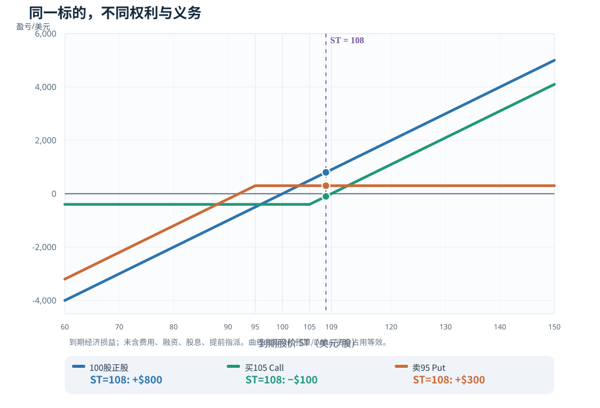

# L01｜期权到底买了什么？——盈亏平衡、权利金、杠杆与风险

> **专业教材版 v2.0｜共通基础 A｜先修：无｜预计 70–100 分钟精读 + 30–45 分钟习题**  
> 适用范围：以标准**美股股票期权**为主要范例；全部行情为人为构造的教学数据，**不是任何真实证券的报价**。本课不提供具体交易指令。

## 先读这一页：5 分钟结论

1. **Call 是买入权，Put 是卖出权。** 买方支付权利金获得“可选择是否行权”的权利；卖方收权利金，承担相应的潜在履约义务。期权价值不是对未来方向的一次投票。
2. **股价看对方向，不等于期权赚钱。** 买一张 105 Call 付 4 美元/股，到期股价 108 时，虽然正股由 100 上涨了 8%，该 Call 仍净亏 **100 美元/张**；到期股价高于 **109 美元**才越过不含费用的盈亏平衡点。
3. **到期盈亏平衡点，不是途中平仓盈利的必要条件。** 持有期内的期权有剩余时间价值，IV、时间、利率、股息和可执行买卖价都会改变实际收益。
4. **杠杆至少有三种口径。** 一张代表 100 股的期权，不等于现在就承担 100 股的即时 Delta；“名义资金/权利金=25 倍”不能直接推断涨 1% 就赚 25%。
5. **最大亏损必须按头寸类型和整个账户判断。** 普通买入 Call 在不考虑行权后的持股风险时，单腿直接最大亏损为权利金；裸卖 Call 的理论亏损无上限，卖 Put 的收款绝不等于稳健利息。

**本课的验收题：** 如果你判断“ABC 一个月内从 100 涨到 108”，能否解释为什么 *买股票、买 105 Call、卖 95 Put、不交易* 是四种不同的决策？先不急着选，先会计算、识别假设和拒绝不划算的交易。

### 本课阅读导航

| 阅读路线 | 章节 | 读完获得的能力 |
|---|---|---|
| **快速掌握（约 15 分钟）** | §1 → §3 → §8 → §10 | 说清期权是什么、成本与亏损是什么 |
| **完整学习（70–100 分钟）** | §1–§11，依序阅读 | 严格计算、对比、识别途中风险 |
| **专业复习（约 20 分钟）** | §4 → §5 → §7 → §9 | 公式、有效杠杆、报价、风险边界 |
| **自测** | [L01 专属练习与逐题详解](习题与详解.md) | 基础计算、纠错、情景分析 |

可视化：先看本章 [两种看多表达的到期净盈亏图](图解.svg)，再打开 [四种基础头寸互动图](../L04-四个头寸-收益曲线-风险/互动图.html)拖动参数。

---

## 本课公式速读图｜先看人话，再看推导

> 下图给出本课核心公式与计算判断的**独立教学示例**。请先看名称、代入和使用边界，再读正文完整推导；原有收益图仍保留。

---

## §1｜从合约出发：一份期权的权利、义务和时间边界

### 1.1 最精确的一句话

股票代表你持有企业股权；**期权是约定标的、数量、行权价、到期日和结算方式的或有权利/义务**。

对典型**实物交割的美式股票期权**而言：

| 交易行为 | 买方取得 / 卖方承担 | 到期前的关键不确定性 |
|---|---|---|
| 买 Call | 以行权价 \(K\) **买入**标的的权利 | 股价能否在有限期限内上升得足够多 |
| 买 Put | 以 \(K\) **卖出**标的的权利 | 股价能否在有限期限内下降得足够多 |
| 卖 Call | 被指派时以 \(K\) **交付/卖出**标的的义务 | 股价大幅上涨及提前指派 |
| 卖 Put | 被指派时以 \(K\) **接收/买入**标的的义务 | 股价大幅下跌及提前指派 |

这里说的“买入/卖出标的”只适用于相应**实物交割**合约。某些指数期权为**现金结算**，不能照搬“交付 100 股”；调整后合约的交割物也可能不再是普通 100 股。合约乘数、行权样式和交割方式都要看产品规格，下一课 L02 详细展开。

### 1.2 买方有权，为什么不必行权？

假设你持有一张 105 Call，股价到期只有 95。按 105 买入市场价值 95 的股票显然不划算：你可以放弃行权，但**已经付出的权利金不会退回**。期权的“选择权”不是免费的。

如果股价在到期之前上涨，也不代表只能靠行权获利。你一般可以通过**卖出平仓**退出持有的 Call。卖出平仓所得取决于当时的期权报价，而非仅取决于股票价格。

**把三件事彻底分开：**

- **行权（exercise）**：行使合约里的买/卖标的权利。
- **平仓（close）**：在市场反向交易，把原有期权头寸结束。
- **指派（assignment）**：卖方按清算及券商流程被要求履行合约义务。美式空头在到期前也可能被指派。

**重要边界：** 初学者不应把“买方只损失期权费”误扩展为“无论如何账户都只会损失期权费”。若多头合约被行权并产生股票仓位，后续持股或融资风险另算；是否足够现金、是否自动行权、指派和通知截止时间必须核对券商规则。

### 1.3 一张不是一股

标准美国个股期权**通常**一张代表 100 股。教学合约若每股权利金为 4 美元，则：

\[
\text{初始支付权利金}=4\ \text{美元/股}\times100\ \text{股/张}=400\ \text{美元/张}
\]

不要把“报价 4.00”看成总价 4 美元，更不要把代表 100 股误解为“已经买入 100 股”。合约调整、不同市场和不同产品可能有其他乘数。

---

## §2｜专业读法：一个统一案例和全部符号

为了让后面的比较可以复算，全课除注明外都围绕**虚构股票 ABC**展开。

| 记号 | 本课假设 | 含义 |
|---|---|---|
| \(S_0\) | 100 美元/股 | 建仓时股价 |
| \(K_C\) | 105 美元/股 | 看涨期权行权价 |
| \(c_0\) | 4 美元/股 | **买入**105 Call 的实际成交价 |
| \(K_P\) | 95 美元/股 | 看跌期权行权价 |
| \(p_0\) | 3 美元/股 | **卖出**95 Put 的实际成交价（独立示例） |
| \(N\) | 100 股/张 | 教学合约乘数 |
| \(T\) | 假设距建仓约 45 天 | 到期日 |
| \(S_T\) | 未知 | 到期标的价格 |

**全课假设：** 用美式实物交割标准股票期权讲合约风险；为了严格推导“到期净损益”，先采用无费用、无融资利息、无股息、无需提前处理、可按终值现金评价仓位的**简化结算视角**。这**不意味着**真实空头不会提前指派，也不意味着实物交割时自动变现金。现金担保、券商保证金、买卖价差和中途风险留到专门章节展开，本课先给必要边界。

符号 \(x^+ = \max(x,0)\) 称为“正部”：\(x\) 大于 0 就取 \(x\)，否则取 0。  
例如 \((S_T-105)^+\) 在 \(S_T=108\) 时等于 3，在 \(S_T=95\) 时等于 0。

---

## §3｜从数学推出来：到期盈亏平衡点不是死记公式

### 3.1 买 Call：为什么是 \(K+c_0\)？

买入 105 Call 后，到期它的**每股行权收益（payoff，不扣成本）**是：

\[
C_T=(S_T-K_C)^+=\max(S_T-105,0)
\]

但收益与**利润（P/L）**不是一回事。你当初每股付了 4 美元，所以一张的到期净损益为：

\[
\boxed{\Pi_{\text{Long Call},T}=N\,[\max(S_T-K_C,0)-c_0]}
\]

逐步推导：

- 如果 \(S_T\leq105\)，行权收益为零，净亏损就是 \(100\times4=400\)。
- 如果 \(S_T>105\)，净利润变为 \(100(S_T-105-4)\)。
- 求盈亏平衡令净利润等于 0：\(S_T-105-4=0\)，得到 **\(S_T=109\)**。
- 换句话说，**股价上涨到 105 只是进入价内；必须到 109 才覆盖你支付的权利金**。

| 到期股价 \(S_T\) | 股票相对 100 的涨跌 | Call 行权价值/股 | Call 净损益/张 |
|---:|---:|---:|---:|
| 70 | −30% | 0 | −400 |
| 95 | −5% | 0 | −400 |
| 100 | 0% | 0 | −400 |
| 105 | +5% | 0 | −400 |
| 108 | +8% | 3 | −100 |
| **109** | **+9%** | **4** | **0** |
| 120 | +20% | 15 | +1,100 |
| 140 | +40% | 35 | +3,100 |

**到期最大亏损**为付出的 400 美元（买入期权这条腿本身，不含交易费用及可能行权后持股）。**到期理论最大盈利**无上限（理论上股价可无限上涨），但“无上限”绝不代表上涨概率高。

### 3.2 买 Put：为什么是 \(K-p_0\)？

买 Put 的到期净损益（暂用一个独立例子 K=95、买入权利金 3）：

\[
\boxed{\Pi_{\text{Long Put},T}=N\,[\max(95-S_T,0)-3]}
\]

若 \(S_T<95\)，求零利润：\(95-S_T-3=0\)，得到 **\(S_T=92\)**。即股价跌破 95 是价内，跌破 92 才是忽略费用的到期盈利。

对**股价下界为 0 的股票**，买 Put 的到期利润上限为 \((K-p)\times N=(95-3)\times100=\mathbf{9,200}\) 美元，不是无限。

### 3.3 卖 Put：同一个 92，为什么意义完全不同？

卖出 K=95、收到 p=3 的 Put，到期：

\[
\boxed{\Pi_{\text{Short Put},T}=N\,[3-\max(95-S_T,0)]}
\]

- \(S_T\geq95\)：最多赚权利金 **300 美元**。
- \(S_T=92\)：到期净损益 **0**。
- \(S_T=70\)：\(100[3-(95-70)]=\mathbf{-2,200}\) 美元。
- \(S_T=0\)：理论到期净损失 \((95-3)\times100=\mathbf{9,200}\) 美元。

收到的 300 美元是**盈利上限**，不是亏损上限。若你把卖 Put 视为“95 美元买股票并立刻收 3 美元折扣”，可以得到到期的**经济成本基准 92 美元/股**，但不能据此断言这家公司真正值 92 美元，也不能忽略下跌到 70 或 0 的风险。

现金担保 Put 的“担保”含义是**预留行权现金**，降低融资缺口风险，而不是给标的价格投保。这里约 9,500 美元的行权义务规模，才是必须进入账户决策的金额；具体担保现金处理以券商要求为准。

### 3.4 到期图：正股 vs 买 Call vs 卖 Put

- **正股**：从 \(S_0=100\) 买入 100 股，净损益为 \(100(S_T-100)\)，没有合约到期日。
- **买 105 Call**：横盘和小涨时亏固定 400，越过 109 后开始盈利，涨得足够多会放大按权利金算的百分比收益。
- **卖 95 Put**：95 以上最多赚 300；跌到 95 以下开始承担近似持股下跌的经济风险，到 92 是盈亏平衡点。

图仅比较同一股价终值下的**净美元结果**；资金占用、初始 Delta 和持有条件都不同，不能光凭曲线高低下结论。

---

## §4｜期权权利金（Premium）：不是押对方向的奖金

### 4.1 什么叫“权利金”？

期权有市场报价。**Premium（权利金）**就是买方支付、卖方收取的期权价格，常以“每股”显示。假设 105 Call 的实际买入价格 \(c_0=4\)：

\[
\text{权利金总额}=c_0N=400
\]

到期价值与权利金之间的差额，才构成这张期权的**到期净 P/L**。

在一般的美式股票期权定价语境中，还可以按**市场权利金≈内在价值+时间价值（外在价值）**理解：例子中 105 Call 于股价 100 时虚值，内在价值为 0，所以支付的 4 美元可理解为对“未来可能有利”的定价。更深的 IV/时间价值拆解放在 L03 和 L07。

### 4.2 “溢价”不是单一数学指标

中文投资讨论里，“溢价”经常含糊：

| 说法 | 实际指什么 | 最常见的误读 |
|---|---|---|
| Option premium | 期权**权利金本身**，本例 4 美元/股 | 误以为是“高出公允价 4 美元” |
| Premium / spot | 权利金与正股价格的比，本例 \(4/100=4\%\) | 把这个 4% 当年化收益率 |
| Extrinsic / time value | 权利金超出即时行权价值的部分 | 把时间价值当必然日赚收益 |
| 相对模型溢价 | 可执行期权价格相对于特定模型估值的偏差 | 把模型当真理，忽略 IV 假设与交易成本 |

没有**同一到期、同一行权价、同一报价时点、同一成交方向、同一资金口径**，不能拿两个“溢价百分比”直接比较划算程度。

### 4.3 为什么“收 300 美元/45 天”不是无风险 3.16% 收益？

如果卖 K=95 Put 收 300 美元、为行权准备 9,500 美元，表面的**单期权利金/行权资金**为：

\[
300/9500\approx3.16\%
\]

这**只是名义现金流比率，不是已实现的收益率，更不是无风险利率**。如果到期股价为 70，亏损 −2,200 美元；实际净收益要扣除平仓价、交易费用和占用现金的机会成本。它也不是可以安全重复多次、按 45 天机械复利的策略。

---

## §5｜杠杆：为什么“25 倍”和“8.75 倍”可能同时出现？

### 5.1 名义暴露 / 权利金：25 倍是一个**规模比**

假设建仓股价 100、一张乘数 100 的 Call 费 400 美元：

\[
\frac{S_0N}{c_0N}=\frac{100\times100}{4\times100}=\boxed{25}
\]

这个比值告诉你“400 美元买入的合约**涉及多大标的名义规模**”，但它**不意味着**正股每涨 1%，期权保证立刻涨 25%。这是一种粗略**资金与名义规模比**，并非定价敏感度。

### 5.2 Delta 等效股数：初始也许只像 35 股

假设（**仅为示意，并非根据上述报价校准出的真实 Greeks**）买入瞬间该 Call 的 Delta 是 **0.35**：

- 股票每涨约 1 美元，Call 的理论**每股期权价格**局部变化约 **+0.35 美元**，前提是其他条件近似不变，且小幅变动。
- 一张 100 股乘数的 Call 的初始 Delta 约等于 **35 股正股**。
- 股价涨 1 美元，持仓理论估值约增 **35 美元**，相对于 400 美元投入约 **8.75%**；而 100 股股票只增约 100 美元，基于 10,000 美元成本是 **1%**。

公式（只对局部小变动有意义）：

\[
L_{\Delta}\approx\frac{\Delta\cdot S_0}{c_0}=\frac{0.35\times100}{4}=\boxed{8.75}
\]

这里的 \(\Delta\) 是期权**每股价格**对股票价格的敏感度，不能把每张 100 股重复乘两次。

### 5.3 为什么有效杠杆不是常数？

因为期权本身会变价：股价改变，Delta 也会变（Gamma）；时间经过会产生 Theta 影响；隐含波动率变化会产生 Vega 影响。把它们放在一个**局部一阶近似**中：

\[
\Delta C\approx \Delta_{\text{call}}\Delta S
+\text{Vega}\cdot\Delta\sigma_{\text{IV}}
+\Theta\cdot\Delta t
\quad (+\text{其他影响})
\]

这不是全程精确公式；Gamma 非线性、跳空和报价变化可令这种局部估算迅速失准。Greeks 的符号、单位和二阶项在 L05–L08 系统推导。

**杠杆损耗辨析：** 买期权的时间价值衰减/到期归零是合约定价机制，和杠杆 ETF 因每日重置、波动路径而产生的复利偏差**不是同一种机制**。不能统称“杠杆越高必然每日损耗固定 X%”。

### 5.4 两种容易被混淆的风险比较

1. **同样“买一张合约 vs 买 100 股”**：正股初始 Delta 100 股，105 Call 可能只有约 35 股的局部 Delta。两者并不具备相同的即时方向敞口。
2. **同样“投入 10,000 美元”**：100 股股票 vs 25 张 Call。后者投入 25×400=10,000 美元，最大可能损失全额 10,000 美元，但初始 Delta 约 25×35=875 股，**不是**“与买 100 股差不多、风险更可控”。

比较策略必须说清究竟是**同股数、同 Delta、同初始成本，还是同最大损失预算**；四者不是一个维度。**杠杆大不是优势本身。**

---

## §6｜同一股票、同一期限：四种表达怎样比较？

如果你研究 ABC 后认为“约 45 天后大概涨到 108”，仍然可能选择不同工具。为了不偷换条件，以下统一看 **\(S_0=100\)、到期 \(T\)、终值 \(S_T\)**，但承认策略的资金预算与风险暴露不同。

- **方案 A：直接买 100 股**，初始付 10,000 美元，期间可继续持有，不由期权到期强制结束。
- **方案 B：买 1 张 105 Call**，初始付 400 美元，期权腿亏损上限 400 美元。
- **方案 C：现金担保卖 1 张 95 Put**，收 300 美元，但准备约 9,500 美元接股现金，承担下跌义务。
- **方案 D：不交易**，保留现金，毛 P/L 视为 0（未计现金利息和机会成本）。

| 终值 \(S_T\) | 正股100股 | 买105 Call | 卖95 Put | 不交易 |
|---:|---:|---:|---:|---:|
| 70 | −3,000 | −400 | −2,200 | 0 |
| 95 | −500 | −400 | +300 | 0 |
| 100 | 0 | −400 | +300 | 0 |
| **108** | **+800** | **−100** | **+300** | **0** |
| 120 | +2,000 | +1,100 | +300 | 0 |
| 140 | +4,000 | +3,100 | +300 | 0 |

**只看这张表不能直接挑最佳策略。** 这里没有真实的市场概率、当前 bid/ask、机会成本、保证金路径，也没有让四条策略的 Delta、最大亏损或占用资金相等。

如果你相信终值是 108：

- 正股让你受益于较小的涨幅，但要承担 100 股的资金与跌价风险。
- 105 Call 花固定费用买“超过 109 的到期上行”，108 只是**方向正确，利润为负**。
- 卖 95 Put 是“收取有限权利金，交换下跌时买入股票的义务”，不是真正参与股票到 120、140 的涨幅。
- 不交易意味着保留选择权；如果期权报价已将你期待的上升充分计价，**不交易可以是理性的结论**。

这是下一个学习层次的入口：**策略服务于有价格、有时间范围、有风险预算的具体观点，而不是交易品类的排名。** L23 将在更严格的风险等效与多场景假设下完整比较。

---

## §7｜到期之前，期权为什么会提前赚钱或亏钱？

### 7.1 到期公式只给终点，不给过程

对买入的一张 Call，若还没到期且能平仓，当时的**可实现平仓盈亏**可近似写成：

\[
\boxed{\Pi_{t,\mathrm{close}}=N\,(b_t-c_0)-F}
\]

其中 \(b_t\) 是当时**实际能卖出的成交价**（不能默认市场中间价一定成交），\(F\) 是双方佣金及可计的交易费用；这个式子不含融资与税费。

在同一时间点，显示屏上的 **mark-to-market** 可能使用 mid 或模型价。**账面标价盈利 ≠ 按 bid 能执行的盈利**。尤其深度虚值、很短期限和流动性差的期权，买卖差价本身可能吞掉交易优势。

### 7.2 两个相反的示例：价格方向不是唯一变量

仍以买入 105 Call、每股付 4 美元为例：

**路径 A：股价涨得不够多，但提前平仓却能赚钱。**

- 距到期仍有约 30 天，ABC 股价为 107。
- 假设那时市场上实际可卖出该 Call 的价是 **6.20**（仅演示一个可能的市场状态；包含剩余时间价值）。
- 立即按 6.20 平仓，暂不计费用，\((6.2-4)\times100=\mathbf{+220}\) 美元。
- 此时股价 **107 小于到期 BE 109**，但提前平仓仍可能盈利。

**路径 B：股价涨了 8%，期权却在亏。**

- 距到期仅余约 10 天，ABC 股价涨至 108。
- 假设此时期权真实可卖价只有 **3.70**（内在价值 3、其余 0.70 为时间价值，教学数字）。
- 以 3.70 卖出，\((3.7-4)\times100=\mathbf{-30}\) 美元（未计费用）。
- 若到期股价仍为 108，最终净损失变成 **−100 美元**。

两个路径**不是同一时刻市场的可套利报价**，仅用于说明不同时间、隐含波动率、期限和流动性下的可能成交价格；并未按某个定价模型校准实际 IV。

### 7.3 必须纠正的一个反向误解

对于正常可交易的**美式股票 Call**，持有人可以提前行权，所以在理想、无摩擦且没有异常报价的条件下：

\[
C_t\geq\max(S_t-K,0)
\]

因此，若股价已经**高于 \(K+c_0\)**，其内在价值本身就超过初始权利金，**不能再笼统地说“股价过了到期盈亏平衡点，Call 中途仍可能因时间衰减而理论亏损”**。

必须明确原因是否是**手续费、可执行 bid 的摩擦、特殊合约/交易限制、买方行权资金安排或异常市场情形**。这是把到期定价和途中交易混说时容易犯的逻辑错误。长期复习时记住：**时间和 IV 能改变收益，但不能随意推翻无套利下界。**

### 7.4 事件和“IV crush”：高波动预期可能已包含在买价里

假如财报前大家预计大涨大跌，期权费可能变贵。财报公布后即使股票上涨，市场对剩余不确定性的定价下降，买方的期权价格也未必上涨得足以弥补高昂买价。

**重要限制：** “IV 高”只说明在特定模型下市场为波动付出较高价格，不等于未来实际波动一定小；“财报前卖出期权一定赚 IV crush”同样错误，因为隔夜跳空和肥尾损失可能远大于收到的费用。L07 与 L13 才会做真正的 IV/RV 和事件策略分析，本节只建立概念边界。

---

## §8｜先谈最坏结果：买方、卖方和账户的风险完全不同

### 8.1 为什么“有限亏损”只适用于特定持仓

| 头寸 | 单腿到期盈利上限 | 单腿到期亏损上限（理论） | 除了公式，还要看什么 |
|---|---|---|---|
| 买普通 Call | 无上限 | 初始权利金 | 时间到期、价差、行权后持股 |
| 买普通 Put | 对股价下界为零的股票，最多约 \((K-p)N\) | 初始权利金 | 股票保护对象、资金占用、执行摩擦 |
| 裸卖 Call | 收取权利金 | **无上限** | 股价跳空、保证金、提前指派/正股空仓 |
| 卖 Put | 收取权利金 | 对股票约 \((K-p)N\) | 股灾、按 K 接股、流动性、强平 |
| 持有股票 | 无上限 | 最多买入成本（对零股价） | 全程下跌、永久损失和资金使用 |

这里讨论的是**各头寸的理论到期收益边界**。美式股票期权卖方可能提前被指派，券商保证金要求可在价格不利时提高；即使到期公式显示有限亏损，**路径中的资金约束仍可能导致被迫平仓、不能按计划等到期**。

### 8.2 一个毁掉“收租”错觉的现实化演算

卖出 95 Put 收 3，假设标的突然暴跌到 70，你理论到期净损失就是 −2,200 美元；与最多收取 300 美元相比，**一次这种结局需要约 7.33 次完整收取 300 美元的盈利，才在金额上抵销，且还未算费用、税和资金成本**。

\[
2200/300\approx7.33
\]

这并不证明卖方长期必输；它证明**“胜率很高”不能代替赔率、尾部风险与长期可执行收益**。真正的期望值要由合理的价格分布和净成本求出，而不是拿赚钱天数直接推导，后面 L09/L22 专门讲。

### 8.3 退出前最后检查

- **有资金接股票吗？** 期权腿净损失上限不总等于行权后账户风险。
- **有对手盘吗？** 你的可执行 bid/ask 与屏幕理论价相差多少？
- **有事件和股息吗？** 美式空头可能提前指派；停止交易不等于合约义务必然消失。
- **有“到期附近”风险吗？** Pin risk、盘后价格变化、券商自动行权及截止时间，都不能按纸上到期图处理。

此处只给风险识别，具体交易所/OCC/券商的规则应在 L02、L18、L19 分别核验。

---

## §9｜从定价直觉走向专业：为什么“看涨”和“买 Call”是两句话

**“看涨”是对未来 \(S_T\) 的判断；“买 Call”是对一个有价格 \(c_0\)、期限 \(T\)、行权价 \(K\) 的合同是否值得付款的判断。**

假设只对终值作一个**主观假设**：45 天后 ABC 可能有三种终值。

| 主观情景（纯假设） | 假设概率 | 买105 Call 到期净P/L/张 |
|---|---:|---:|
| 跌至 90 | 50% | −400 |
| 涨至 110 | 30% | +100 |
| 涨至 140 | 20% | +3,100 |

在这组**假设概率**下，买 Call 的单张期望到期净收益：

\[
E[\Pi]=0.5(-400)+0.3(100)+0.2(3100)=\mathbf{+450\ 美元}
\]

这并不是“已证明可以买”：概率是教学者随意指定的，**20% 的极端上涨概率可能完全不可信**，还未扣滑点与费用、估计误差、风险承受能力和其他更优工具。为了知道一个价格是否值得付，必须提出并检验**比市场定价更准确的分布判断**，而不是因为“认为涨”就买一个 Call。

同样，卖 Put 虽然可能有较高到期盈利频率，但它的真实优势取决于价格是否充分补偿下跌风险。**交易机会的定义应该是：可执行的净价格与自己有依据的风险判断之间存在足够的差距。**

这是一条通向以后专业进阶的线索：

- Natenberg 的研究重点是**波动率、模型局限与实际仓位风险**。
- McMillan 的侧重点是**用信号和波动率衡量机会，而不是只有方向意见**。
- Edward Thorp 提醒**优势要在扣成本和坏情景后验证**。
- Taleb 提醒**肥尾与生存条件可能使看似漂亮的均值缺乏操作价值**。

这里只借用研究视角，不把某位大师的表达当无条件投资规则。后续 L09、L22、P01–P04 会将假设、价格、对冲和生存条件逐一展开。

---

## §10｜六个高频误区：判断错在哪里？

**误区 1：“权利金便宜，所以期权便宜。”**  
低权利金可能因为行权价太远或期限太短，意味着需要极大涨幅才能到期盈利。真正的“价格便宜”要与同条件风险、IV、市场报价比较。

**误区 2：“股票上涨 8%，Call 就应该赚 8%×杠杆。”**  
到期超过行权价之前，Call 可能没有行权价值；途中 Delta 不是常数，IV 和时间也在变化。静态“25 倍”不是回报公式。

**误区 3：“到期盈亏平衡 109，所以股价 107 时不可能卖出盈利。”**  
错误。到期前期权可能仍有时间价值，按有利的实际报价提前平仓可以盈利；见路径 A。

**误区 4：“股价 110 已超过 109，但 Theta 可以在无摩擦情况下让这张美式 Call 理论亏损。”**  
错误。若可提前行权、内在价值已超过买价，必须先解释为什么市场可执行价会低于行权价值，以及手续费、流动性和特殊规则的影响，不能违背无套利边界。

**误区 5：“现金担保卖 Put 没用杠杆，所以等于无风险收息。”**  
错误。现金担保消除的主要是“无现金接股”的部分资金风险，不消除股价下跌到 70 或 0 的损失。

**误区 6：“同样投入 10,000，买25张Call的最大亏损不比买100股大，所以一样保守。”**  
错误。两者最大名义损失都可能为 10,000，但初始 Delta、时间容错、到期价值分布和损失速度很不一样，不能仅按最大亏损金额判断等价。

---

## §11｜结业检查单：能够解释后再进 L02

在没有写程序的情况下，能够自行完成下列任务，才算通过第一课：

1. 不看答案写出买 Call、买 Put、卖 Put 的**到期净损益公式**，并正确乘上合约乘数。
2. 用 \(S_0=100,K=105,c_0=4,N=100\) 解释：**105 是价内门槛，109 是到期盈亏平衡点**。
3. 证明为什么到期前在 107 时可以买 Call 平仓获利；又为什么在 110 时不能随意违反美式 Call 的内在价值下界。
4. 分辨**100 股名义规模、35 股 Delta 等效暴露、400 美元权利金**，三者为什么不能互相替换。
5. 对同一个“ABC 到 108”的判断，不靠策略名称投票，而是能说出正股/Call/卖 Put/不交易的不同风险来源。

练习材料（**与原第一批 13 道题并行，不替换它们**）：
- [L01 教材级习题与逐题详解](习题与详解.md)
- [原第一批练习 1–3 题](../../references/练习-第一批.md)

### 本课与后续章节的边界

- **L02**：合约代码、开平仓指令、执行样式、自动行权和真实交割流程。
- **L03**：内在价值/外在价值、时间价值的严格拆分与影响因素。
- **L05–L08**：Greeks 精确定义、Gamma/Theta/Vega/Rho、局部近似的失效。
- **L09/L22**：期望值、隐含分布和优势验证。
- **L23**：长期投资同一股票、多策略和不交易的完整比较。
- **P01–P04**：合成平价、波动率曲面、动态对冲与专业优势验证。

### 合约事实参考（核对于 2026-10-08）

- Options Industry Council (OIC), [Leverage & Risk](https://prd-web.optionseducation.org/optionsoverview/leverage-risk)：合约通常乘数、买方全损和卖方风险、内在/时间价值等基本概念。
- OIC, [Exercising Options](https://prd-web.optionseducation.org/optionsoverview/exercising-options)：行权、提前行权、指派与除息日注意事项。
- OIC, [Options Assignment FAQ](https://www.optionseducation.org/referencelibrary/faq/options-assignment)：美式短仓在到期前可能被指派，自动行权和经纪商处理存在细则。

参考资料用于核对**合约机制**，非实时价格、胜率、模型盈利保证；实际交易以具体 OCC 合约条款、交易所、券商最新说明为准。

