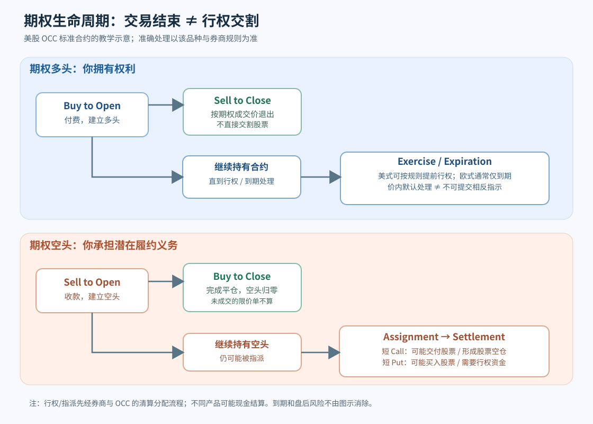

# L02｜你交易的究竟是哪一张合约？——期权链、开平仓、行权、指派与结算

> **专业教材级 v2.0｜共通基础 A｜先修：L01｜预计精读 70–100 分钟 + 习题 30–45 分钟**  
> 主要市场：美国交易所上市、由 OCC 清算的**标准股票期权**。本文特别标出指数、调整合约和券商差异。  
> **所有 ABC 数值为虚构教学行情**，不是可交易报价；费用、分红、价格冲击和融资默认忽略，只有明确提及处才计算。

## 五分钟总览：先记住六个事实

1. **同样显示“4.00”的期权，不一定是 400 美元的同一风险。** 必须核对标的、Call/Put、到期日、行权价、乘数、**实际交割物**、行权样式和结算方式。标准美股个股期权通常一张对应 100 股；调整合约不一定如此。
2. **买卖合约 ≠ 行权交割。** 买入开仓获得期权多头；卖出平仓通常只是出售该权利。卖出开仓承担短头寸义务；买入平仓是结束短头寸。买方行权和卖方被指派是另一套流程。
3. **美式/欧式说的是“什么时候能行权”，现金/实物说的是“如何结算”。** 这两个维度不能互相代替，也跟在美国还是欧洲上市无关。
4. **到期并非“市场收盘时自动清空所有风险”。** OCC 的美股标准期权通常有到期价内 0.01 美元/股的 *exercise-by-exception* 默认流程，但有相反行权指示、券商更早的客户截止、盘后变动与特殊合约。不能仅靠收盘价猜次日账户。
5. **价差组合的到期盈亏上限，不等于中途无资金或指派风险。** 如果空头腿被指派而多头腿尚未处理，会出现真实股票仓位、融资与隔夜风险。
6. **保证金是账户担保/清算约束，不是最坏损失。** 裸卖 Call 理论损失无上限；卖 Put 可能承受标的几乎跌至零的损失。现金担保 Put 也有股票跌价风险。

**本课验收问题**：你能读懂一个期权链报价，并画出一条“建仓→平仓/继续持有→行权或指派→交割”的可能路径吗？尤其要说清楚“到期价内”和“账户真的持有哪些股票”不是同一陈述。

### 三种阅读模式

| 阅读方式 | 推荐顺序 | 目的 |
|---|---|---|
| **速读 15 分钟** | §1 → §3 → §5 → §9 | 建立下单与到期风险直觉 |
| **完整教材** | §1–§11 + 习题 | 看懂一张真实期权链与可能发生的每种义务 |
| **进阶复盘** | §4 → §6 → §7 → §8 → §10 | 拆解交割流程、公司行动、保证金与异常情景 |

配套图： [L02 合约生命周期流程图](图解.svg)。习题与答案：[L02 专属教材级练习](习题与详解.md)。

---

## §1｜合约不是“代码+价格”：你必须知道交易的是什么

### 1.1 虚构 ABC 期权链中的一行

假设时间为 2026 年某交易日，ABC 股票现价 \(S=100\) 美元。你看到下面一行（数值只是教学输入）：

| 字段 | 教学内容 | 操作时必须理解的含义 |
|---|---|---|
| 标的 | ABC | 价格跟随哪只股票；有无特殊公司行动 |
| 合约类型 | Call | 看涨买权；持有人可按 K 买入 |
| 到期日 | 2026-12-18 | 权利的期限；并非“所有时候都能交易到收盘后” |
| 行权价 K | 100 美元 | 对标准实物交割股票期权，行权买/卖 1 股的基准价 |
| 期权代码 | ABC + 日期 + C + 行权价编码 | **标识**特定合约，不足以代表全部经济条款 |
| 买一价 Bid | 3.80 美元/股 | 通常是卖出时面临的报价，未必能足量成交 |
| 卖一价 Ask | 4.00 美元/股 | 通常是买入时面临的报价，未必能足量成交 |
| Bid/Ask 数量 | 假设 5/8 张 | 此一刻报价的可见规模，不是保证随时可按此量成交 |
| 成交量 Volume | 假设 600 张 | 当前交易日已成交量；不代表现在能立刻成交 |
| 未平仓量 OI | 假设 2,000 张 | 未了结合约量，通常并非交易所实时更新 |
| 乘数、交割物 | 100 股/张；实物交割 | 该张行权对应多少股票、交付现金还是其他标的 |
| 行权样式 | American | 到期前按规则可行权 |

### 1.2 用美元把一行报价读出来

买入 1 张 ABC 100 Call，假设你**真的以 Ask 4.00 成交**，乘数 \(N=100\)：

\[
\text{买方支付期权费}=4.00\times100=\boxed{\$400}
\]

\[
\text{标的名义规模}=S\times N=100\times100=\boxed{\$10,000}
\]

\[
\text{按 K 行权购买股票的现金金额}=K\times N=100\times100=\boxed{\$10,000}
\]

三个 10,000/400 的含义不能互换：**400 美元买到合约权利，并不是花 400 买到一万美元股票**；日后按合约行权，还可能需要承担股票的实际资金和交割责任。

卖出 1 张 Call 收到权利金，也不等于其风险只有 400 美元。卖方交付标的的义务要独立评估。

### 1.3 如何识别合约编号与 OCC/OSI 代码

交易界面可能展示较短的链式合约名，也可能展示按 *OSI* 风格编码的字串，通常包含**标的根代码、到期年月日、C/P 标识、按约定精度编码的行权价**。但：

- 不同经纪商显示可能不同；特殊根代码、调整合约与某些指数产品需单独核对。
- **代码只用来定位合约，不应用来推断“永远是100股”或“必然现金结算”。**
- 交易时以券商展示的产品描述、OCC/交易所合约规格及公司行动公告为准。

可以把“代码”看作货物条形码；真正有约束力的是**合同条款与交割物**。

### 1.4 Bid、Ask、Mid：净收益的第一道门槛

假如 Bid=3.80，Ask=4.00，中间价 \(3.90\) 并不意味着你一定能用 \(3.90\) 买到。

假设在报价未变化且不允许价差内改善成交的最不利示例下：

- 按 Ask 4.00 买一张，现金流 \(-\$400\)；
- 立刻按 Bid 3.80 卖出平仓，现金流 \(+\$380\)；
- 不计手续费，**即刻平仓亏 \(\$20\)**。

\[
\Pi_{\rm roundtrip}=(3.80-4.00)\times100=-\$20
\]

真实成交可能在价差内，且报价与深度一直变化；上式是**执行成本示范**，不是固定交易费用，也不是日后损失的预测。买卖价差、订单数量、手续费和潜在滑点共同决定策略“纸上盈利”能否兑现。

---

## §2｜四种交易指令，与“行权”究竟差在哪里

“买”“卖”只是方向，“开”“平”决定你在增加还是减少期权未平仓头寸。

| 指令 | 英文 | 交易之后（原有仓位假设适当） | 是否立即取得/交付股票？ |
|---|---|---|---|
| 买入开仓 | Buy to Open (BTO) | 建立期权多头 | **通常否** |
| 卖出平仓 | Sell to Close (STC) | 平掉原来的期权多头 | **通常否** |
| 卖出开仓 | Sell to Open (STO) | 建立期权空头 | **通常否** |
| 买入平仓 | Buy to Close (BTC) | 平掉原来的期权空头 | **通常否** |

这四种是**期权交易**。而：

- **Exercise（行权）**：持有期权的买方依据产品条款行使选择权。
- **Assignment（指派）**：清算和券商分配流程把对应履约义务分配给某个期权空头账户。
- **Settlement（结算/交割）**：真正履行由行权/指派或合约到期结算产生的现金/证券流转。

重要区别：**一个买方选择行权，不代表市场上某个特定卖方“直接跟他配对成交”**。OCC 先清算并分配给相关清算会员，再由会员/券商按获批准方法分配给客户短仓。卖方未必知道是谁行权。

### 2.1 完整实例：买入后不行权，也可以赚钱

你按 4.00 买入 1 张 100 Call。若后来这张期权卖出报价为 6.50，你按 6.50 **Sell to Close**：

\[
\text{期权净现金流}=(6.50-4.00)\times100=\boxed{+\$250}
\]

忽略费用。你没有因为这笔期权平仓而新买入 100 股 ABC；“股票涨到多少”影响了期权价格，但此笔已实现盈亏由**期权成交价**决定。

相反，若你要求**行权**，对标准 100 股实物交割 Call：理论上按 K=100 取得 100 股，支付 \(100\times100=\$10,000\)（再计已支付的期权费和可能的收费）。股票一旦进入账户，随后就有新的市场风险。

### 2.2 空头怎样结束真正的义务

你 Sell to Open 卖出一张 Put 收 2.00，之后 Buy to Close 按 0.50 买回：

\[
\text{已实现期权 P/L}=(2.00-0.50)\times100=\boxed{+\$150}
\]

在买回合约**完成平仓且头寸数量已正确归零**之后，原空头才不再承担该张的后续行权指派义务。**下单未成交、排队中、部分成交、或已有指派正在处理**，不能被当成“空仓已解除”。

这里有一个实操陷阱：如果你同时在股票上有独立多空头寸，平掉期权不自动平掉股票。务必分别核对**期权持仓、股票持仓、未成交订单、资金余额**。

---

## §3｜美式 vs 欧式、实物 vs 现金：是两条轴，不是一个标签

### 3.1 行权时机轴

- **美式（American-style）**：在合约规定的可行权期间内，通常允许到期日前的营业日行权。美股标准**个股股票期权**通常是美式。
- **欧式（European-style）**：通常只允许按产品规则在到期结算时行权；**不能因为股价中途到价内就提前行权**。
- 行权**权利**与在市场上的**可交易时间**也不同：欧式期权到期前通常可以交易平仓，并非只能一直持有。

### 3.2 交割资产轴

- **实物交割（Physical delivery）**：标准股票 Call 行权使持有人买入股票，Put 行权使持有人卖出股票；空头相反。
- **现金结算（Cash settlement）**：通过结算价值与行权价之差，按合约乘数折算**现金**，不交付股票。某些股票指数期权是此类型。
- **美元现金结算 ≠ 必然欧式**；实际上不同指数期权的行权样式可以不同。具体组合以交易所和 OCC 对**该产品**的说明为准。

### 3.3 三个反例，防止概念混淆

**反例 A：美国上市的美式股票期权**。它在美国上市，允许提前行权，通常交割股票。  
**反例 B：美国上市的欧式现金结算指数期权**。也是在美国上市，但到期行权通常只产生现金差额。  
**反例 C：某些指数期权可能采用美式、现金结算。** “现金结算”本身不能推出“只能到期行权”。

对现金结算指数看涨期权（设该合约乘数为 100 美元/指数点），如果结算指数点位 \(I_{\rm settle}=4{,}050\)，行权价 \(K=4{,}000\)：

\[
\text{合约行权结算现金}=\max(4050-4000,0)\times100=\boxed{\$5,000}
\]

这个 **\$5,000 是行权结算收入，不是扣除期权费后的净利润**。指数最终结算值的计算机制、结算时点（如某些产品的 AM/PM 结算）与期权最后交易时间都须按产品核实。不能简单拿日常看到的一个收盘指数替代结算指数。

---

## §4｜买方行权、卖方指派：从权利到股票账户的流程

### 4.1 买方选哪条路？

一张**多头** Call 如果还没到期，有四类可能结果：

1. **市场平仓**：卖出期权，结束多头；盈亏来自期权卖出收入减最初期权成本。
2. **继续持有**：持仓继续暴露于正股、剩余时间和 IV 的变化，同时需了解到期安排。
3. **主动提前行权**（仅对允许提前行权的产品）：放弃该期权并按合同交换资产/现金；可能舍弃剩余外在价值。
4. **到期行权或到期失效**：按产品适用规则及经纪商指示处理，并不保证“你以为的状态”等于最后交割状态。

是否应主动行权，先核对**按 bid 出售期权相对行权处理的经济价值**、外在价值、股息/借券、账户资金以及券商截止时间。不能仅凭“价内”决定提前行权。

### 4.2 OCC 与经纪商各做什么？

以下是美股/OCC 标准机制的**简化层级**，不是每家券商后台实现图：

**持有人** → 向**券商/清算会员**提交行权意向（或适用到期默认规则） → **OCC** 清算并分配行权通知给持有相应空头的清算会员 → **券商**按规则分配到客户短仓 → **股票/现金交割**。

- OCC 是清算组织，不是个人交易界面。散户一般通过经纪商管理行权请求。
- 卖方被指派不是“同一买家的直接交易”。只要美式短仓仍未平掉，就可能在适用期限内被指派。
- 标准股票期权行权引起的股票交割，一般遵循下一营业日 **T+1** 交割规范；个别特殊情况与产品另核对。
- **消息通知时间**和**经济义务发生时间**可能不一致；不能因为交易界面暂未看到股票就断言义务不存在。

### 4.3 为什么“我的期权已经没价值”不等于“不会再有股票”？

例如你持有 ABC 100 Call，股票到期收盘 100.02（每股价内 0.02）。此时该期权的**内在价值只有 2 美元/张**，但标准 100 股 Call 的行权会涉及约 10,000 美元的股票交换金额。若账户没有准备这么多可用资金，你可能仍要面对券商的提前平仓、自动处理、行权抑制或其他风险管理措施。

**微薄的到期价内金额，也能转成大额股票仓位。** 这就是到期风险与期权“贵不贵”完全不同的主题。

---

## §5｜到期日究竟发生什么：Ex-by-Ex、反向指示与盘后变化

### 5.1 0.01 美元/股是什么意思？

根据 OIC 对美国 OCC 标准股票期权的介绍，很多到期期权符合“**exercise-by-exception（例外行权，Ex-by-Ex）**”的默认规则：标准股票期权到期时**价内至少 \$0.01/股**，通常会按默认流程行权，除非持有人通过合规流程提交相反指示，或特定产品/停牌等规则另有处理。参见文末 OIC/OCC 官方资料。

这是**默认清算处理标准**，不是“持有人不能拒绝”，也不是“只要没到 0.01 就绝不会有人主动行权”。

### 5.2 为什么不能机械推断一定行权？

三类例外很重要：

- **Do Not Exercise (DNE)**：持有人可能按券商规定请求放弃对到期价内期权的行权。
- **主动行权虚值合约**：在适用规则和时限内，持有人可以请求与 Ex-by-Ex 默认处理不同的结果，可能与盘后事件、资产持仓或其他目的有关。
- **券商资金风控及截止时间**：券商对客户的截止时间、风险处理可能**早于**交易所或清算层截止；账户保证金不足时，券商可能提前关闭或做不同处理。

不能提供一个“所有券商、所有期权”的统一截止钟点。最后交易时间、截止、适用结算价要在交易当日核对**该券商和该期权品种**。

### 5.3 Pin Risk：盘后发生的事情可能改变结局

假设你**卖出开仓** 1 张 ABC 100 Call，到期日常规交易结束附近 ABC 股票为 **99.98**（略低于 K）。你以为 Call 虚值 0.02，肯定不会指派，于是直接关掉电脑。

但盘后有突发消息，股价跳到 **101.50**；持有人在可接受的截止前可能按有效指示行权。你作为短仓**无法决定自己是否被指派**。

可能出现的结果：

- 你原本没有持有股票，被指派后需要按 **100 美元/股交付 100 股**；
- 若无正股可交，账户可能产生**卖空 100 股**的持仓及后续融资/借券风险，具体受券商和市场规则制约；
- 下一交易日股价继续大涨，短股票仓位的风险与“期权到期利润图”会出现不同的账户路径。

这不意味着盘后股价变化会自动重算所有 Ex-by-Ex 规则：**关键在持有人的合法指示、清算所依据的结算值、时点与券商处理。** 所以结论只能是“可能发生”，不能写成“盘后涨就一定被指派”。

### 5.4 另一个容易误判的组合：Bull Call Spread

你买 1 张 95 Call、卖 1 张 100 Call（同到期，标准实物交割合约）。教材里常写“最大到期盈利 = 价差宽度减净权利金”，但现实到期时：

- 如果长腿价内且按规则行权，账户可能**买入** 100 股 @95；
- 如果短腿未被行权/指派，你**不会自动**同时卖掉这 100 股 @100；
- 你因此可能带着 100 股股票过夜，股票隔夜波动能让**实际账户结局**偏离只按同一期权终值画出的损益表。

反过来，如果短腿被指派而长腿未按预期处理，也会有类似的额外股票和资金风险。**价差“理论最大损失封顶”依赖对到期两条腿恰当处理的结算假设，不能理解成“无需管理到期持仓”。**

---

## §6｜提前指派：除息日前为什么空头 Call 要多看一眼

### 6.1 除息前深度价内 Call

假设 ABC 股价 110，某张**美式** 100 Call 期权中途市场价格 10.15：内在价值 10，外在价值仅 0.15 美元/股。假设股票**即将除息，每股现金股息 0.80 美元**。

持有人如果提前行权，可能在除息前拿到股票及对应股息资格；是否经济上合理，还取决于**放弃的外在价值、资金时间价值、交易成本、股票/股票借券及执行条件**。在这一组简化数字中，股息 **0.80 大于外在价值 0.15**，意味着持有人**可能有动机**考虑提前行权，但**不能仅凭这两个数字保证一定行权**。

对**卖出该 Call 的人**：

- 如果已持有 100 股作 Covered Call，被指派可能提前卖出股票，改变持股与股息归属。
- 如果是裸 Call，被指派可能产生短股票与相关股息责任，另有借券和资金成本。
- 即使原计划到期前才处理仓位，行权权利属于持有人，不能保证卖方等到计划时间。

### 6.2 深度价内 Put 也会提前指派

Put 需要单独理解。深度价内的美式 Put 在某些资金条件下可能有提前行权激励；空头被指派后，需按 K 买入股票，并承担后续正股市场风险。不能因为“没有除息”就断言空头 Put 到期前绝不被指派。

下一阶段 L19 将详解**除息、公司行动、提前行权选择**。本课只要求在建仓前识别风险、了解通知和资金后果。

---

## §7｜拆股、合并、特别股息：合约乘数不总是100

### 7.1 为什么公司行动会改变旧合约？

普通 100 股标准合约，如果标的发生拆分、合并、特别分配、并购等公司行动，OCC 可能公告合约调整，包括：

- **交割单位**变化：可能变成非 100 股、若干其他证券、现金，或者多种资产混合；
- **行权价 / 合约数量 / 乘数或 root** 变化；
- 结算价格的口径不同，期权软件看起来的“每股报价”不能再按标准股数机械折算。

合约的*deliverable*（交割物）比“表面乘数”更关键。**调整后合约在报价、行权和盈亏计算上可能有非标准细节**，要看 OCC 官方 adjustment memo 和券商该合约详细描述。

### 7.2 一个只有教学意义的拆股算例

假设原来一张 100 股交割、K=100 的期权，正股发生**假设的 2:1 普通拆股**。为保持原来同等名义经济权利，在一种常见调整实现中，可能出现**合约数量增加、行权价减半、每张仍100股**等处理。

原来潜在交换额 = \(100\times100=\$10,000\)。调整后如果对应为两张各 K=50 且各交割 100 股，则合计交换额 \(2\times50\times100=\$10,000\)。

**这是为了训练“经济等价检查”的示意，不是保证每一次拆股都按上述机制调整。** 具体由 OCC 通告决定。对反向拆股、并购、特别股息尤其不能擅自假设比例等价。

### 7.3 合约调整审阅四问

1. 这是不是标准合约？是否存在特殊 root / adjustment 标记？
2. 一张**实际**交割什么，数量几何，含不含现金成分？
3. 行权价、乘数、张数、到期日和券商显示的报价单位是否变了？
4. 能否用“旧合约总经济交换额 / 新合约总经济交换额”复核？**不吻合要先暂停，查公告**。

---

## §8｜保证金与最大损失：不同账户同一策略也可能不一样

### 8.1 买方与卖方的风险不是镜像

对普通**已付清权利金**的买入 Call/Put，且不考虑随后行权形成的股票头寸，单腿最坏直接损失通常为付出的权利金。但卖方风险是承担履约：

| 头寸与简化条件 | 最多赚 | 理论最坏到期结果 | 账户可能追加的风险 |
|---|---|---|---|
| 买 Call K100 费4 | 股价上涨无固定上限 | 亏 400 | 行权后持股票或券商到期处理 |
| 卖 Put K90 收2 | 赚 200 | 亏 \( (90-2)\times100=\$8,800 \) | 跌价、接股、保证金上升或被强平 |
| 卖 Call K110 收2，**无正股保护** | 赚 200 | 理论损失无上限 | 指派后可能短股票/股息/借券 |
| Cash-Secured Put K90 收2 | 赚 200 | 同裸卖 Put 的股票价格最坏结果 | 虽预留约9,000现金，仍承受跌价 |

到期函数与 L04 会更完整展开；本课重点是**不要把账户初始冻结金额误认为亏损上限**。

### 8.2 Reg-T 与组合保证金（Portfolio Margin）只说最关键的区别

- 普通保证金账户依券商/监管框架和产品组合设初始、维持要求；部分头寸可能按公式或对冲结构抵减。
- 组合保证金可能根据**整个组合情景损失**计入相关性和对冲，但“当前保证金低”不等于真实损失低，更不保证极端行情资金占用不会突然跳升。
- 不同账户类型、市场权限、跨币种借贷、分红与券商 house margin 会影响结果；尤其不要假设某一固定百分比的通用保证金规则覆盖所有账户。

专业习惯是分开记录：**（a）到期理论最大损失，（b）当前可用资金，（c）被指派之后所需履约现金/证券，（d）中途压力情景需要的额外保证金。**

### 8.3 一个期权腿风险“只有400”却能诱发账户问题的例子

持有一张 K100 Call，期权费已经付 400。如果到期股价 100.02、按标准规则进行实物行权，就可能涉及买入 100 股，交换额 **\$10,000**。这**不意味着这张多头期权本身的最大期权费损失超过 400**，而是说明**行权可能建立一个新的股票头寸**。券商也可能在到期前限制或处理这类不足资金的仓位。

同样的理由，**现金结算的指数期权**和实物交割股票期权，账户处理不能用一张万能表说明。

---

## §9｜“到期前一日”的实操核对卡

对真实交易，不能只看“明天股价大概率不会到 K”。你需要确认的是：

| 检查项 | 应获得的证据 | 何时必须动作 |
|---|---|---|
| 产品类型 | 标的、Call/Put、American/European、physical/cash、交割物 | 发现是调整合约、非标准指数或不清楚条款 |
| 截止与结算 | 最后交易时段、券商客户指示截止、行权结算取值时点 | 即将到期、存在盘后事件 |
| 持仓方向 | 多头/空头、张数、其他腿与股票头寸 | 裸短腿、已有价差 |
| 资金 | 现金、保证金、行权后的股票方向与金额 | 账户可能买/卖100股而准备不足 |
| 执行价格 | 当前可实现 bid/ask、可交易量和限价订单状态 | 价差过宽、订单未成交 |
| 事件风险 | 分红/除息、公司行动、财报、盘后公告和停牌 | 指派或自动行权可能改变账户 |

**一个可靠的停止条件**：如果你无法明确说出“明天账户可能多或空多少股、需要多少现金、最坏行情下一步如何处理”，那就不应该把“等待到期”当成默认策略。可以研究提前平仓或更简单的仓位处理，但以真实账户、限价和交易权限为准。

---

## §10｜六种最容易造成真金白银损失的误解

**错① “股票期权永远每张100股。”**  
标准合约通常如此，但企业行动可能调整合约交割物。后果：现金需求和实际标的数量计算错误。

**错② “我的期权已经价内，自动行权总是利好。”**  
价内的**期权腿**可能有正内在价值，行权产生的股票却可能需要大额融资并承担隔夜行情。后果：买到了超出风险预算的股票。

**错③ “我卖出期权之后可以决定是否被指派。”**  
卖方没有此选择权，能控制的是事前仓位、可执行平仓、风险与资金准备。后果：按计划未到期却提前交割股票。

**错④ “欧式合约不能提前交易平仓。”**  
欧式限制的是提前**行权**，不是通常情况下的市场**平仓**。后果：错失退出机会或错误预期账户处理。

**错⑤ “价差理论有限风险，因此到期完全不用管。”**  
不同腿的行权/指派路径可能不同，盘后和账户股票持仓会造成额外风险。后果：意外多头/空头正股、融资/借券风险。

**错⑥ “卖 Put 保证金只冻结2,000，就说明最多亏2,000。”**  
资金担保额与损失上限不是同一个变量。后果：市场暴跌时本金亏损远超初始冻结额。

---

## §11｜本课的专业验收与下一章边界

如果你能**不看答案**完成下面五项，这一课就真正学会了：

1. 给一行期权链，算每张权利金、标的规模、行权交换金额；识别Bid/Ask和中间价差异。
2. 解释 Buy to Open、Sell to Close、Sell to Open、Buy to Close 与行权/指派在**现金流与证券流**上的不同。
3. 按条款区分美欧式与现金/实物结算；遇到公司行动不能默认100股。
4. 说明 Ex-by-Ex 默认行权、反向指示、卖方指派和盘后 pin risk；**不能用收盘价保证账户最终仓位**。
5. 在 Put、Call 和垂直价差中分清**到期理论损益、途中股票/现金义务与保证金风险**。

配套 [L02 教材级 14 题与逐题详解](习题与详解.md)。原第一批 L02 的 3 道基础练习也继续保留：[第一批原练习](../../references/练习-第一批.md)。

**边界**：本课不是复杂组合策略教学（L14–L16），也不把股票 IV 波动的定价公式提前塞进合约章节（L03–L09）。关于除息和合约调整的进阶定价将在 L19 完整分析，今天先把**交易生命周期、交割与风险识别**打牢。

### 核查资料（2026-10-08；均为官方说明）

1. [OCC — Equity Options 产品规格](https://www.theocc.com/clearance-and-settlement/clearing/equity-options-product-specifications)：标准股票期权 100 股、调整合约、行权样式及 T+1。
2. [OCC — Index Options](https://www.theocc.com/clearance-and-settlement/clearing/index-options)：现金结算指数、不同美/欧式、最终结算取值规则。
3. [OIC — Options Assignment FAQ](https://www.optionseducation.org/referencelibrary/faq/options-assignment)：空头指派随机分配、除息附近风险和到期 0.01 处理。
4. [OIC — Options Exercise FAQ](https://www.optionseducation.org/referencelibrary/faq/options-exercise)：期权多头行权、日历价差及股息风险。
5. [OIC — Understanding the Life Cycle of an Option Trade](https://prd-web.optionseducation.org/news/understanding-the-life-cycle-of-an-option-trade)：Ex-by-Ex、反向行权指示与买方/卖方流程。

**规则变化优先级**：以上用于识别美国/OCC 标准机制；具体下单是否可行、客户指示截止、券商提前平仓和账户追保规则，最终以你的券商当天正式条款为准。
