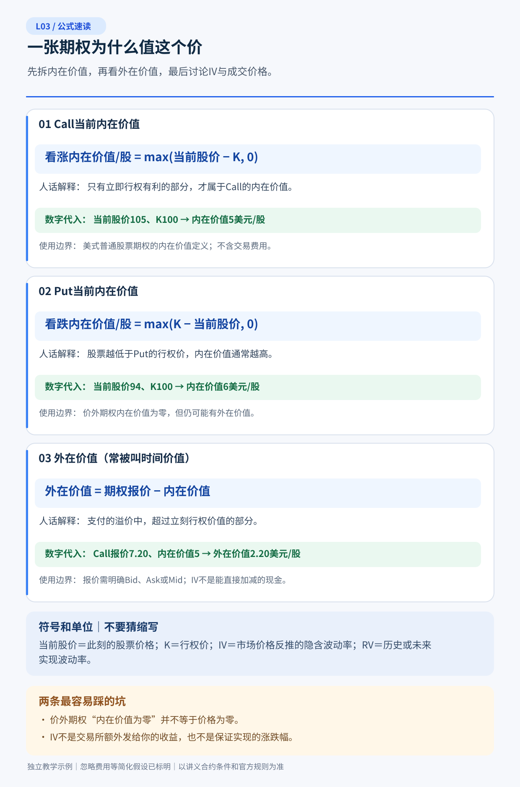
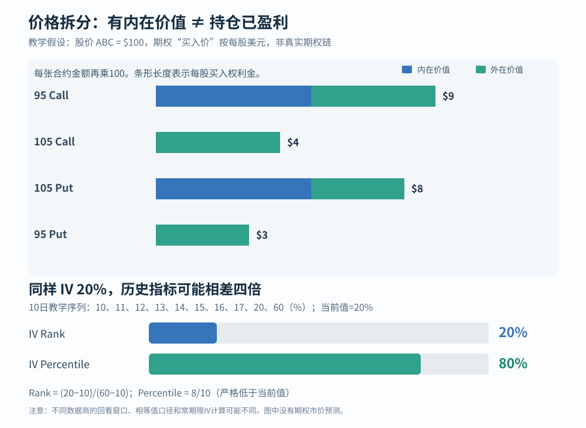

# L03｜期权为什么值这个价格？——内在价值、时间价值、隐含波动率与交易成本

> **专业教材级 v2.0｜共通基础 A｜先修 L01–L02｜预计精读 80–110 分钟 + 习题 35–50 分钟**  
> 以**美股标准股票期权**为主要教学环境；如未另写，假设一张交割 100 股、报价为美元/股。所有 ABC 行情、IV 序列和事件价格都是**人为设定的教学数据**，不是实际可交易合约和实时信息。本文不提供具体交易建议。

## 5 分钟读懂：七个结论

1. **权利金（premium）是你支付或收取的期权交易价格，不是超额收益。** 例：股价 100、95 Call 报价 9，内在价值 5，外在价值 4；105 Call 报 4，内在价值 0、外在价值 4。
2. **内在价值与“到期利润”不同。** 期权现在有 5 美元内在价值，也不表示扣除买入权利金后已赚 5 美元；行权和卖出平仓更不是同一种现金流。
3. **外在价值来自定价中的未来不确定性及资金、股息等因素，不是简单每日平均扣掉的“时间手续费”。** 一般情况下到期临近，其他条件不变的多头期权外在价值趋于消失；但途中报价不一定单调下跌。
4. **IV（隐含波动率）是从期权市场报价中反解出的“定价参数”，不是股票上涨概率或一定实现的未来波动率。** 不同到期、行权价、模型、Bid/Ask 会产生不同 IV。
5. **历史波动率是已经发生的价格变化，IV 是市场期权价格所隐含的模型输入。** 对比必须对齐期限、事件、采样、年化单位，且不能仅凭 IV 高于历史波动就判定卖出期权有优势。
6. **IV Rank 和 IV Percentile 不是同一个分位。** 一次历史极端值可能让 Rank 很低、Percentile 却很高；指标必须标注回看窗口、输入口径与计算方法。
7. **“看对方向”可能被买入价格、时间流逝、IV 下降及买卖价差抵消。** 同样，卖方收时间价值也必须承担跳空与肥尾损失，不存在无风险“赚 Theta”。

### 阅读导航

| 路线 | 推荐阅读 | 目标 |
|---|---|---|
| **15 分钟概览** | §1、§2、§5、§9、§11 | 不混淆内在、外在、IV 和利润 |
| **完整教材** | §1–§11 + [配套详解](习题与详解.md) | 从报价到情景分析的完整链条 |
| **专业复习** | §3、§4、§6、§7、§8 | 理解局部模型、IV 结构及事件后的再定价 |

图示：[权利金拆分与 IV Rank/Percentile 对比](图解.svg)。习题另存 [L03 教材级 14 题](习题与详解.md)，原第一批 L03 三道题依然保留在 [原练习](../../references/练习-第一批.md)。

---

## 本课公式速读图｜先看人话，再看推导

> 下图给出本课核心公式与计算判断的**独立教学示例**。请先看名称、代入和使用边界，再读正文完整推导；原有收益图仍保留。

---

## §1｜先把四个价格分清：市场报价、成交价、内在价值与利润

### 1.1 一张标准合约也有几种不同“价格”

假设虚构股票 ABC 当前 \(S=100\) 美元，某 Call 的行权价 \(K=95\) 美元，市场报价为 Bid=8.80、Ask=9.00（每股美元）。假定你**真的以 9.00 买到**一张标准 100 股合约：

- **买方支付权利金**：\(9.00\times100=\$900\)。
- **内在价值**：\(100-95=5.00\) 美元/股，即 \(\$500\)/张。
- **外在价值（相对买价）**：\(9.00-5.00=4.00\) 美元/股，即 \(\$400\)/张。
- **如果立即以 Bid=8.80 卖出平仓**：现金净损益 \( (8.80-9.00)\times100=\mathbf{-\$20}\)（暂不计费用）。

**“花 900 买了一个有 500 内在价值的合约”不等于“亏 400”。** 剩下的 400 是你购买的其他价值部分；能否卖出、按什么价卖出，才决定中途已实现收益。此刻反手平仓的 20 美元亏损来自**成交买卖差价**。

> 单位纪律：股价、权利金、行权价一般为美元/股；仓位金额为美元/张。不要在公式中多乘或少乘 100。

### 1.2 术语规范：不要见“溢价”就想当然

| 中文容易混淆的说法 | 更精确的表述 | 常见错误 |
|---|---|---|
| Premium / 权利金 | 市场的期权价格，成交时按每股价×合约乘数 | 当成期权费之外额外加收的“溢价” |
| Intrinsic / 内在价值 | 立即行权的正向经济价值（简化股票模型） | 当成已扣成本的投资利润 |
| Extrinsic / Time value / 外在（时间）价值 | 市场权利金减内在价值的差额 | 当成“每天固定支付的利息” |
| Premium / Spot | 权利金占股票现价的比率 | 当成净回报率或可安全年化的收益 |
| Relative richness / 相对定价贵 | 在**明确模型假设和可执行成交价格**下比较的相对差额 | 把“模型估值”视作可以无风险套利的真值 |

本课优先使用**权利金、内在价值、外在价值**，并把盈利/亏损留给**已付款、已收款与当前/终值的比较**。

---

## §2｜内在价值：ITM、ATM、OTM 与四个统一示例

### 2.1 两个公式

对每股报价的标准股票 Call 与 Put，正股现价 \(S\)、行权价 \(K\)：

\[
\text{Call 内在价值}=\max(S-K,0)
\qquad
\text{Put 内在价值}=\max(K-S,0)
\]

- **ITM / 价内（实值）**：Call 的 \(S>K\)，Put 的 \(S<K\)。
- **ATM / 平值**：\(S\) 约等于 \(K\)（价内/价外临界附近）。
- **OTM / 价外（虚值）**：Call 的 \(S<K\)，Put 的 \(S>K\)。

**价外不等于毫无价值。** 期限尚存时，价格可能改变，未来的选择权可以被交易市场定价。ATM/OTM 期权的即时内在价值为零，不意味着权利金为零。

### 2.2 主案例：四张期权拆分

假设同一时刻 ABC 现价 \(S=100\)，下表“买价”是为了让计算可复算而设定的虚构 Ask；并未声称这四份报价在真实市场由同一波动率曲面共同产生。

| 合约 | 假设期权买价/股 | 即时内在价值 | 外在价值＝买价－内在 | 价内/价外 |
|---|---:|---:|---:|---|
| 95 Call | 9.00 | 5.00 | 4.00 | ITM |
| 105 Call | 4.00 | 0 | 4.00 | OTM |
| 105 Put | 8.00 | 5.00 | 3.00 | ITM |
| 95 Put | 3.00 | 0 | 3.00 | OTM |

以 105 Call 为例，持有人现在选择按 105 买市场价值 100 的股票没有正收益，所以内在价值是零；但它在到期前仍可能因为股票上涨或市场 IV 变动而被人以 4 美元/股买卖。

以 105 Put 为例，当前即时行权的经济价值是 \(105-100=5\)；若以 Ask=8 买入，另有 3 美元/股外在价值，并非已经“净赚 5 美元”。

### 2.3 无套利下界：重要但不能误用

对**可立即行权的美式股票期权**，理想的可执行、无摩擦市场下，期权理论价值不应低于即时行权价值：

\[
V_{\rm American}\geq \text{Intrinsic}
\]

这说明为什么一个“股价110、K100美式Call”的**理论价格**不应合理地低于 10；但真实屏幕 Bid 可以低于内在价值，原因可能是报价更新、深度、流动性、执行与行权成本。不能把某档不可成交的低 Bid 当成低于内在价值的无风险买入机会。

对**不能提前行权的欧式期权**，特别是有股息和融资效应时，不能不经限定地套用美式的“随时行权下界”。因此“外在价值＝市价－即时内在价值”作为市场语言可以使用，但遇欧式、特殊资产、负利率/分红、合约调整、异常价格时，**外在部分可能显示负数或需改用远期/无套利框架**，并不代表可以凭空锁定收益。

---

## §3｜为什么还有外在价值：时间、波动率和持有成本

### 3.1 直觉先行：它是未来机会的价格，而非“时间利息”

想象两份同标的、同K的 Call：

- A 明天到期；
- B 90 天到期。

如果今天正股仍低于 K，B 拥有更长时间可能到价内，通常能卖出更高的价格。这背后还有模型与资金条件：**“期限越长，权利金必然更高”不是所有欧式资产与分红/利率条件下无条件成立的定律**，比较必须锁定其他输入；对一般可提前行权的美式同条款期权，较长期的行权选择集通常包含短期选择集。

### 3.2 影响权利金的六类变量

| 变量 | 直观作用 | 为什么不能孤立看 |
|---|---|---|
| 标的价格 \(S\) | 股价上涨通常有利 Call、不利 Put | Delta 随 K、时间和 IV 变化 |
| 行权价 \(K\) | 改变现在与未来到价内的门槛 | 同一权利金不代表同一风险 |
| 剩余期限 \(T\) | 更多时间意味着更多路径可能 | 对不同条款需考虑融资、分红和事件 |
| 预期/隐含波动 \(\sigma\) | 在常见模型下波动越大，双向选择权通常越值钱 | 高 IV 不一定是独立交易优势 |
| 利率、资金成本 \(r\) | 影响期权与延后支付行权资金的相对价值 | 对深度价内或长期限更应关注 |
| 股息、公司行动 \(q\) | 改变远期价格、提前行权动机及经济权利 | Call/Put 反应不同，不能只看现价 |

其中**外在价值不是单独某一种“时间”资产**。它是用市场期权价格扣除内在价值得到的剩余，反映多种因素和供需的共同结果。

### 3.3 时间价值衰减不是每日等额扣款

你以4美元买入105 Call，并不意味着40天到期就“每天扣0.10美元”。时间剩余越短，期权的价格非线性通常越明显，尤其接近平值时：

- **Theta**：期权理论价格对时间推移的局部敏感度（具体符号/单位以L06定义）。
- **Gamma**：Delta 随股价变化的敏感度；临近到期、接近平值时风险可迅速增加。
- **Vega**：期权价格对 IV 参数变化的局部敏感度，通常多头 Call/Put 为正，但不是在所有资产/模型/路径上都保持固定。

**一句话：买方支付外在价值，不是在按时钟机械扣费，而是在承担随时间、波动与标的路径变化的非线性风险。** 卖方不能因为估计Theta为正，就忽略Gamma和隔夜跳空。

---

## §4｜到期前价格与到期内在价值不是同一个表

以买 105 Call、实际成交价4、乘数100为例（和L01一致）：

到期的**经济净损益**是：

\[
\Pi_T=N[\max(S_T-105,0)-4]
\]

若仍有剩余期限、实际能以 Bid \(b_t\) 卖出平仓，则**可实现期权腿净损益**是：

\[
\Pi_{\rm close,t}=N(b_t-4)-\text{交易总费用}
\]

设定两种独立、并不模拟同一条IV曲面的教学路径：

| 路径 | 当时股价 \(S_t\) | 剩余时间 | 实际假设 Bid | 平仓净损益/张（不计费） |
|---|---:|---|---:|---:|
| A | 107 | 30天 | 6.20 | **+\$220** |
| B | 108 | 10天 | 3.70 | **−\$30** |
| 同样108持有到期 | 108 | 0 | 到期经济价值3.00 | **−\$100** |

路径 A 说明到期的 \(K+c=109\) **并非途中平仓的盈亏分界线**。路径 B 说明看对上涨8%仍可能因为买入价格、期限及IV变动亏损。

**严格补充**：对正常可提前行权的美式股票 Call，理想无摩擦价值有即时行权的内在价值下界。因此，如果正股已上涨到 \(S_t>K+c\)，就不能泛称“因Theta令这张美式Call理论上仍亏损”；若现实成交损失，必须检查**Bid、手续费、执行摩擦、异常报价或不同交割物**。这是防止用“时间损耗”解释一切的关键逻辑。

---

## §5｜什么是隐含波动率 IV：如何从市场价格“倒推”出来

### 5.1 一个定价模型的正向和反向问题

普通期权定价模型的输入常可写成：

\[
C_{\rm model}=f(S,K,T,r,q,\sigma;\text{合约样式、模型})
\]

**正向**：假定 \(S,K,T,r,q,\sigma\) 等参数，模型计算期权理论价格。  
**反向**：观察到市场成交/报价 \(C_{\rm market}\)，保持其他模型输入，寻找某个 \(\sigma_{\rm IV}\) 满足：

\[
f(S,K,T,r,q,\sigma_{\rm IV})\approx C_{\rm market}
\]

这个反推的 \(\sigma_{\rm IV}\)，就是**该合约、该模型、该报价时点下的隐含波动率**。它反映市场给这个风险合约的价格如何映射成波动率参数，**不是“下个月必定实现波动率X%”的承诺，更不是上涨概率**。

- **IV为年化数值**：例如 30%/年，通常是波动率尺度（标准差意义）；不是30%预期收益率，也不是30%未来价格涨幅。
- 不同合约**不同 IV**：例如45天K95 Put与90天K110 Call，各有市场价格，可有不同的反推结果。
- **模型影响 IV**：Black–Scholes/Black–Scholes–Merton、针对美式股票期权的模型、分红假设不同，会改变反推口径。BSM 的推导在 L09 选学，今日只讲使用限制。
- **Bid/Ask 会产生 IV 区间**：流动性差的期权，即使中间价隐含IV好看，买卖任一侧的可执行价格也可能令判断反转。

### 5.2 同一期权 IV 上涨通常意味着什么？

以普通非负Vega的多头期权为例，其它参数近似不变时，模型IV提高，Call 和 Put 的理论价格通常同时上涨。因为它们都是对较大向上/向下波动具有选择权的合约。

这是**“固定其他因素”的比较**。现实IV、正股、期限往往同步变化，不能推出“买Call看到IV涨，必然赚钱”；你还需要知道是否真的成交、正股方向、Theta和费用。更不能由 IV 上升推出股票上涨或下跌的方向。

### 5.3 一个局部敏感度实验：股价上涨，期权估值仍可能下降

假设（**仅为数学演示，不代表真实期权链中互相校准的Greeks**）某 Call 当前：

- Delta = 0.35（股价每涨1美元，理论期权价局部约增加0.35美元/股）；
- Vega = **每IV增加1个百分点**，期权价理论增加0.12美元/股；注意这里Vega采用“每百分点”单位，而非把0.01与1混写；
- Theta = 在其它因素不变时，**每经过1天**期权理论价局部降低0.08美元/股。

如果接下来股价上涨2美元、IV下降5个百分点、又经过2天：

\[
\Delta V_{\rm approx}
=0.35\times2+0.12\times(-5)+(-0.08)\times2
=0.70-0.60-0.16
=\boxed{-0.06\ \text{美元/股}}
\]

对一张100股标准期权，**局部理论估值约下降6美元**，尽管股票上涨2美元。这里已经发生三个变量变化，因而不能把结果解释为“股票涨、Delta仍预测看涨却失灵”；模型只是在把多个敏感度影响相加。

**边界比结果更重要**：跨两美元股价和五个百分点IV变化时，Delta、Vega、Theta本身也在变化，Gamma与交互项可能不可忽略；成交价还会有Bid/Ask。这是**一阶近似的方向感练习，不是逐日精确盈亏预测**。L05–L08将给出这些局部参数的严格定义。

---

## §6｜历史波动率/实现波动率：怎样实际算一个数

### 6.1 定义区别

- **历史波动率 HV**：选定过去的价格观察窗口，计算该段价格变动的统计波动。
- **实现波动率 RV**：对指定**已经实现的**期间和抽样频率计算，例如未来一个月过去以后才知道它的30天RV。HV和RV在很多实际语境有重叠，但强调的评价时段不同。
- **IV**：从当前期权报价反推的模型参数（年化），未观察到未来路径。

一种经典的日收益年化波动率统计方法：

\[
r_i=\ln(P_i/P_{i-1}),\quad
\bar r=\frac1n\sum r_i,\quad
s=\sqrt{\frac{\sum(r_i-\bar r)^2}{n-1}},\quad
\sigma_{\rm annual}=s\sqrt{252}
\]

这里 \(252\) 是常见的**交易日年化假设**，并非所有期权交易都统一的日历天基准。比较IV与HV前，必须解决日历/交易日、事件、窗口与定义差异。

### 6.2 四个假设日收益：用计算器复现

取四个**教学假设的日对数收益率**：+1%、−1%、+2%、−2%，均值0。

\[
s^2=\frac{(0.01)^2+(-0.01)^2+(0.02)^2+(-0.02)^2}{4-1}
=\frac{0.0010}{3}\approx0.00033333
\]

\[
s\approx1.82574\%\ \text{/日},\qquad
\sigma_{\rm annual}\approx1.82574\%\times\sqrt{252}\approx\boxed{28.98\%}
\]

这不代表该股票“真实未来波动率28.98%”：4个观测样本过小，且存在跳空/非正态/波动聚集风险。它只告诉你**如何按统一公式得到一个历史统计量**。

如果某45天期权的IV显示35%，你只能说“在当前各自定义下，35%大于这段28.98%的历史估计”；不能因此认为“卖出波动率就赚6个百分点”。IV与RV之间存在风险溢价、事件、采样和对冲成本，卖方即使均值看似有利也可能遇到灾难性跳空。

---

## §7｜IV Rank 与 IV Percentile：同一个IV也能给出两个不同结论

### 7.1 两种定义

先固定一条可比的**IV序列**，例如同一标的、同一期限附近、同种聚合方法，历史观察窗口为10日（这里只为手算）。假设10个已观测IV百分比：

\[
[10,11,12,13,14,15,16,17,20,60]\%
\]

当前IV为 **20%**（为让例子可复算，设当前观察包含于10日样本）。

**IV Rank（位置）**：

\[
\text{Rank}=
\frac{IV_{\rm now}-IV_{\min}}{IV_{\max}-IV_{\min}}\times100\%
=\frac{20-10}{60-10}\times100\%=\boxed{20\%}
\]

**IV Percentile（历史占比）**：如果定义为“历史样本中**严格低于**当前IV的比例”，则有8个观测 10–17 小于20：

\[
\text{Percentile}=\frac8{10}\times100\%=\boxed{80\%}
\]

一个高到60%的**历史极端点**，拉大Rank的分母，却几乎不改变观测序列的排序。因此“Rank低，Percentile高”**不矛盾**。

### 7.2 为什么不同软件的值不一样？

- 有的数据商比较**不含当前日**的此前252日，有的包含当前日；样本量和边界不同。
- Percentile 是“严格小于”还是“低于或等于”，遇到相等值结果不同。
- 有的使用ATM IV，有的使用30日常期限IV或指定合约IV；历史数据的回补/清洗也不同。
- 如果 \(IV_{\max}=IV_{\min}\)，Rank分母为0，**必须标为未定义**，不能默默记为0%。

**完整表述示例**：“按同一数据商的 30天常期限ATM IV、过去252个交易日、以严格小于计，今天的IV Percentile为80%。”脱离数据定义的“IV 80分位”不可复现。

### 7.3 不要把80% Percentile直接转成卖方信号

IV指标只告诉你**历史相对位置**，不能告诉你未来是否出现财报跳空、公司事件或市场流动性崩溃。选卖方或买方，需要回答**现价所隐含的风险补偿是否足够**，并考虑Gamma、现金保证和策略最大损失。仅靠历史位置决定是否交易，是把统计排名误当作未来条件概率。

---

## §8｜波动率不是单一数字：期限结构、偏斜和事件风险

### 8.1 同一个标的可以有一整张IV“曲面”

期权的IV依赖 \(K\) 与 \(T\)（还依赖模型和时点）。把同到期各行权价的IV连起来，叫**波动率微笑/偏斜**；把同一个参照位置的不同到期IV连起来，叫**期限结构**。

假设（全是教学数）：

| 期权切片 | 假设 IV |
|---|---:|
| 近月 ATM | 45% |
| 近月 较低K Put | 60% |
| 远月 ATM | 30% |
| 远月 较高K Call | 34% |

不能把“近月60%”对“远月30%”直接称为无风险价差——它们不同期限、不同K、不同尾部暴露。更不能把一个0DTE期权的IV代表全公司的“市场IV”。

### 8.2 为什么财报前近月IV可能特别高？

如果短期限包含一场财报发布，市场把一次事件的不确定性计入覆盖该事件的期权价格。财报后剩余不确定性下降，期权报价反推的IV**可能大幅下降（IV crush）**。

**注意两层含义不同：**

- 事件公布后**剩余期限的模型IV下降**，在其他条件固定时对正Vega多头不利；
- 但同一夜股票**可能大幅跳空**，实际标的变化带来的收益/亏损可能远超IV变化的影响。

因此“高IV就卖出跨式”、“财报后IV会跌所以做空波动”都没有自动的正期望证据。卖方的极端亏损和保证金路径必须被记录。

### 8.3 “ATM Straddle 市场预期涨跌幅”有多准确？

市场常用一个**启发式指标**：

\[
\text{跨式权利金占现价比}=
\frac{\text{同K、同到期的ATM Call价+ATM Put价}}{S}
\]

例如正股100，覆盖财报的ATM Call每股6、ATM Put每股5，则跨式每张合计权利金 \(11\times100=\$1,100\)，比正股现价约 **11%**。

**这不是“财报有68%概率在±11%以内”的严格统计结论。** 跨式价格还包含剩余期限、风险溢价、偏斜、利率/股息和流动性，启发式并不等于风险中性或真实世界概率区间；不能混同“IV×平方根时间”的模型量。精确定价与事件归因留到 L09、L13、P02。

---

## §9｜案例：看对财报上涨仍亏钱，买方与卖方都不能只看方向

### 9.1 买方被高权利金“吃掉”的情景

假设财报前ABC股价100，买入1张K105 Call，**实际每股买价7**，合约乘数100；忽略费用。若到期股票为110：

\[
\text{到期内在价值}=110-105=5
\]

\[
\Pi_T=100[\max(110-105,0)-7]=\boxed{-\$200}
\]

正股上涨10%，Call仍亏200；到期盈亏平衡价是 \(105+7=\boxed{112}\)。这说明市场在买价里已经计入了昂贵的未来可能性。

### 9.2 事件之后的途中再定价：不同情景同时考虑

假定相同的7美元买价、财报后的**实际可卖出 Bid**如下（教学数据，不是模型计算或真实期权链）：

| 情景 | 财报后股价 | 仍剩余期限 | 假设平仓 Bid/股 | 平仓净损益/张 |
|---|---:|---|---:|---:|
| 看对但涨幅不足 | 110 | 20天 | 5.60 | −\$140 |
| 涨幅强得多 | 120 | 20天 | 15.50 | +\$850 |
| 方向失误 | 90 | 20天 | 0.80 | −\$620 |
| 小幅上涨、流动性差 | 108 | 5天 | 3.10 | −\$390 |

检查这四份示意 Bid 均不低于同一时刻对美式 Call 的正部内在价值：110→5.00；120→15.00；90→0；108→3.00。**只有满足合同经济约束的教学数据才适合作为案例**，否则容易把错误的 IV crush 故事说成规则。

这些报价无法反向唯一证明某个IV路径，也没有保证可成交数量。它们的目的仅是说明：成交价、终值和剩余期限共同决定结果，**“只判断股价涨跌”不足以决定选择期权还是正股**。

### 9.3 为什么卖方也未必更好？

财报前有人看到 Call 很贵，便卖出裸 Call 收7。到期110，他确实赚 \((7-5)\times100=+\$200\)；但若股价跳到145，到期经济净损益变成 \([7-(145-105)]\times100=\boxed{-\$3,300}\)。收7不是无风险卖保险。要有真正优势，必须证明风险补偿、交易成本、尾部承受能力以及执行条件都可行。

---

## §10｜怎样判断贵不贵：让定价服务于股票投资，而非替代研究

面对一只你长期看好的股票，选择“持股、买Call/LEAPS、卖Put、价差或不交易”之前，请按顺序作五层检查：

1. **合约是同一种东西吗？** 标的、行权价、到期、乘数、交割物、是否财报或股息窗口是否一致？
2. **交易价格能实现吗？** Ask 与 Bid 分别多少、可见张数多少、组合滑点及费用是多少？中间价只是估计。
3. **你比市场多知道什么？** “IV Rank低”并非便宜的充分理由；“股票便宜”也不能证明短期Call便宜。先列对期限内**价格分布和催化剂**的独立判断。
4. **相同情景下经济损失是多少？** 用股票上涨、横盘、下跌、跳空四种情景测算终值与途中平仓，而不是比较权利金百分比和股票收益率。
5. **什么结果令你放弃这笔交易？** 当期权费已经反映你的乐观幅度、成交价差太大、期限不匹配、损失预算不能承受，**不交易是合理且可比较的备选**。

这套“股票研究 → 合约定价 → 风险预算 → 可执行净价格 → 复盘”的闭环，将在 L09（从期权链到交易价值）与 L23（同一股票多策略选择）完整训练。本课的目标是**能读懂市场价格的组成，并识别“便宜”“高IV”“时间损耗”的错误推理**。

### 快速可携带的四个公式

\[
\boxed{\begin{aligned}
I_C&=\max(S-K,0),\quad I_P=\max(K-S,0)\\
E&=V_{\rm option}-I \quad\text{（外在价值，按同一报价口径）}\\
\Pi_{\rm long\ call,T}&=N[\max(S_T-K,0)-c_0]\\
\Pi_{\rm close,t}&=N(b_t-c_0)-F
\end{aligned}}
\]

其中 \(F\) 是为完整平仓计算的总费用。**前两条说明价格组成，后两条才是持仓净损益**；绝不能把其中一条替换为另一条。

---

## §11｜结业标准、边界与来源

### 你必须能解释的七句话

1. 价内是对**行权价和当前正股**的关系描述；“盈利”必须扣掉你付的期权费。
2. 虚值期权有权利金不神秘：剩余期限内不确定的未来有价格。
3. 外在价值不是手续费或固定Theta；利率、股息、波动预期和交易供需也影响它。
4. IV 是给定模型对期权市场价格的反解，不是涨跌方向，更不是无误差的未来RV。
5. 用四个样本算出29%的年化HV不能证明期权卖方存在6个百分点免费利润。
6. IV Rank20、Percentile80可能同时成立；窗口和算法必须同时给出。
7. 财报前支付高权利金，即使方向看对也可能亏；裸卖收到高权利金同样不能忽略极端行情。

### 分层练习

- [L03 专业教材级 14 题及完整解析](习题与详解.md)：从内在/外在拆分，走到RV、IV统计、财报情景和成本验证。
- [第一批基础练习 L03 部分](../../references/练习-第一批.md)：保留原始三题。
- [L03 价格结构与IV序列SVG](图解.svg)。

### 不在这一节“抢跑”的后续内容

- L05–L08：Delta、Gamma、Theta、Vega、Rho 的定量公式、单位、非线性与对冲。
- L09：期权链报价/概率/期望值、风险中性与真实概率之别，以及可选BSM数学附录。
- L13、L15、P02：事件波动率交易、期限结构/偏斜和波动率曲面相对价值。
- L18–L23：保证金、财报、真实策略选择、资金预算和策略检验。

### 官方参考与证据层级（资料查阅日期：2026-10-08）

1. Options Industry Council（OIC）, [Options Pricing](https://www.optionseducation.org/optionsoverview/options-pricing)：权利金、内在/外在价值及影响价格的主要因素。
2. OIC, [Leverage & Risk](https://www.optionseducation.org/optionsoverview/leverage-risk)：价内/价外、外在价值及基本风险表述。
3. OIC, [Understanding Volatility and Options Skew](https://prd-web.optionseducation.org/news/april-webinar-key-takeaways-understanding-volatility-and-options-skew)：历史与隐含波动率、偏斜概念。
4. OIC, [Options Premium and Structural Pricing](https://prd-web.optionseducation.org/news/february-webinar-key-takeaways-understanding-options-premium-and-structural-pricing)：风险维度、Delta、Theta、价格组成。
5. OIC, [Long Call](https://www.optionseducation.org/strategies/all-strategies/long-call)：隐含波动率与时间经过对多头Call的可能影响。

**区分证据层级**：合约规则和数学定义可检验；教学报价/IV序列是本课虚构数据；财报的未来跳幅、真实概率与“期权是否值得买卖”需要独立研究，不能由官方教育文章或大师 Skill 代替投资判断。本课任何图表都不表示实盘预测。
