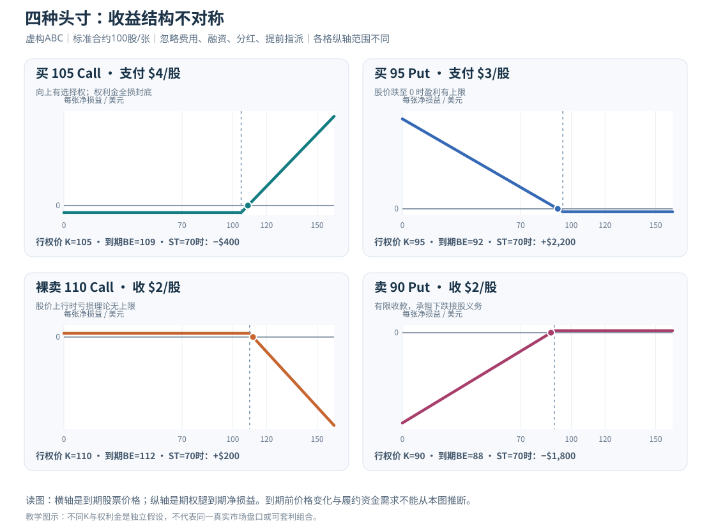

# L04｜四种基础期权头寸：盈亏曲线、义务与账户风险

> **专业教材级 v2.0｜共通基础 A｜先修：L01–L03｜预计精读 80–110 分钟 + 习题 40 分钟**  
> 教学市场：以 **美国标准个股美式、实物交割期权** 为例；一张假设对应100股，行权条款以具体产品与券商为准。全部报价、公司和情景都是**虚构教学示意**，并非实时行情或个人下单建议。

## 先读五分钟：七条不能忘记的判断

1. **四个方向，不是四种对称投资。** 买Call付费买上涨选择权；买Put付费买下跌选择权；卖Call收钱承担按K卖出标的的义务；卖Put收钱承担按K买入标的的义务。
2. **到期收益图首先是合同数学，不是中途收益预测。** 到期股价固定后可算出终值净损益；提前平仓必须看当时可执行的Bid/Ask、IV、时间和费用。
3. **买Call和买Put的期权腿最大直接亏损通常是初始权利金**（普通已付清单腿且不考虑行权后产生的正股）；但买Put到期理论最大盈利不是无限，因为普通股票价格不能低于零。
4. **裸卖Call的理论损失没有上限；卖Put的理论到期亏损可高达 \((K-p)N\)**，即使它们看起来经常“轻松收租”。权利金收入是盈利上限，不是风险上限。
5. **现金担保Put≠保本；Covered Call≠无风险。** 现金担保Put需要有接股能力，仍可能买到持续暴跌的股票；Covered Call需要拥有足额标的，而标的仍会跌价。
6. **美元盈亏、占用资金、Delta等效股数与最坏损失必须分开。** 只比较“买Call回报率200%”和“卖Put权利金收益2%”没有可比的经济意义。
7. **没有一种单腿必然最优。** 关键是你的股票判断、幅度、时间、愿承受的回撤、能否接股/交股、可执行价格，以及**不交易**这个备选。

**通过本课要做到的事**：给任意 \(S_T\)，能写出四个头寸的每股及每张净损益；从图中找到盈亏平衡和极端风险；给出一个“虽然方向看对、但因为价格或账户义务不值得做”的反例。

### 阅读地图

| 方式 | 路线 | 阅读成果 |
|---|---|---|
| **快读（15分钟）** | §1→§2→§5→§9→§11 | 掌握四条公式、四张曲线及危险界限 |
| **完整学习（80–110分钟）** | §1–§11 + [14题逐题详解](习题与详解.md) | 公式推导、途中退出、账户资金义务 |
| **专业复盘（20分钟）** | §4→§6→§7→§8→§10 | 把单腿数学翻译成实际可持有的仓位 |

本章图片：[四种头寸独立到期盈亏曲线](图解.svg)；参数试验：[原有四头寸离线互动图](互动图.html)。该互动图用**同一人为权利金**画不同腿的形状，不代表存在这样的四份实盘报价。

---

## §1｜先固定合同假设：否则一张表也算不准

全章用虚构股票 ABC，建仓时每股 \(S_0=\$100\)。比较四笔**相互独立**的交易（不是同一张期权的同时买卖，也不假设四张报价在某个真实IV曲面内校准）：

| 名称 | 头寸 | 合约条件 | 开仓现金流 |
|---|---|---|---|
| LC | 买1张105 Call | K=105；按Ask成交 p=4/股 | **−\$400** |
| LP | 买1张95 Put | K=95；按Ask成交 p=3/股 | **−\$300** |
| SC | 裸卖1张110 Call | K=110；按Bid成交 p=2/股 | **+\$200** |
| SP | 卖1张90 Put | K=90；按Bid成交 p=2/股 | **+\$200** |
| 股票对照 | 买100股正股 | 100美元/股 | **−\$10,000** |

**约定**：持有至同一假设到期日 \(T\)；标的到期价格 \(S_T\ge 0\)；一张 \(N=100\) 股。先忽略佣金、税费、融资、股息、交易价差、提前指派，并以**最终经济价值**计算净P/L。这样可以清楚推导合约数学，但不是说实际美式股票期权会自动按经济价值现金结算——**真实标准个股期权通常实物交割**，到期与提前指派都可能产生正股仓位，详见 L02 与本课 §7。

符号 \(x^+=\max(x,0)\)；“净损益”是**行权收益减已付权利金**或**收到权利金减所欠行权收益**，而不是“股票到期变动 × 杠杆”。

---

## §2｜四个函数：从买方权利到卖方义务一步步推出来

### 2.1 买 Call：有利才行权，买方先付钱

Call 持有人到期获得每股行权收益 \((S_T-K)^+\)。把成本 \(c\) 扣掉：

\[
\boxed{\Pi_{\rm LC}=N\big[(S_T-K)^+-c\big]}
\]

在本例 \(K=105,c=4,N=100\)：

- \(S_T\le105\)：到期无行权价值；净损失 **−\$400**。
- \(S_T>105\)：每涨1美元，**到期函数**增益\$100；先补回已经付出的\$400。
- **到期盈亏平衡**：\(105+4=\boxed{109}\)。
- **单腿理论最大到期亏损**：\$400；理论最大盈利无上限（股价理论没有上限）。

不要偷换成“股票上涨到105就赚钱”。**105只是价内门槛，109才是没有费用时的到期收支平衡。**

### 2.2 买 Put：上涨不是它的目标，跌至零是终点

Put 持有人有权按K卖出，经济行权收益为 \((K-S_T)^+\)，扣除初始买价 \(p\)：

\[
\boxed{\Pi_{\rm LP}=N\big[(K-S_T)^+-p\big]}
\]

在本例 \(K=95,p=3,N=100\)：

- \(S_T\ge95\)：期权无到期行权价值，净亏 **−\$300**。
- \(S_T<95\)：股价每跌1美元，**到期经济净损益**增加\$100。
- **到期BE**：\(95-3=\boxed{92}\)。
- 对普通股票 \(S_T\ge0\)，最坏看跌到零时多头Put最大净盈利 \(100(95-3)=\boxed{\$9,200}\)；**不是无穷大**。
- 最大直接亏损：已付权利金\$300，不包含相关正股头寸。

如果Put用来保护你**已经持有的股票**，必须另加正股盈亏，不能把“买Put赚9,200”的单腿收益说成整个组合的净利润。

### 2.3 卖 Call：收钱是上限，交割义务可能没有价格上限

对相同合同，卖方欠买方的正向Call行权收益。收到 \(c\) 后：

\[
\boxed{\Pi_{\rm SC}=N\big[c-(S_T-K)^+\big]}
\]

本例 \(K=110,c=2\)：

- \(S_T\le110\)：到期该期权腿最多赚**\$200**。
- \(S_T>110\)：股价越上涨，卖方经济损失越大。
- **到期BE**：\(110+2=\boxed{112}\)。
- 到期 \(S_T=150\)：\(100[2-(150-110)]=\boxed{-\$3,800}\)。
- \(S_T\) 继续上涨，损失可继续扩大，**裸卖Call理论损失无上限**。

本例“裸卖”严格指**没有足额匹配的股票或其他保护腿**。如果你另持100股成为Covered Call，就不是同一个整体风险结构，必须把股票亏损/上涨封顶一起算（L11再系统研究）。

### 2.4 卖 Put：股票暴跌风险换有限权利金

卖方收 \(p\)，欠买方Put到期行权收益：

\[
\boxed{\Pi_{\rm SP}=N\big[p-(K-S_T)^+\big]}
\]

本例 \(K=90,p=2\)：

- \(S_T\ge90\)：期权腿最多赚**\$200**。
- \(S_T<90\)：标的每继续跌1美元，净损益减少\$100。
- **到期BE**：\(90-2=\boxed{88}\)。
- \(S_T=0\)：亏 \(100(2-90)=\boxed{-\$8,800}\)。
- 即使手头预留\$9,000作为Cash-Secured Put，**标的跌到0的经济损失仍为\$8,800**；现金担保影响资金履约与强平路径，不是股价保险。

### 2.5 把四个结论变成完整表

| 头寸 | 到期净损益/股 | 到期BE | 理论最大盈利/张 | 理论最大亏损/张 |
|---|---|---|---|---|
| 买Call | \((S_T-K)^+-c\) | K+c | 无上限 | 付出 cN |
| 买Put | \((K-S_T)^+-p\) | K−p | 对股票为 \((K-p)N\)（典型p≤K） | 付出 pN |
| 裸卖Call | \(c-(S_T-K)^+\) | K+c | 收到 cN | **无上限** |
| 卖Put | \(p-(K-S_T)^+\) | K−p | 收到 pN | 股票跌至0时 \((K-p)N\)（典型p≤K） |

**范围限制**：表格是四个单腿的**简化到期经济P/L**。买Put理论最大盈利的上式采用典型正价格条件；如发生非常规价格、组合对冲或实际结算物变化，需重新按合同计算。**卖Call若已有正股，风险不再是裸卖Call这条单腿代表的整个账户风险。**

---

## §3｜把四条折线画出来：为什么不能只看“收益率”

每张图**横轴=到期股价**，**纵轴=每张期权到期净美元盈亏**。这是有条件的静态函数，不是到期前市场报价曲线。

- **买Call（正凸性）**：左侧最多亏权利金，过K后向右上倾斜。
- **买Put（正凸性）**：右侧最多亏权利金，跌破K后向左上倾斜，但正股只能跌到0。
- **卖Call（负凸性）**：左侧最多收权利金，右侧亏损继续放大；与相同合约买Call的净P/L互为反向。
- **卖Put（负凸性）**：右侧最多收权利金，跌破K后向左下倾斜，损失受股票价格不能低于0的边界限制。

**为什么说“买方买凸性、卖方卖凸性”？** 单腿多头期权的**到期收益函数**在行权价处斜率发生有利于多头的弯折；空头恰好反向。但**凸性不是免费收益**：买方先支付权利金，卖方收到它作为承担非线性义务的对价。真正中途Gamma、Theta、Vega还依赖市场模型与剩余期限，L05–L08再定义。

### 两个画图最容易犯的错误

1. 把各张图的“横向最大损失”视作整个**组合账户**最大亏损：若期权提前行权并产生股票头寸，还要继续计算正股变动、利息及强平。
2. 把四份示意期权权利金当成同一交易时刻的真实可配对报价：本章为学习函数特地使用不同K/不同p，**不能**据此做套利或认为某个裸卖期权必然更有价值。

---

## §4｜同一终值：四种头寸到底赚或亏多少？

使用 §1 的虚构合同并保持单位一致：

| 到期股价 \(S_T\) | 买105 Call、付4 | 买95 Put、付3 | 卖110 Call、收2 | 卖90 Put、收2 | 买100股@100 |
|---:|---:|---:|---:|---:|---:|
| **0** | −400 | +9,200 | +200 | **−8,800** | −10,000 |
| **70** | −400 | +2,200 | +200 | −1,800 | −3,000 |
| **90** | −400 | +200 | +200 | +200 | −1,000 |
| **100** | −400 | −300 | +200 | +200 | 0 |
| **108** | −100 | −300 | +200 | +200 | +800 |
| **120** | +1,100 | −300 | −800 | +200 | +2,000 |
| **150** | +4,100 | −300 | −3,800 | +200 | +5,000 |

**同一行不能直接用来评“哪种更好”**：这四笔期权初始K、到期盈亏门槛、方向暴露、最大损失、现金占用完全不同。

### 4.1 假设你看好股价短期涨到108

- 买100股正股，期末+800美元；但要付约10,000美元且承担从100跌到0的损失。
- 买105 Call，期末**−100美元**；方向看对但幅度不足，期权费仍未赚回。
- 卖90 Put，期末最多收**+200美元**；你的真正交易内容是“承担跌破90时可能买股的义务”，而不是参与持续上涨。
- 裸卖110 Call，期末+200，但如果股票涨到150则**−3,800**，不能因为108这个中心预测就排除股价大涨。

若你没有经审查的到期股价分布、卖方保证金预算和风险预案，**不交易仍然是有效决策**。

### 4.2 三种比较口径：同张数、同Delta、同损失预算

- **同张数**：一张Call和一张Put都标称100股乘数，但即期Delta不一定等于100股。
- **同初始Delta**：不同K、期限、合约类型可能要配置不同张数，且Delta随股价和IV变化；空头腿Delta方向也要带符号。
- **同最大亏损预算**：买方可按权利金预算，而裸卖Call无法用有限预算机械认定“最大亏损”；卖Put还应看接股的完整资金责任。

**只有说明比较基准，才能把“期权ROI比股票高”变成有实际意义的研究问题。**

---

## §5｜买方：有限权利金风险，为什么仍可能很不适合长期投资？

### 5.1 买Call：输的不是方向，是价格×时间的联合判断

以105 Call买价4为例，股票从100涨到108是正确的上涨判断，但到期内在价值只有3，**亏100美元**。如果看涨观点发生在到期**之后**，合约仍可能归零。

相反，股票涨到150时，Call净赚4,100美元，相对400美元权利金本金的比例惊人，但这并非同仓位或同风险的正股替代。**25张这样的Call需要10,000美元权利金，风险暴露与100股正股完全不一样**。

常见误读：“我既然看好长期公司价值，那么买最便宜的虚值短Call资金效率最高。”实际上短Call便宜可能因为**需要在很短时间完成远距离上涨**。股价横盘、上涨太慢、IV降低都可能让期权腿接近全损。LEAPS与长期股票投资的比较将在L10、L23深入。

### 5.2 买Put：既可以是方向投机，也可以是保险

单独买Put，期权腿利润在股票下跌时增加。但持有100股又买Put的**保护性Put**，净结果必须用：

\[
\Pi_{\rm protective\ put}
=100(S_T-S_0)+100[(K-S_T)^+-p]
\]

如果正股100买入、Put K95支付3，到期股价70：

- 正股亏 \(100(70-100)=-\$3,000\)；
- Put腿赚 \(100(95-70-3)=+\$2,200\)；
- **组合净亏 = −\$800**（未计费用及分红）。

这说明Put可以在一定价格附近保护下跌，但保险费让组合承受成本；**不能把Put腿赚2,200写成组合赚2,200**。保护策略的分层、到期不同步、滚动购买保险的长期成本，在L12再讲。

### 5.3 “最大亏损为权利金”有实际账户边界

对**普通已付款单腿买方期权，且在行权前平仓或失效**，期权腿最大直接损失为权利金。但美式多头可能被主动行权，价内到期可能按默认规则行权，随后出现股票仓位，**买股/卖股、融资、借券和交易费用的风险不能继续被原单腿上限概括**。如果账户缺乏履约资金，券商可能提前做风险处理。下一次“查看仓位”时未必还持有原来那张期权。

---

## §6｜卖Put：现金担保与裸卖的经济亏损为何相同？

假设卖90 Put收2（每张收200美元）。

### 6.1 到期可能需要什么现金？

如果到期被指派，标准股票Put卖方通常按K买入100股：

\[
\text{股票买入交换现金}=90\times100=\boxed{\$9,000}
\]

你最初收到200美元，但**接股票需要的资金与收到的权利金不是一个数量级**。有些券商可能按净额等方式定义担保资产，具体规则以账户为准；不应无条件用一个固定保证金数字套全部券商。

现金担保Put：你为潜在股票履约准备了足够资金/等价合格担保，因此减少资金短缺与强行融资风险；**股票仍可能暴跌**。

裸卖Put（没有足额现金担保且允许按保证金开立的空头）：股票的期末经济净损益函数与同一K、同一p的现金担保卖Put**相同**，但中途可能出现追加保证金、利息、强平及账户清算风险，结果可能不同。

### 6.2 “本来愿意90买股”不足以证明这是好交易

卖Put获得的**经济成本基准**可写成 \(90-2=88\) 美元/股（忽略成本）。但：

- 如果股票跌到70，单腿到期净亏**1,800美元**；
- 如果股票一路涨到150，卖Put仍只赚200美元，放弃了直接持股的上涨空间；
- 只有你确实愿意在可能的经济下跌情景下接股、资金充足、且卖出收款相对风险有合理补偿，才有继续研究的基础。

**“到期盈利概率很高”并不能推出期望值为正**。卖方以有限盈利对换深度下跌损失，概率分布不能靠直觉填，详细验证见L09、L22。

### 6.3 Put卖方的提前指派

美式Put可以在到期前按规则行权，空头有可能提前被指派；深度价内、剩余外在价值及利率等条件可能影响行权动机。即使账面显示“仍剩30天”，也不能保证履约义务会等30天才来。**股票仓位和资金压力可能比模型预测的到期结果先出现**。

---

## §7｜裸卖Call：为什么不是一种“轻松看空”的工具？

### 7.1 裸卖和备兑不是一个投资

卖110 Call收2，一张最多拿到200。股票涨到150时亏3,800。标的理论上可继续上涨，这条裸卖Call的理论亏损无上限。

但若你同时**已经持有100股ABC**，你卖出的Call和股票构成Covered Call（备兑Call），必须看**整体**：

\[
\Pi_{\rm covered\ call}
=100(S_T-100)+100[2-(S_T-110)^+]
\]

若 \(S_T=150\)：

- 股票赚 \(100(150-100)=+\$5,000\)；
- Call腿亏 \(100(2-40)=-\$3,800\)；
- **整体赚+\$1,200**（净上行被封顶），不是“裸卖Call亏3,800就代表账户亏3,800”。

如果 \(S_T=0\)：股票亏10,000，Call腿赚200，整体**−\$9,800**。**备兑不是价格下跌保险**。如果没有股票，却把空头Call当Covered Call，账户承担的风险类别会变得完全不同。

### 7.2 到期前的持仓风险更难画在折线里

美式空头Call可能在到期前被指派；除息前深度价内、剩余外在价值很小的Call可能有提前行权激励。裸卖Call若被指派，在满足券商规则的条件下可能出现**卖空100股正股**及借券/股息责任。

备兑Call被指派，100股可能提前卖出，你的持股与股息权利可能改变。**到期收益图只算统一终值下的数学差额，不说明哪天会失去股票。**

### 7.3 看空为什么不等于“卖裸Call”？

想表达看空，可以考虑减掉已持股票、多头Put或后续的熊市价差；每种有权利金或上限的代价，但并非必须承担无限价格上涨风险。**复杂策略也有提前指派与多腿执行风险**，不是无条件安全。基础课程的目的不是替你选工具，而是让你能说出：如果标的突然大涨50%、100%，自己头寸会发生什么。

---

## §8｜到期图无法告诉你的途中收益：IV、时间和真实报价

### 8.1 买方途中平仓怎么算？

期初买105 Call按Ask4.00，过一段时间股票上涨到108，假设**真实可成交Bid**为3.70。

\[
\Pi_{\rm LC,close}
=(3.70-4.00)\times100=\boxed{-\$30}
\]

此时股价涨了8%，但Call平仓仍亏30，可能与时间、IV及原始买入价有关。其即时内在价值为3.00，Bid3.70仍高于内在，**不违反美式Call的行权价值下界**。

另一个时间情景：股票107、假设Bid6.20时，\((6.20-4)\times100=+\$220\)，尽管股价没到到期BE109，也可能提前实现盈利。

### 8.2 卖方回补怎么算？

期初卖90 Put收2.00，若后来**买回所需Ask**升到4.70，则期权腿已实现净亏：

\[
\Pi_{\rm SP,close}=(2.00-4.70)\times100=\boxed{-\$270}
\]

虽然当时可能还没有到期、未发生任何指派，卖方需要以**可执行买入价格**结束义务。若券商软件按中间价标记账户，实际回补成本还可能更不利。原来只收200美元，买回可能花470美元，不存在“最多亏掉收到的200”一说。

### 8.3 Greeks 的作用与边界

| 因素 | 单腿多头通常如何暴露（局部条件下） | 为什么静态P/L图看不出 |
|---|---|---|
| Delta | Call通常正、Put通常负 | 即时方向敏感度不是到期收益折线的全程固定斜率 |
| Gamma | 普通单腿多头期权通常为正 | 股价变化导致Delta变化；短到期可很敏感 |
| Theta | 许多常见多头期权的时间流逝影响为负 | 到期前价值随时间变化，亦可能与股息/利率/深度价内条件相关 |
| Vega | 在许多常见模型下，多头通常为正 | IV下跌可让方向看对的买方亏损 |
| 卖方 | 对以上常见方向相反 | 收时间费背后是负Gamma、事件跳空及融资/指派 |

上述是**典型教学局部方向**，不是所有合约、所有资产、所有波动率模型无条件符号定律，也不是说多头一定会亏Theta。Greeks 的精确定义、单位与跨变量相互作用在L05–L08展开。

---

## §9｜一张风险表：真正的“最坏情形”是哪些？

| 头寸 | 最坏到期理论价格情景 | 到期单腿亏损 | 途中账户可能先出现的风险 |
|---|---|---|---|
| 买105 Call、付4 | 股价≤105，期权价值归零 | −400 | 权利金流失、到期实物行权后资金/正股风险 |
| 买95 Put、付3 | 股价≥95，期权价值归零 | −300 | 保险成本、卖出成交价、行权交割所需持股/空股 |
| 裸卖110 Call、收2 | 股价理论无上限 | **无上限** | 保证金上升、提前指派、空股/借券/股息义务 |
| 卖90 Put、收2 | 股价跌至零 | −8,800 | 接股资金9,000、提前指派、强平及流动性危机 |
| Covered Call：100股@100+卖110 Call收2 | 股价到零 | 整体−9,800 | 持股跌价、股票提前被交走、资金与股息 |

### 9.1 为什么保证金不是最大亏损？

保证金是**维持和清算头寸的资金规则**。它可以根据券商风险制度、波动率与组合变化而调整；不决定最坏价格路径的数学上限。裸卖Call即使初始只占用一部分资金，也不能推导“我的最大亏损就是冻结额度”。

### 9.2 两种尾部风险不能用同一“安全度”排序

- 买Put与买Call的尾部方向不同，且买Put最大到期盈利受普通股票价格零下界约束。
- 裸卖Call理论亏损无限，卖Put理论亏损有界但对高价股票依然可能极大。不能得出“卖Put风险小所以总是值得卖”；还要结合公司基本面、相关性、集中度、跨币种融资和可用现金。

### 9.3 期权临到期的“最后一张”依然可能产生股票

对美式实物交割个股期权，到期价内默认行权安排、反向指示、盘后变化、券商提前平仓，都可能造成意外股票仓位。这在L02详解过。持有一张“快到期的零成本卖方仓位”不意味着**市场收盘时自动无风险归零**。

---

## §10｜四个工具怎样进入一个理性投资决策？

**第一步：先说明观点。** 例如“ABC我认为合理价值135，但何时涨到135并不确定”，或“未来30天有特定财报事件，市场可能大幅波动”。这两种观点需要的交易表达不同。

**第二步：再明确风险预算和现金义务。** 买一张Call最多直接损失权利金；卖一张Put可能必须接股；卖裸Call有无上限上行风险。如果你的可用现金无法承担履约，单靠预计收款不能使策略合理。

**第三步：比较时间和价格。** 对应的合约是否到期太早？Bid/Ask是否过宽？市场价格是否已计入你预期的涨幅/事件？胜率直觉不能代替概率和成交成本。*股票价值低估*是对股票的判断，不自动变成*短期Call被低估*。

**第四步：把不交易放进候选。** 你可以直接持股、减少股票、研究LEAPS、考虑价差，或暂时不建期权仓。若对上涨发生时间完全没有把握、报价太昂贵、现金或追加保证金承受不了，暂不交易不是遗漏策略。

**第五步：事前写出退出条件。** 包括观点证伪、价格/IV变化、到期前的指派预期、买回成本、事件及流动性异常。**Roll（展期）不是避免实现亏损的魔法**，是平旧仓+开新仓（L17）。以能持有到最后为名忽略途中保证金，会把正确的股票研究变成错误的衍生品交易。

---

## §11｜六个常见错误与通关检查，之后才能学Delta

### 六个常见误区

1. **“只要Call价内就肯定盈利。”** 错：价内是与K比较；盈利需要扣实际买价，且到期与途中不同。
2. **“卖Put收权利金，即使跌价也不会亏超过收的钱。”** 错：跌到零理论亏 \( (K-p)N\)，本金风险远大于收款。
3. **“卖裸Call只是看空，涨过K一点最多亏200。”** 错：200是收款上限，不是损失上限；股票大涨可造成不设上界的亏损。
4. **“买Put买到的是无限下跌利润。”** 错：普通股票跌到0是有限下界；Put理论到期盈利有限。
5. **“同样每张100股，所以四个策略Delta都等于100股。”** 错：乘数是合约单位，Delta是局部敏感度；不同K、期限和买卖方向差异极大。
6. **“我做好备兑或现金担保，策略就没有股票价格风险。”** 错：备兑仍承担所持股票的下跌；现金担保卖Put仍承担被指派后股票跌价。

### 本课完成条件

不看公式表，你应该能：

- 写出四个到期净收益函数，并把**每股结果乘100**转换为单张期权美元；
- 正确说出四个头寸的最大盈利/亏损与BE（包含买Put并非无限盈利、裸卖Call亏损无上限）；
- 画出四张折线，在任一股价 \(S_T\) 解释斜率变化；
- 同时算出裸卖Call、备兑Call、裸/现金担保卖Put的**期权腿与股票组合**风险；
- 在真实账户语言里区分到期净损益、途中可执行Bid/Ask、指派后的股票、保证金和不交易。

**练习**：[L04专业教材级14题与详细答案](习题与详解.md)，[第一批原13题中的L04部分](../../references/练习-第一批.md)。先独立做Q1–Q6，再看完整答案。

### 官方资料阅读入口（合约事实优先，教学数据不可当行情）

- [Options Industry Council — Options Strategies](https://www.optionseducation.org/strategies/all-strategies)：买/卖Call、Put及备兑策略的结构和风险。
- [OIC — Long Call](https://www.optionseducation.org/strategies/all-strategies/long-call)：支付权利金、盈亏与到期风险。
- [OIC — Long Put](https://www.optionseducation.org/strategies/all-strategies/long-put)：看跌期权的利润上限与到期结构。
- [OIC — Cash-Secured Put](https://www.optionseducation.org/strategies/all-strategies/cash-secured-put)：卖Put的股票接收义务、担保现金与风险。
- [OIC — Naked Call (Uncovered/Short Call)](https://www.optionseducation.org/strategies/all-strategies/naked-call-uncovered-call-short-call)：裸卖Call的无限上行亏损风险。
- [OIC — Covered Call (Buy/Write)](https://www.optionseducation.org/strategies/all-strategies/covered-call-buy-write)：持股与卖Call组合后的封顶收益、股价下跌和提前指派风险。
- [OIC — Options Assignment FAQ](https://www.optionseducation.org/referencelibrary/faq/options-assignment)：美式空头到期前指派与到期风险。

参考链接用于讲解**合同层面的结构**；具体股息、券商保证金、执行价格、行权截止和税费以交易当天官方资料为准。L05从这里接续Delta，不在本章假装已经完成Greeks、完整组合定价或专业对冲研究。
