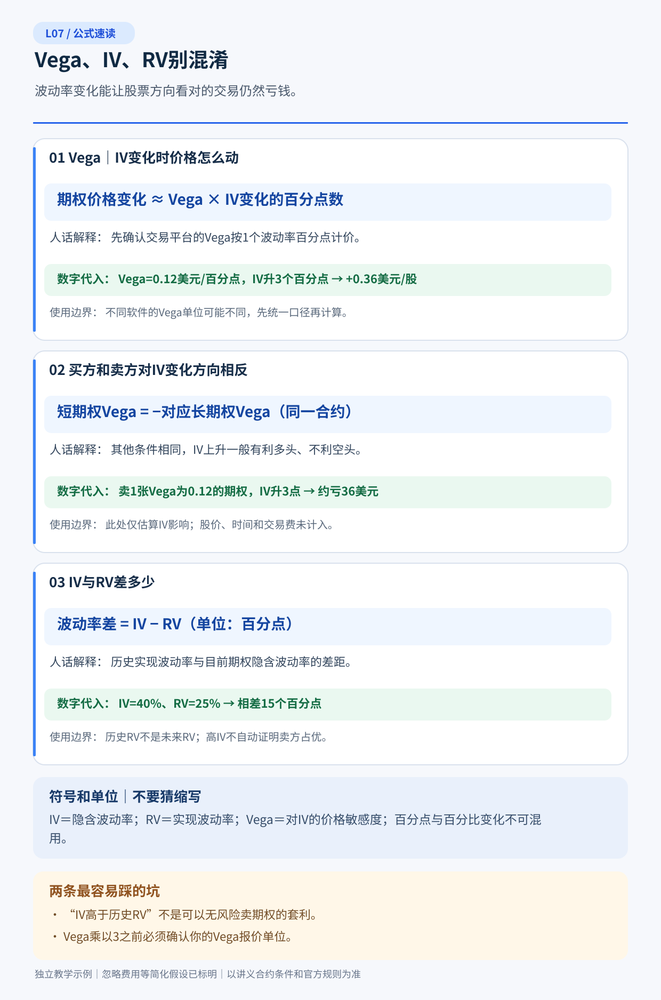
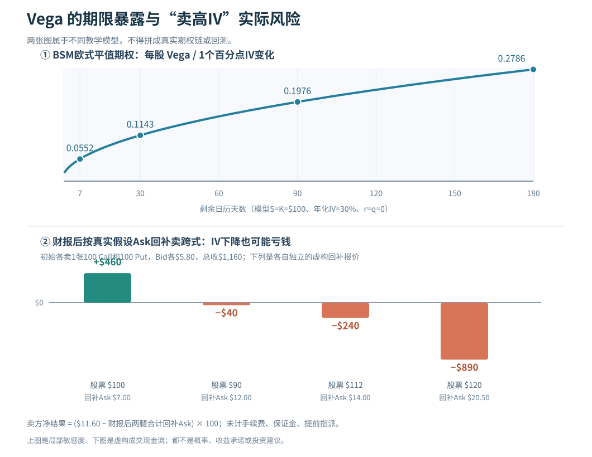

# L07｜Vega、IV 与 RV：高隐含波动率真的值得卖吗？

> **专业教材级 v1.0｜A 共通基础｜先修 L01–L06｜精读80–110分钟 + 习题35–50分钟**  
> 默认美国标准股票期权，每张合约通常对应100股，报价为美元/股。**全部ABC行情、IV历史序列和交易报价为教学虚构**；唯一标记BSM的数学表格使用同一欧式无股息、零利率的解析模型。教学案例不能作为真实期权估值、交易记录或券商风控条款。

## 5分钟速读：七个值得牢记的结论

1. **Vega 是“期权模型价格对IV变化的局部敏感度”**，不是标的股票波动率本身。多头普通Call和Put通常正Vega，卖方同一合约负Vega。务必核实平台的Vega是“每1个百分点”还是“IV小数增加1.00”的口径。
2. **IV 是用期权市场价格反推的模型参数；RV/HV 是已发生收益率的统计量。** 二者都常年化，却不等于同一个未来价格分布，也不等于真实涨跌概率。
3. **IV高不代表卖方有优势。** 可能是公司存在尚未发生的大跳空、事件临近、市场对左尾担忧上升，或者流动性与风险偏好发生变化。高权利金对应的赔付义务也在变。
4. **即便未来RV低于当初IV，某笔卖方策略也不保证赚钱。** IV与RV的差值不是扣成本净利润；Delta/Gamma、分红、期权结构、路径、尾部、做市价差、对冲次数和账户强平都重要。
5. **IV Rank与IV Percentile只回答“相对自身历史在哪里”**，不是股票涨跌方向、隐含利润率或卖方胜率。两者用不同公式，可同时出现Rank20%、Percentile80%。
6. **财报后IV下降（IV crush）可能让多头期权贬值，但跳空涨跌也可能使它赚钱。** 卖跨式赌IV回落可能遭受远超收到权利金的亏损。
7. **波动率交易的可证伪问题是：** 买卖报价里的风险补偿，减去可预期的对冲、融资、交易及尾部代价后，是否仍有独立证据支持正的风险调整后收益？不知道时，不交易优于伪造答案。

**核心能力**：给你一个“近月IV 55%、过去历史30%、卖Put收8%”的提议，你应能要求对方交出期限匹配的实现波动预测、真实Bid/Ask、事件分布、极端损失和资金预算；而不是仅凭“IV比历史高”就下单。

### 阅读与配套

| 路线 | 章节 | 能解决什么 |
|---|---|---|
| 15分钟速读 | §1、§3、§7、§9、§11 | 不再把高IV当无风险收租 |
| 完整教材 | §1–§11 + [L07 14题详解](习题与详解.md) | 从Vega到卖方优势检验 |
| 专业重点 | §2、§4–§8、§10 | 年化单位、事件定价、路径与成本 |

图：[期限与Vega、财报后卖方平仓结果](图解.svg)。它上半部分是**标明公式的BSM模型**；下半部分是**虚构成交报价情景**，不是同一套模型求解的收益预测。

---

## 本课公式速读图｜先看人话，再看推导

> 下图给出本课核心公式与计算判断的**独立教学示例**。请先看名称、代入和使用边界，再读正文完整推导；原有收益图仍保留。

---

## §1｜Vega的数学含义：请先把单位写清楚

### 1.1 为什么你可以“方向看对却被IV打败”？

记 \(V(S,K,T,r,q,\sigma)\) 为每股期权理论价格，\(\sigma\) 是**以小数表示的年化波动率**，例如30%=0.30：

\[
\boxed{\mathrm{Vega}_{\rm unit}=\frac{\partial V}{\partial\sigma}}
\]

上式的单位是：**IV小数变化1.00时，模型期权每股价变化多少美元**。真实交易软件往往将Vega换成“IV变动1个百分点”的数值：

\[
\boxed{\mathrm{Vega}_{\rm pp}=0.01\,\mathrm{Vega}_{\rm unit}}
\]

若Vega显示“+0.12美元/股/百分点”，IV从40%下降至35%是**下降5个百分点**，局部模型价变化：

\[
\delta V\approx0.12\times(-5)=\boxed{-\$0.60/\text{股}}.
\]

一张100股合约理论估值约下降 **\$60**；若该平台的0.12其实代表“每IV小数1.00”，则5个百分点的影响只为 \(0.12\times(-0.05)=-0.006\)美元/股。**两个单位的误解会造成100倍误差。**

### 1.2 Long/Short Vega的符号

通常的非奇异欧式股票Call/Put（普通模型、其他条件固定）均有**正的多头Vega**；卖出同一合约，头寸的Vega变为负。方向性Call或Put的Delta可以一正一负，但**多头Vega通常同时为正**，因为更大价格分散程度提升了选择权的模型价值。

组合的Vega要按**有符号张数×真实乘数×每股Vega**加总：

\[
\mathrm{Vega}_{\rm portfolio,pp}
=\sum_i q_i m_i\mathrm{Vega}_{i,\rm pp}.
\]

例如买2张每股Vega0.12的Call、卖3张每股Vega0.08的Put，100股乘数：

\[
2(100)(0.12)-3(100)(0.08)=\boxed{0\text{美元/IV百分点}}.
\]

这只表示**选定模型和每腿IV均同幅变动**的一阶组合Vega近似为零。真实波动率曲面可能发生扭曲、不同K和T的IV并不同幅变动；“净Vega=0”不代表曲面风险或路径风险消失。

### 1.3 局部变化不是实际交易收入

如果股票移动、剩余期限减少、财报揭晓导致IV变化同时发生，应用局部模型展开：

\[
\delta V\approx\Delta\,\delta S
+\tfrac12\Gamma(\delta S)^2
+\Theta_{\rm day}\,\delta t
+\mathrm{Vega}_{\rm pp}\,\delta IV_{\rm pp}.
\]

这里忽略更高阶与交叉项，也没包含买入Ask、卖出Bid的差。**这是一张解释因子的数学表，不是一张实盘成交账单。**

---

## §2｜可复算BSM：期限越长，Vega为什么经常更大？

采用独立且一致的BSM教学参数：欧式期权，\(S=K=100\)美元，\(r=q=0\)，年化\(\sigma=30\%\)，\(T=d/365\)，无交易费。

对这一模型，Call和Put的单位Vega相同：

\[
d_1=\frac{\ln(S/K)+(r-q+\sigma^2/2)T}{\sigma\sqrt T}
=\frac{\sigma\sqrt T}{2},
\]

\[
\boxed{\mathrm{Vega}_{\rm unit}=S\,e^{-qT}\phi(d_1)\sqrt T,\qquad
\mathrm{Vega}_{\rm pp}=0.01\,S\phi(d_1)\sqrt T.}
\]

其中 \(\phi(z)=e^{-z^2/2}/\sqrt{2\pi}\) 是标准正态密度。用同一公式计算四个期限的**单位Vega**：

| 剩余天数 | 每股每1个百分点IV变化的Vega（约） | 100股标准合约价值局部变化（约） |
|---:|---:|---:|
| 7天 | 0.0552美元 | 5.52美元 |
| 30天 | 0.1143美元 | 11.43美元 |
| 90天 | 0.1976美元 | 19.76美元 |
| 180天 | 0.2786美元 | 27.86美元 |

同样在ATM且模型参数不变，较长期限有更大的绝对Vega；**这不代表长期Call更“危险”或更值得卖**：期权费、Theta/Gamma、到期敏感度、资产估值、风险预算、不同IV期限结构还没比较。

### 2.1 为什么极短期Gamma高、Vega反而可能低？

L06证明ATM附近Gamma粗略随 \(1/\sqrt T\) 增大；此处Vega粗略随 \(\sqrt T\) 变动。期限越短，**股价是否越过K的敏感性更尖锐**，但对“在剩余未来全部路径上增加一点年化波动率”的价格敏感度可能变小。一个0DTE期权可以同时表现出**极高Gamma风险和较小绝对Vega**，不是数学矛盾。

这个比较固定K、S、IV与合同条件；深实/虚值、调整合约、到期前IV结构、股息/事件都可能改变数值。期货期权和指数期权不要未经合约检查直接套股票100股乘数。

### 2.2 盘口会让模型Vega结论失效

同一份期权Ask=8.00、Bid=7.70、模型中间价7.85，你用Vega推算理论估值涨0.15，并不等于可以赚0.15：如果先按8.00买入、目前只有7.70可卖，一笔立即往返就可能亏\$30/张。**交易优势必须以相同Bid/Ask和可成交数量口径复核。**

---

## §3｜IV、HV、RV：一个模型参数与两个统计对象

### 3.1 IV到底是“市场预测”还是“市场价格”？

更精确的说法是：**IV从期权市场价格，在给定模型假设下反解出来，表达这张期权价格所对应的年化波动率尺度。** 市场报价可以包含保险需求、左尾跳空、风险溢价、流动性、事件、融资与微观结构。因此它未必等于参与者的“真实平均未来波动率预测”，更不是市场给你的客观未来结果。

一张期权的Bid和Ask能反解不同IV；同一股票不同K、不同期限也有不同IV。所谓“ABC IV=45%”如果不说明是近月ATM、30天常期限插值，还是某一张Put的Bid IV，严格说并不是同一个观测对象。

### 3.2 HV与RV怎么计算？

取一段**已经观察到的**价格 \(P_0,\ldots,P_n\)，计算日对数收益：

\[
r_i=\ln(P_i/P_{i-1}),\quad
s^2=\frac{\sum_{i=1}^n(r_i-\bar r)^2}{n-1},\quad
HV_{\rm annual}=s\sqrt{252}.
\]

252是交易日年化**惯例假设**；若你的IV使用日历日、包含周末的事件效应或不同抽样频率，比较前要对齐。如果使用平方收益求和的**实现方差**估计而不是减均值的样本标准差，所得RV数值可能不同；必须事先指定方法。

**可复算的四日例子**：假设日对数收益为 \([+1\%,-1\%,+2\%,-2\%]\)，均值0，平方和0.0010，样本方差 \(0.0010/3\)，日标准差约1.82574%，乘 \(\sqrt{252}\) 得到年化HV约 **28.98%**。

这四个观测实在太少，**绝不是未来30日真实波动率的可信预测**。历史相对平静的一段可与下一周极端跳空同时出现，尤其公司发布财报时。HV只是后视镜。

### 3.3 “IV减RV”为什么不直接等于盈亏？

例如某30日期权开仓IV=35%，随后同一窗口实际计算的RV=25%。**相差10个波动率百分点，不意味着卖方净赚10%或每张赚1000美元。**

一个真正Delta对冲的期权头寸利润取决于沿途不同时间的Gamma、Theta、实际股价变动、IV再定价、再平衡价格与手续费；未对冲的短Call/Put还承受方向与尾部。用Vega把10个百分点乘一个常数只能描述固定其他参数的**一个局部敏感度**，而无法代替持有期现金流。

### 3.4 “未来实现波动率”是需要事后验证的假设

在交易前你可以写出独立预测：未来30个交易日、日收盘对数收益的样本标准差年化预计25%，并为财报/跳空给出修正。然而**只有未来这30个交易日过去后**，RV才是可观察的真实统计值。把预测值也叫“实现波动率”会混淆先验判断和事后证据。

---

## §4｜IV Rank与IV Percentile：只解决历史位置，不解决真实估值

再来一次严格复算，目的是防止进入专业交易后误用指标。固定**同一数据商、同一标的、同一期限插值与同种ATM口径**，观察10天教学IV序列（百分数）：

\[
[10,11,12,13,14,15,16,17,20,60]\%,\qquad IV_{\rm now}=20\%.
\]

**IV Rank（历史极值位置）**：
\[
IVR=\frac{20-10}{60-10}\times100\%=\boxed{20\%}.
\]

**IV Percentile（严格低于当前的样本比例）**：
\[
IVP=\frac{\#\{IV_i<20\}}{10}\times100\%=\frac8{10}\times100\%=\boxed{80\%}.
\]

一日的60%极端高值把Rank压得很低，却没有改变其余8天比今天低的事实。某些数据商采用不含当前日的窗口、严格小于或小于等于、前252个交易日或52周窗口；若历史max=min，Rank**不可定义**，不能机械设为零。

**Rank20%并不证明低估，Percentile80%不等于卖方80%胜率。** 两者没有对未来RV、盈亏路径或市场对冲成本给出确定答案。指标“看起来低”也许只是历史罕见高波动污染了区间；“看起来高”可能恰恰因新风险出现。

### 4.1 数据口径是研究能否复现的第一条件

保存一条IV历史指标至少记录：合约/常期限定义、ATM或Delta目标、IV模型、日期时点、数据源、回看范围、分母、相等值算法、是否包含当前值、缺失/停牌处理。没有这些，即使两个人都说“IV Rank 40”，也不能确信看到的是同一件事。

---

## §5｜期限结构、偏斜与财报事件：为什么“一个IV”误导性很强

### 5.1 IV是曲面，不是一条股票属性

某虚构股票有以下四个**各自独立、非统一模型报价**的IV观测：

| 合约切片 | 示意IV | 为什么不能直接对比 |
|---|---:|---|
| 7天ATM（跨财报） | 70% | 包含一次离散事件跳空 |
| 30天ATM | 43% | 同一事件权重被更长时间摊薄 |
| 90天ATM | 30% | 长期限包含其它经营与宏观风险 |
| 30天低K Put | 54% | 下跌保险和左尾需求可能形成Put skew |

同一公司在同一瞬间完全可能有不同的近远月与行权价IV；高近月IV不一定是错误定价，**可能是特定期限购买尾部保险的价格**。把90天30%的IV当作7天70%期权的公允价值替代，是期限错配。

### 5.2 Skew、Smile和远期波动的直觉

波动率偏斜（skew）描述同期限不同K或Delta切片IV不一样；期限结构描述指定moneyness/Delta附近的IV随到期不同。比较两个合约“相对贵”时，还需要考虑同样的Delta、同样的尾部敞口或一致的**总方差尺度**，而不是只减两个IV数字。

一个常见的总方差近似是：

\[
w(T)=\sigma_{\rm IV}(T)^2T.
\]

对**同一可比波动率切片**，如果要把期限 \(T_1,T_2\) 的总方差差推成“期间前向方差”，可示意：

\[
\sigma_{\rm fwd}^2\approx\frac{\sigma_2^2T_2-\sigma_1^2T_1}{T_2-T_1}.
\]

这仍需要一致模型与结构假设，**事件跳空、偏斜、风险溢价可能破坏简单平滑直觉**；不能仅由这条式子构造无风险calendar spread。L08与P02会专门研究期限结构与曲面的可交易检验。

### 5.3 IV Crush到底“压掉”了什么？

财报公布后，原先“不知道会公布什么”的不确定性被部分消解，覆盖该事件的期权价格可能下降，从其报价反推的IV也可能下降。这个下降影响多头Vega的**局部模型价值**，但同时股票可能大涨或大跌、Theta推进、报价改变；**“IV Crush发生”≠“期权多头一定亏、短跨式一定赚”**。

---

## §6｜案例一：同样股票上涨，Vega和Theta让买Call亏损

虚构ABC现价100、标准Call一张100股，开仓实际Ask=8.00美元/股。教学时点的模型敏感度设为：Delta=+0.50、Gamma=+0.02/美元、Theta=−0.10美元/股/日、Vega=+0.12美元/股/IV百分点。

假设经过1天，股价从100涨到101，而IV下降10**个百分点**。局部模型的期权价格变化约：

\[
\delta V\approx0.50(1)+\tfrac12(0.02)(1)^2-0.10(1)+0.12(-10)
=0.50+0.01-0.10-1.20
=\boxed{-0.79\text{美元/股}}.
\]

若**进一步人为假设**最初成交价8.00也正好是起始模型参考价，新的模型参考价为 \(8.00-0.79=\boxed{7.21}\)。注意：**7.21不是可执行Bid**，也不是某个BSM校准期权的精确定价；Theta和Vega在剧烈变化时并不固定。

如果下一时刻实际可卖出Bid只有7.00，按Bid卖出平仓产生的**真实教学现金流**：

\[
(7.00-8.00)\times100=\boxed{-\$100}
\]

而不是“由−0.79近似推出精确亏79美元”。若Bid为7.60，实际损失则为−\$40。你可以方向看对，却在时间、IV和价差的复合作用下亏损；也不能只把亏损全归咎于IV，因为这里每个影响项都已经分别列出。

### 6.1 如果是卖方，是否刚好反向赚100？

卖出**完全相同合约**、同起终成交价且无费用的对手方现金流确实与买方对称；但如果真实市场中卖方只能以Bid=7.70开仓，之后需按Ask=7.30回补，则卖方净收入仅 \((7.70-7.30)\times100=\boxed{+\$40}\)，不能用买方的−100倒推自己的+100。**同样的模型变化≠不同交易者同样的成交价**。

更重要的是，现实卖方可能被提前指派、面临保证金、跳空和无法回补的风险；“在这一条有利路径中赚40”不构成普遍卖方优势。

---

## §7｜案例二：卖财报跨式，IV下降却发生重大亏损

### 7.1 先看真正能收到的钱

ABC=100、同K100同到期的虚构ATM Call和Put，假设两腿Bid均为5.80美元/股，Ask均为6.00美元/股；开仓**各卖1张**：

\[
\text{卖方初始信用}=(5.80+5.80)\times100=\boxed{\$1,160}.
\]

这是 **Short Straddle（卖跨式）**，涉及短Call和短Put两项义务。**我们在此仅用来解构风险，正式策略设计将在L13/P04讨论。** 不考虑费用的到期经济净损益：

\[
\Pi_T=100\left[11.60-|S_T-100|\right].
\]

| 股票到期价 \(S_T\) | 合约到期净损益/两腿 | 说明 |
|---:|---:|---|
| 100 | **+\$1,160** | 最多保留卖方信用 |
| 110 | +\$160 | 股票动了10%，仍略盈利 |
| 112 | **−\$40** | 超过到期BE 111.60 |
| 120 | **−\$840** | 跳空20%超过全部权利金 |
| 70 | **−\$1,840** | 股票暴跌30%，亏损继续加深 |

到期BE为 \(100-11.60=88.40\) 与 \(100+11.60=111.60\)。普通股票下跌至0时Put侧损失有限但很大；股票理论上可无限上涨，因此裸短Call侧的**理论组合损失无上限**。保证金需求、临到期指派与股票账户变化不由这个图保证。

### 7.2 到期前的“财报后回补”：IV跌了不等于赚

假设财报后股票来到如下价格，剩余期限仍非零，并给出该跨式两条腿**合计可成交回补Ask**（以下每种独立假设，不是由上面初始IV或同一条BSM曲面生成）：

| 财报后股票 | 两腿合计回补Ask/股 | 卖方平仓现金净损益 |
|---:|---:|---:|
| 100 | 7.00 | \(100(11.60-7.00)=\boxed{+\$460}\) |
| 90 | 12.00 | \(100(11.60-12.00)=\boxed{-\$40}\) |
| 112 | 14.00 | \(100(11.60-14.00)=\boxed{-\$240}\) |
| 120 | 20.50 | \(100(11.60-20.50)=\boxed{-\$890}\) |

每种合计Ask均不低于该股票价格下两腿的合计即时内在价值 \(|S-100|\)。财报后IV**可能明显下降**，但跳空使Call/Put内在价值上升；结果并非只由IV决定。即使股价没有动，仍需要确认**7.00合计Ask是否真的可以成交**，更不保证总能在想要的时刻退出。

**这就是“卖波动”在方向风险和执行上仍可能很危险的原因。** 卖方不应为了“收更多权利金”无条件增加张数或使用不足资金支持的裸头寸。

---

## §8｜IV-RV差与波动率风险溢价：为什么不是自动提款机？

### 8.1 风险溢价的经济来源

期权买方可能愿意支付保险费，获得对极端波动的凸性保护；卖方承担危机、跳空、对冲失效、资金约束和流动性紧缩的风险，从长期与特定市场的统计意义上**可能**获得报酬。这就是讨论**波动率/方差风险溢价（volatility/variance risk premium）**的基础。

Cboe的波动率产品介绍提到，SPX期权所含波动率长期往往高于之后实现的波动，但**历史平均现象不能直接推广为任何个股、任何期限、任何策略的免费利润**。<https://www.cboe.com/en/tradable-products/vix/>。用数值描述风险溢价时，金融研究常用**方差差异**而非简单IV-RV百分点差；符号、测度、期限和实际可交易产品定义都要给清。

### 8.2 一个反例：胜率高但期望为负

假设只是**抽象的期权卖方交易结局分布**，并非来自真实行情：

- 90%的交易小赚 **\$100**；
- 10%的交易重大亏损 **\$1,500**。

则每次期望净损益：

\[
E[\Pi]=0.90(100)+0.10(-1500)=90-150=\boxed{-\$60}.
\]

90%胜率仍然负期望。真实卖方更糟糕之处在于极端亏损可能和其它资产同时发生、账户不能承受回撤、强平提前锁定损失。不能用“IV比RV高且胜率高”省掉最大亏损与尾部分析。

### 8.3 什么时候才可以说有可检验的优势？

至少需要：事前固定IV口径和筛选信号、在**相同到期窗口**评价事后RV、覆盖财报和极端事件、用可执行Bid/Ask扣掉费用与融资、按实际交易时间检验保证金和指派、计算每笔收益分布的**均值与左尾**，再做样本外验证。即使这样，也要明确风险补偿与可持续Alpha并不是一回事：正的平均风险溢价可能只是承受低频高额损失的回报，而非策略有额外信息优势。

---

## §9｜风险管理：Vega可以接近0，账户仍会损失很多

### 9.1 Net Vega只是曲面的一个局部投影

不同期限的期权会对不同期限IV变化敏感；看似相抵的多短Vega组合，如果近月财报IV暴跌、远月只微降，真实收益仍未对冲。**波动率曲面风险**至少含期限方向、行权价偏斜、成交深度和模型选择；组合简单求和只处理“所有腿IV同幅变动”的假想冲击。

### 9.2 多头/空头必须分别承认非对称尾部

买方已付清权利金的单腿直接最坏可亏全部期权费，但行权后股票头寸另算。卖方短Call、短Put、跨式都可能承担远超初始收入的损失；除息/美式提前行权可使股票头寸出现得更早。**保证金只是账户担保条件，不是损失上限**。

### 9.3 实际报价必须有停止条件

如果期权链Bid=0.60、Ask=1.20，且可成交量很小，模型推断它相对贵0.10美元/股，你不能用不可交易的mid0.90推导可重复获得价差。标的重大事件、报价停滞、交易所异常、券商风控规则改变时，应重新计算，必要时**不交易或缩减持仓**。不能为了保持理论净Vega=0而忽略订单成交与实际可用资金。

### 9.4 并非一切都是波动率交易

长期看好企业、只是需要更低价格进入，Cash-Secured Put可能是股票买入义务的表达；长期看涨也可买正股或LEAPS。它们既有Delta也有Vega和期限风险。**判断企业价值与判断期权的波动率风险补偿，是两种不同的优势来源**，应分别建立研究证据。

---

## §10｜如何建立一个可以被推翻的“卖波动”研究？

这里给出**流程性研究框架**，而不是让你马上卖期权。

**研究假设（示例）**：“在同一类大盘指数、排除特定公告并明确期限/Delta目标、按真实可交易Bid卖出并规范控制风险后，某种短期波动率风险暴露，扣除成本及尾部事件后，仍能获得对风险预算有意义的收益。”这比“IV Rank＞80就卖”更有可证伪性。

| 必须保存的证据 | 目的 | 怎样判失败 |
|---|---|---|
| 期权合约、IV截面、数据商、报价时点、到期、乘数 | 研究可复现 | 字段缺失或不同窗口混用 |
| 交易成本：Bid/Ask、费用、成交量、回补价与滑点 | 防止纸面盈利 | 净优势被价差吞掉 |
| 未来实际价格路径与同窗口RV | 纠正后见之明 | 只挑盈利月份、忽略跳空 |
| 同仓位Delta/Gamma/Vega/Theta以及融资与指派 | 完整风险来源 | 保证金或借券使计划不可执行 |
| 尾部与集中度、压力行情、退出触发条件 | 账户生存 | 最大承受回撤过高或无法执行 |
| 样本外时间区间与稳定性 | 避免拟合 | 优势只出现在训练样本 |

**第一性原则不是追求复杂，而是衡量净经济价值。** 如果研究成本和风险预算无法支持这个验证，直接持股或不交易可能更合适；无论IV多高都不值得强迫自己“收租”。

### 10.1 何时改变你的判断？

假如你卖方观点依赖未来RV显著低于IV，但后来发现这一月包含一个你遗漏的二次财报、监管裁决或潜在停牌，该交易假设就被削弱甚至证伪。若实际Bid因流动性下降只剩你想象的一半，即使理论IV仍高，也应撤回“可交易优势成立”的结论。

反过来，若你有独立且经过样本外检验的波动率预测，真实成交价差较窄、资金可承受极端损失，才可以从“没有理由交易”升级到“值得进一步模拟检验”，**不是自动升级到实盘卖出**。

---

## §11｜七个常见误区、结业清单及下一课边界

1. **“高IV = 一定贵 = 卖方赚钱。”** 错。高IV可能是合理事件风险价格；是否贵需要和独立未来分布、成本及尾部比较。
2. **“Vega0.12，IV下跌5%就亏0.60。”** 必须先问5%是“百分比相对变化”还是“5个百分点”，以及Vega口径。这里计算仅适用下降5个百分点、每百分点0.12的局部模型。
3. **“未来RV低于过去HV就应该卖。”** 错。HV是历史、未来RV未观测，且必须与同期限IV和交易结构比较。
4. **“IV Rank和IV Percentile都叫分位，随便选一个。”** 错。极端值、样本窗口、相等定义可造成巨大差异。
5. **“财报后IV Crush已发生，所以卖跨式必赚。”** 错。标的跳空足以超过全部卖方权利金。
6. **“净Vega=0就没有风险。”** 错。曲面变形、Gamma、Theta、Delta、尾部、指派与成交风险依然存在。
7. **“卖方胜率90%比买方胜率40%好。”** 错。收益规模、肥尾、回撤、资金和真实净期望才是评价对象。

**结业必须能做**：写出Vega及单位换算；用同一BSM假设计算不同期限Vega；从四日收益计算HV；解释IVR/IVP不同；完成卖跨式的到期及财报后平仓损益；提出什么信息会推翻“IV高适合卖”的结论。

练习：[L07专业教材级14道习题与完整解答](习题与详解.md)，图：[L07 Vega与卖波动风险案例](图解.svg)。

### 后续知识边界

L08才详细讨论Rho、股息、远期、完整skew/期限结构与Greeks联动；L09关注实际成交链、价格与个人判断、概率/期望值及BSM选学推导；L13/P02/P03/P04则深挖跨式、曲面相对价值、动态Delta对冲与可证伪收益。**本课的目标是避免“卖高IV必胜”的错误逻辑，不是提前替所有策略做结论。**

### 经核对的官方教育资料（2026-10-08）

- [Options Industry Council — Vega](https://prd-web.optionseducation.org/advancedconcepts/vega)：Vega定义及IV与市场报价的关系。
- [Options Industry Council — Implied Volatility Metrics](https://www.optionseducation.org/videolibrary/implied-volatility-metrics)：IV Rank/Percentile的区别。
- [OIC — June Office Hours: IV Statistics](https://prd-web.optionseducation.org/news/june-office-hours-faqs-iv-statistics-position-management-and-the-wheel-strategy)：两指标的计算意义。
- [OIC — IV Crush](https://www.optionseducation.org/videolibrary/implied-volatility-and-the-iv-crush)：财报等事件后剩余不确定性的再定价。
- [Cboe — VIX Volatility Products](https://www.cboe.com/en/tradable-products/vix/)：波动率风险溢价的历史背景，不能替代个股策略验证。

以上材料用于**定义与市场机制**；所有具体金额、IV序列、财报平仓情景和比较结论由本文自建、明示为教学假设，并非官方回测结果。