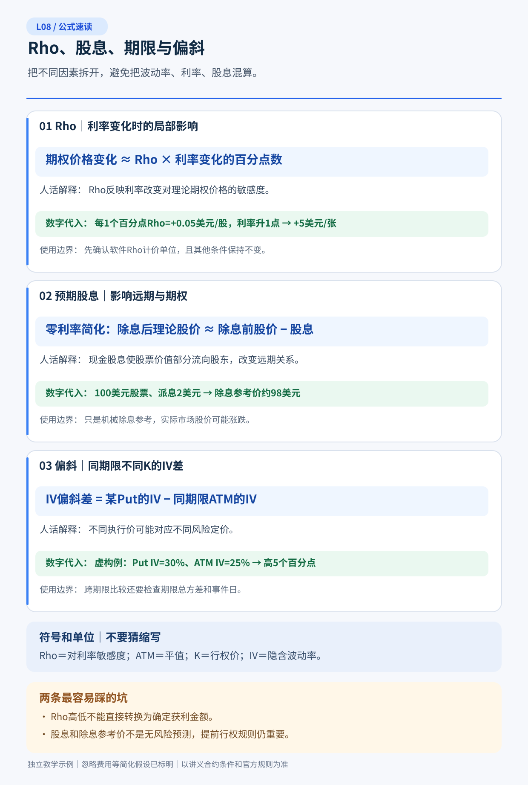
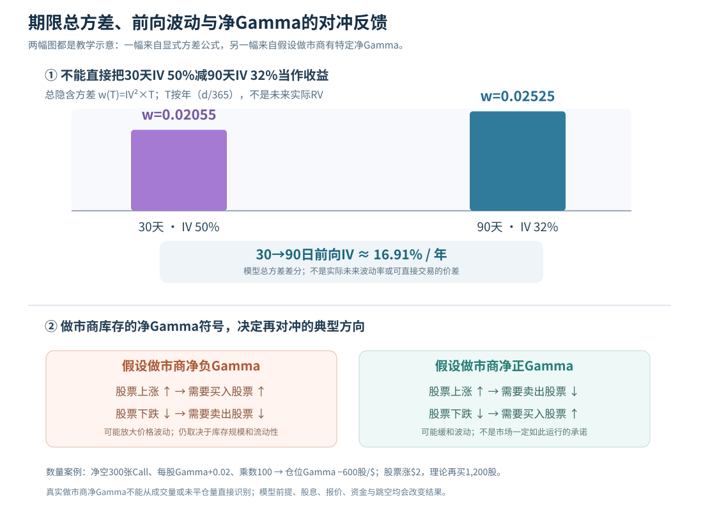

# L08｜Rho、股息、波动率期限结构与偏斜：Greeks 如何一起影响交易？

> **专业教材级 v1.0｜A 共通基础｜先修 L01–L07｜建议精读 85–115 分钟，练习 40–55 分钟**  
> 以美股普通股票期权为主；默认合约乘数100股/张。凡有“ABC”“教学报价”“假设Greeks”“做市商仓位”的地方，均为**人工构造的示例**，不代表可交易行情、真实交易所报价或已观测做市商持仓。BSM解析式只在明确给定的欧式、连续股息与定价模型假设下有效；美式实物交割合约另有提前行权、指派和股息风险。

## 5分钟读懂：七个结论

1. **Rho 不是股价涨跌预测，而是期权理论价格对模型利率 \(r\) 的局部偏导。** 常规欧式多头 Call 的 Rho 为正、多头 Put 为负；卖出同一合约时符号反转。利率“上调25个基点”与“上调25个百分点”相差100倍。
2. **股息影响期权的相对价值和行权选择。** 在连续股息率 \(q\) 模型中，增加 \(q\) 通常压低 Call、抬高 Put 的模型价值；现实公司是按**离散除息日和每股金额**分配股息，不是连续现金流。
3. **股票价内美式 Call 可能在除息前被提前行权。** 卖方若被指派，可能提前交出股票或形成空股及相关股息责任。不能只拿“Call仍有14天”当作不会被指派的保证。
4. **IV从来不只是一条股票的“30%”。** 它随到期 \(T\)、行权价 \(K\)/Delta切片、报价时点与模型变化，形成期限结构、偏斜和波动率曲面。低K Put比ATM IV高并不自动证明Put值得卖。
5. **比较不同期限应考虑总方差 \(\sigma^2T\)，但公式有严格前提。** 跨财报的高近月IV可能来自一次事件，不应简单年化外推；观察到“负的简化前向方差”先检查可比口径和模型，不能立即宣告套利。
6. **Greeks 互相作用，单个参数不够。** 股票涨、IV降、时间经过、利率与股息假设变化同时发生时，Delta/Gamma/Vega/Theta/Rho的一阶或二阶近似只是解释模型价值，实际结算还要看Bid/Ask、现金和指派。
7. **Gamma Squeeze 是一种“可能强化价格变动”的特定对冲机制，不是万能原因。** 假如做市商整体净Gamma为负、又必须再对冲，股价上涨时可能买入标的，跌时可能卖出；净Gamma为正时往往反向。外界很难从成交量或未平仓量单独确认真实做市商仓位。

**通关问题**：同一股票你认为价值低估；期限结构看起来“近月IV高、远月IV低”，且下周有除息和财报。你能否分别说清**股票观点、利率/股息建模、期权成交价格、提前指派及波动率尾部**五个独立层次，而不是只下结论“该卖近月”？

### 快速导航

| 读法 | 章节 | 最终能力 |
|---|---|---|
| **15分钟概览** | §1、§3、§5、§8、§11 | 利率、除息、偏斜、挤压的核心边界 |
| **完整精读** | §1–§11 + [14道题及逐题解析](习题与详解.md) | 复算Rho、远期、总方差、账户风险 |
| **偏专业交易** | §2、§4、§6–§10 | 跨期限结构、整体Greeks、对冲方向和资金约束 |

配套：[L08 模型期限总方差与Gamma对冲方向图](图解.svg)。图的**上半部分是按已声明IV输入计算的代数示意**；下半部分是**人为假设做市商净Gamma**的方向机制，并非某日真实持仓或预测。

---

## 本课公式速读图｜先看人话，再看推导

> 下图给出本课核心公式与计算判断的**独立教学示例**。请先看名称、代入和使用边界，再读正文完整推导；原有收益图仍保留。

---

## §1｜Rho：给定其他因素，利率变化怎样改变期权价格？

### 1.1 利率并非权利金以外另收的一笔手续费

记期权每股理论价值为 \(V(S,K,T,r,q,\sigma)\)，其中 \(r\) 是该定价模型使用的**连续复利利率**（小数/年，例如4%=0.04），\(q\) 是连续股息收益率，\(\sigma\) 是年化IV。

\[
\boxed{\rho_{\rm unit}=\frac{\partial V}{\partial r}}\qquad
\boxed{\rho_{\rm pp}=0.01\,\rho_{\rm unit}}
\]

- \(\rho_{\rm unit}\)：利率小数从0增加**1.00**时，每股期权理论价格变化多少美元的局部斜率。
- \(\rho_{\rm pp}\)：利率变化**1个百分点（100bp）**，每股期权模型价值近似变化多少美元。
- **25bp = 0.25个百分点 = 利率小数0.0025**。按百分点口径的Rho应乘0.25，而不是25。

例如虚构Call每股 \(\rho_{\rm pp}=+\$0.46/\text{利率百分点}\)，模型利率从3.00%上升到3.25%，其它参数固定，则每股价值局部变化约 \(0.46\times0.25=\boxed{+\$0.115}\)，一张100股约 **+\$11.50**。**这不是你能按该价格成交**，也不表示央行公布一次利率调整后市场期权必然如此变化：真正的利率期限曲线、远期股息、股票价格和IV也会变动。

### 1.2 为什么Call与Put常有相反的Rho？

Call给予未来按K买股的选择权，越晚支付K的资金价值在较高利率下通常越高；Put给予未来按K卖股的选择权，固定行权收款折现后价值通常受更高利率压低。对普通欧式股票期权，这体现为：

| 头寸 | 理论 \(\rho\) 的典型方向 | 和卖出同一合约的关系 |
|---|---|---|
| 买Call | 正 | 卖Call的仓位Rho负 |
| 买Put | 负 | 卖Put的仓位Rho正 |
| 买股票 | 不用“期权Rho”代替购股资金成本 | 资金现金流另算 |

**Rho变化的正负不是股价涨跌判断。** 利率变化可能同时引起股票贴现率、股息预期与市场IV变化，持仓真实净损益未必遵守单个Rho项的符号。

### 1.3 一个必须会的BSM公式（只讲结果与使用前提）

在连续股息收益率的欧式 Black–Scholes–Merton 模型里，设 \(\Phi\) 是标准正态CDF，

\[
d_1=\frac{\ln(S/K)+(r-q+\sigma^2/2)T}{\sigma\sqrt T},\quad d_2=d_1-\sigma\sqrt T,
\]

\[
\boxed{\rho_C=KTe^{-rT}\Phi(d_2)},\qquad
\boxed{\rho_P=-KTe^{-rT}\Phi(-d_2)}.
\]

这里 \(\rho_C,\rho_P\) 是**每利率小数单位1.00**的模型导数，换每个百分点要乘0.01。到期越远，通常绝对Rho更大；但K、IV、价内程度、贴现和分红都会改变精确值。

为了有一个可复算结果，取欧式 \(S=K=100,T=1,\sigma=20\%,r=q=0\)，则 \(d_1=0.10,d_2=-0.10\)，正态分布 \(\Phi(-0.1)\approx0.46017,\Phi(0.1)\approx0.53983\)。

\[
\rho_{C,\rm pp}=0.01(100)(0.46017)\approx\boxed{+\$0.46017/\text{股/pp}},
\quad
\rho_{P,\rm pp}\approx\boxed{-\$0.53983/\text{股/pp}}.
\]

所以同样模型利率上升**25bp**，Call模型价值局部增加约\$0.11504/股（每张约\$11.50），Put模型价值局部下降\$0.13496/股（每张约−\$13.50）。**有限的利率变化仍只是局部近似**，尤其长期限、利率大幅变化或非欧式期权，需要重新定价。

---

## §2｜股息、远期价格与“资金持有成本”是一套逻辑

### 2.1 为什么金融模型会把利率与股息放在一起？

持有股票可能获得股息，但需要占用资金；购买Call则先付权利金，把是否未来买股的选择保留到期限后。对连续股息收益率 \(q\) 的欧式模型，远期价格的**理论简化形式**：

\[
\boxed{F_{0,T}=S_0e^{(r-q)T}}.
\]

如果ABC现价100，模型无风险利率 \(r=4\%\)，连续股息收益率 \(q=2\%\)，期限 \(T=1\)年，则：

\[
F=100e^{0.02}\approx\boxed{\$102.02}.
\]

这不是对一年后股价的真实世界预测，也不是“股价一定涨2.02%”：它是**在模型融资与股息假设下的理论无套利远期关联**。真实可交易的股票远期还涉及实际离散股息、借券、税负、融资差、交易费用和不同主体的资金成本。

### 2.2 Put–Call Parity只是相同欧式合约的比较基准

在上述**欧式、连续股息、相同K和T、相同标的、理想无摩擦**假设下：

\[
\boxed{C-P=S_0e^{-qT}-Ke^{-rT}.}
\]

取S=K=100、r=4%、q=2%、T=1：

\[
C-P=100e^{-0.02}-100e^{-0.04}
\approx98.01987-96.07894=\boxed{\$1.94092/\text{股}}.
\]

注意，这不是说C比P高1.94就能立即套利：**合约样式、K/T、交割物、Bid/Ask、借券可得性与股息流**必须一致。更不能把欧式等式不加变更地当成全部美国美式股票期权的精确等式。美式Call/Put在提前行权权利下，需要不同的无套利上下界；P01以后才深入合成复制、融资及可交易套利门槛。

### 2.3 股息的方向和连续股息敏感度

在连续收益率 \(q\) BSM里：

\[
\boxed{\frac{\partial C}{\partial q}=-TSe^{-qT}\Phi(d_1)},\qquad
\boxed{\frac{\partial P}{\partial q}=+TSe^{-qT}\Phi(-d_1)}.
\]

当其它变量固定，假设股息率提高，Call理论价通常下降、Put理论价通常上升；长Call的股息敏感度为负、长Put为正。卖同一合约则符号反转。

**模型的连续股息收益率不等于股票具体哪一天派多少钱。** 普通美股分红多是离散现金派发，精确定价应考虑**已知/预期除息金额、日期、持有权利和公司行为**，不能用一个q粗暴覆盖所有短期合约。对不派息公司的短期期权，Rho的影响可能远小于Delta/Gamma/Vega；对长期限，利率和分红路径的重要性上升。

---

## §3｜美式Call除息前行权：从价格模型回到账户

### 3.1 为什么“我卖了Call，等到到期再说”会出问题？

对**普通美国股票的美式实物交割Call**，持有人有权在到期前按规则申请行权。若股票即将除息，一些深度价内且**剩余外在价值很小**的Call持有人可能选择提前行权以获得股票与股息权益，短Call卖方面临提前被指派概率上升。OIC明确提醒：**除息日前Call空头的指派机会可能增加**。

**简化识别规则不是充分条件**：某些市场参与者用“预期股息大于Call可卖出市场外在价值”作为提示，但还需考虑融资、成交Bid/Ask、行权与持股时间、股票借券、税务和券商截止，不能把它当作所有美式Call必行权的公式。对股息金额有争议时更要先核查公告与实际合约权利。

### 3.2 一张可复算的真实账户情景

虚构ABC股票 S=120，短Call K=100，乘数100。假设你最初以 \$22.40/股卖出这一张Call，除息前期权现在可买回的**Ask =\$20.30/股**（即时内在价值20、外在价值仅0.30），公司即将派**普通现金股息 \$1.00/股**。这些报价是独立教学假设。

| 项目 | 每股 | 一张合约的美元 |
|---|---:|---:|
| 短Call开仓已收款 | +22.40 | +\$2,240 |
| 现在按Ask买回成本 | −20.30 | −\$2,030 |
| 买回平仓的期权腿已实现P/L | **+2.10** | **+\$210** |
| 若被指派，行权价对应股票交割款 | 100.00 | **\$10,000** 的股票卖出交换现金流 |
| 若确实符合股息责任规则，名义股息/空股责任量级 | 1.00 | **\$100** |

**重点：提前指派并不等于净盈利\$2,240。** 如果你已持有100股，则可能按100卖掉股票，持股成本和上涨损益要一起算；如果没有股票，可能发生空股、借券限制、股息支付等义务，实际清算取决于券商和交割规则。即使按Ask买回看起来只花2,030，也需要问账户有无足够现金、是否已被指派、订单何时真正成交。**提前指派后的总组合损益不能仅凭上表推导**，因为并未给出原股票成本、借券/融资和后续股价路径。

### 3.3 除息价差不是“无风险白拿1美元”

公司在除息日股票的理论价格通常会在其他条件不变下反映股息价值，但现实股价还受到市场供需；因分红获得现金同时要承担持股价格与资金义务。除息日前买Call、提前行权买股、除息后收到股息并不是自动套利：你支付了行权价、放弃部分外在价值，且会承受股票价格变化。

股票派发**特别股息、拆股、合并、合约调整**时，标准100股交割物与通常的“每股”计算可能不再适用。请先核对OCC合约调整公告、交易所和券商的实际交割物；不能机械套本节普通股息的100股金额。

---

## §4｜期限结构：同一股票可以有许多个IV

### 4.1 它不是所谓“公司自身波动率”

所谓IV term structure（隐含波动率期限结构），是固定一个**可比较的切片**（例如同一标的、同一估值口径、近似同一forward moneyness或固定Delta）时，不同到期期权所反推出的波动率随期限的变化。注意三个常见不一致来源：

- “近月ATM”与“远月ATM”未必相同实际行权价/相同forward moneyness；
- 近月报价包含财报和到期时点，远月可能另含宏观风险、融资与股息事件；
- IV反推模型不同、报价不同、流动性不同，就不是严格意义上的同一曲线。

假设虚构公司ABC即将发布财报，市场教学数据：

| 切片 | 期限 | 假设IV |
|---|---:|---:|
| 固定近似ATM切片 | 30日 | 50% |
| 同一可比切片 | 90日 | 32% |
| 30日期限较低K Put | 30日 | 60% |
| 30日期限较高K Call | 30日 | 38% |

**“近月50%、远月32%”只是被市场定价的不同期限波动尺度，不是说30日卖方已经多赚18个百分点。** 若是财报跳空使近月高，事件后两份期权IV仍可能同时下降，且股价大幅移动让短Gamma头寸亏损。

### 4.2 为什么跨期限只减百分比可能误导？

期限波动率常按**年化标准差**展示。为了获得“某时段积累多少风险”的统一尺度，理论上常用：

\[
\boxed{w(T)=\sigma_{\mathrm{IV}}(T)^2 T}
\]

称为年化IV平方乘剩余年数的**总隐含方差**（模型意义的量），而不是实际未来RV。若 \(T_1=30/365,T_2=90/365,\sigma_1=50\%,\sigma_2=32\%\)：

\[
w_1=0.50^2(30/365)\approx0.020548,\quad
w_2=0.32^2(90/365)\approx0.025249.
\]

在**同一模型、同类远期moneyness、可比期限切片和适合的variance interpolation条件**下，用两个总方差之差估计30→90日之间的“前向方差”：

\[
\boxed{\sigma_{\mathrm{fwd}}^2\approx\frac{w_2-w_1}{T_2-T_1}}.
\]

这里 \(T_2-T_1=60/365\)，由此估算30→90日的前向年化波动率约 **16.91%**。近月50%、远月32%并不与较低的后续前向波动率矛盾：即将发生的重大事件被近月集中计价，而90天把风险分摊到更长窗口。

**但这个16.91%只是两期总方差差分后的模型隐含量，既不是未来真实世界波动率预测，也不是可交易的60日“期权价格”。** 跨期价差还同时暴露不同Gamma、Theta、Vega、偏斜、早行权及资金路径。

### 4.3 如果算出“负的前向方差”怎么办？

另设30日IV=60%、90日IV=30%。直接计算：\(0.36(30/365)\approx0.029589\)，\(0.09(90/365)\approx0.022192\)，后者总方差反而更低。套上述差分得到**负值**，不能对它开实数平方根。

这是一个**严谨性的警报**：检查两端是否同一forward moneyness、相同IV模型/报价时点、是否存在早行权、错配股息/公司行为、异常Bid/Ask、不同风险尾部。简单ATM IV切片出现负差分，并**不足以单凭两项数值断言市场存在可无风险执行的日历套利**。需要完整期权价格面、同K/远期归一化的价差无套利条件及实际执行成本才能判断。

---

## §5｜偏斜/微笑：同一天同到期为什么Put可能更贵？

### 5.1 先说定义，不要把Skew当“看跌信号”

对同一到期 \(T\)，不同K或Delta切片的隐含波动率构成**波动率微笑、偏斜（Smile/Skew）**。如果某30天切片里低K Put的IV=60%、ATM=50%、高K Call=38%，可以描述为**下跌保护相对昂贵**，但不能单凭此宣布股票下一月下跌概率60%或低K Put值得卖。

不同合约Delta、到价内门槛、尾部损失、交易流动性与交割约束不同；**相同IV也不代表相同权利金、相同最大亏损或相同预计收益**。

### 5.2 偏斜为何存在：定价上的需求与尾部

一种常见机制是投资者购买下跌保险，市场对大幅下跌给予更高边际定价，而期权市场同时承担不可连续对冲的跳空、仓位与资金约束。供需、杠杆效应、跳跃风险与风险溢价都可能影响偏斜。

风险中性定价中的**尾部权重**不等于真实世界下一次下跌的发生概率：市场可以对低概率但高损失事件收取较高保险费。**“Put比Call IV高”不等于市场以更高客观概率预测下跌**。

### 5.3 为什么不能只看两个IV百分比判断套利？

比较“30天低K Put IV60%”与“90天高K Call IV32%”实际上混合了K、T和不同方向风险；一个价差可能同时是短Gamma、短Vega、长Delta或复杂的资金头寸。真正的专业研究需要在**相同可比风险尺度**下评估曲面，同时检查报价可执行性。P02会完整研究相对定价；本课只训练**识别可比/不可比对象**。

---

## §6｜Greeks是同一张风险账本：怎样把它们相加？

### 6.1 从局部模型估值开始，而不是从账户现金流开始

期权每股模型价格 \(V\) 受股价 \(S\)、日历时间 \(t\)、年化IV \(\sigma\)、模型利率 \(r\)、股息收益率 \(q\) 影响。忽略高阶混合偏导后，一种**教学近似**是：

\[
\boxed{\delta V\approx
\Delta\,\delta S
+\tfrac12\Gamma(\delta S)^2
+\Theta_{\mathrm{day}}\,\delta t_{\mathrm{day}}
+\mathrm{Vega}_{\mathrm{pp}}\,\delta\sigma_{\mathrm{pp}}
+\rho_{\mathrm{pp}}\,\delta r_{\mathrm{pp}}
+\eta_{q,\mathrm{pp}}\,\delta q_{\mathrm{pp}}.}
\]

**\(\eta_q\)** 是本文为便于教学而使用的“模型股息率敏感度”记号，软件未必展示该Greek；**不要和Rho混为一谈**。上述Greeks必须统一到**每股期权价、IV/利率/股息率百分点、日历日**。真正有固定到期的金融产品，还可能有离散股息导致非光滑再定价；此公式不能跨除息日无条件使用。

### 6.2 一次五个输入同时改变：可复算但不是实盘

虚构Call在某时点有这些**教学局部模型参数**（它们彼此独立设定，不声明由同一完整BSM曲面求得）：

| 因素 | 每股期权局部敏感度 | 假设变化 | 理论贡献/股 |
|---|---:|---:|---:|
| Delta | +0.55 | 股票 +\$2 | +1.10 |
| Gamma | +0.03/股票美元 | 变动+2美元的二次项 | +0.06 |
| Theta | −\$0.08/日 | 经过1个日历日 | −0.08 |
| Vega | +\$0.12/IV百分点 | IV降低3个百分点 | −0.36 |
| Rho | +\$0.25/利率百分点 | 利率提高25bp=0.25百分点 | +0.0625 |
| 股息率敏感度 \(\eta_q\) | −\$0.40/股息百分点 | 模型股息率提高0.10个百分点 | −0.04 |

\[
\delta V_{\rm approx}=1.10+0.06-0.08-0.36+0.0625-0.04
=\boxed{+\$0.7425/\text{股}}.
\]

一张100股期权的**理论参考值**约增加\$74.25，**不是净利润\$74.25**。若你曾按实际Ask=\$7.00买入，后来仅能按Bid=\$7.50卖出，**已实现期权腿现金P/L**只有 \((7.50-7.00)\times100=\boxed{+\$50}\)（未计费用）；市场成交价是否同理论估值变化一致，没有假设也不能保证。

若股价剧烈跳空、IV暴跌、利率期限曲线不是平移或实际除息已发生，一阶/二阶Greeks可能显著失准。**顺序变化也重要**：先股价上涨使Delta/Gamma变化，随后IV变动，不能假装模型敏感度始终等于初始六个数字。

### 6.3 常见术语交互项你必须认得

- **Vanna**：Delta对IV的敏感度（或Vega对股价的交叉敏感度，按模型及单位区分）；股价变动与IV变动同时发生时，常数Delta与Vega近似不足。
- **Charm**：Delta随着时间变化的敏感度，定义符号受时间变量选择影响。
- **Vomma/Volga**：Vega对IV的敏感度；大幅IV跳变时一阶Vega可能失效。
- **Color/Speed** 等更高阶Greeks：描述Gamma随时间或股价变化，但名字本身不构成交易优势。

不需要在L08背完整的高阶偏导表，更不能把任何一个Greek解释成持仓胜率。要把它们当作**“一阶模型什么时候会错”的检查单**。专业量化对冲在P03–P04再完整展开。

---

## §7｜Gamma Squeeze：为什么有时对冲会推动行情？

### 7.1 用仓位符号解释，而不是说“散户买Call一定推涨”

做市商为了履行报价和交易义务，可能持有某种期权库存，并用股票或期货管理Delta。假定做市商**总体持有净负Gamma**，在其它输入暂时不变时：

- 股票上涨，使做市商期权组合Delta变得**更负**（或原来的正Delta变少）；要恢复原来净Delta，对冲可能需要**买入更多股票或期货**。
- 股票下跌，使期权组合Delta朝相反方向变化；对冲可能需要**卖出股票或期货**。
- 这样的“涨时买、跌时卖”反馈，在市场深度不足且仓位很大时**可能放大已有波动**。

如果做市商持有**净正Gamma**，再对冲的方向通常相反：股票涨时卖、跌时买，可能减弱短期价格摆动。**做市商不是统一行动的单一机构**，实际风险中性库存、限额与成交场所不同，不能用示例代替真实参与者行为。

### 7.2 可复算的负Gamma对冲量级

假设某做市商总体**空300张**普通Call，每张乘数100股，每股期权当前Gamma=+0.02（美元股价变化1美元时Delta增加0.02）。因为是**空头**，组合Gamma股数/美元：

\[
G_{\rm dealer}=(-300)(100)(+0.02)=\boxed{-600\text{股等效Delta/美元}}.
\]

若股价在局部模型范围内上涨\$2，其他条件暂时不变，做市商期权仓位Delta变化约：

\[
\delta D_{\rm option}\approx(-600)(2)=\boxed{-1200\text{股}}.
\]

若为了保持之前的净Delta≈0，理论上**还需买入约1,200股**标的来对冲。若同样规模为做市商**净正Gamma**，理论上应卖出约1,200股。

**绝不能因某只股票“当天Call成交300张”就推断做市商空300张。** 成交有买卖双方，客户可能交易不同到期/行权价、已有持仓可抵消、经纪商可能内部对冲，库存也可能被其它资产或期货对冲。上述数字**只是单一净仓假设下的局部数学演示**，还没计算股票自身上涨原因和交易深度。

### 7.3 这类机制何时不成立？

净Gamma方向未知、实际做市商已经对冲、标的流动性充裕、指数及ETF跨市场分流、对冲不即时、监管交易限制、新闻驱动的基本面订单更大，都能改变甚至淹没对冲反馈。**“Gamma Squeeze”是一种需要证据才能判断的机制假设，不是看到涨停或大涨就可以贴的叙事标签。**

Cboe有关0DTE市场影响的研究特别讨论做市商净Gamma**规模和符号**的差别；学会这种条件推断，比事后把所有涨跌归因于“伽马挤压”更有意义。

---

## §8｜把价格、股息和波动率结构放进真实账户

### 8.1 同一家公司的三种投资表达

你认为ABC长期真实价值135、目前现价100，但不知道上涨发生在一个月还是两年后，同时股票一周后将除息。三个常见选择：

| 选择 | 最主要的暴露 | 时间与账户义务 | 容易遗漏的代价 |
|---|---|---|---|
| 买100股股票 | +100股线性Delta、公司价值 | 占用约\$10,000，无期权固定到期，股息归属按持仓与规则 | 股价到0时购股本金风险、持有资金机会成本 |
| 买1张长期Call（LEAPS） | 正Delta、正Vega、Theta及Rho/股息模型影响 | 先付期权费，可能全损；价内到期或主动行权产生股票交割资金义务 | 支付的外在价值、错过持股股息/行权决策 |
| 卖现金担保Put | 正Delta、负Vega、通常正Theta的卖方风险 | 收有限权利金；可能提前被指派按K买100股 | 极端跌价、资金占用、融资/保证金与失去上涨参与 |
| 不交易 | 无新增期权仓位 | 保留现金，放弃可能上涨的即时参与 | 机会成本与后悔情景 |

股息是否真正“影响很大”，与期限、预期股息规模、行权价、Call外在价值及融资条件有关。**不能仅因为股票有分红，就认定买股票永远优于买Call或卖Put。** 应把股票总回报与期权腿现金流放到同一时间区间、同一可承受最坏损失下比较。

### 8.2 平价、备兑与保护性Put不能省略结算过程

理论上的某些合成等价依赖**同K同T、融资与股息现金流匹配、可执行报价及交割同步**；美式股票期权会增加早行权/指派路径。备兑Call即使长期账面盈利，也可能在除息前交出股票；卖Put虽然可能最终接到自己愿意持有的股票，途中仍可能被强平。不要因为策略名称带“保护”“备兑”就跳过合同细则。

### 8.3 两个会改变判断的反例

**反例A：利率上升不一定让你的Call赚钱。** 如果理论Rho显示利率+25bp带来\$11.5参考增值，但同一天股票下跌\$3、IV下降，真实Call仍可能大幅亏损。模型偏导必须在**其它输入固定**时才有解释力。

**反例B：低K Put IV高不一定适合卖。** 若企业将面临重大诉讼或监管裁决，你所谓“高IV”可能是合理的尾部损失补偿，且卖方真实Bid可能低于你看到的mid。企业估值被证伪时，应重新评估接股意愿，而不是为了收更多权利金增加卖出量。

---

## §9｜真正交易前的检查表：六种常见决策失败

| 错误快捷判断 | 为什么错 | 需要的实际证据 |
|---|---|---|
| “美联储加息，买Call一定赚” | Rho只是一项局部敏感度 | 期权链、现股走势、IV、到期、利率期限曲线 |
| “股票除息，只看Call剩余天数” | 美式空头可能提前指派 | 除息日/金额、Call可平仓Ask、外在价值、账户股票数量 |
| “远月IV低就是便宜” | 不同期限总方差、风险事件不同 | 同切片期限数据、事件日、真实成交价与最坏损失 |
| “低K Put IV高就卖Put” | 左尾高IV可能合理，且收到的Bid有限 | 企业风险、价格分布、保证金/现金接股能力 |
| “净Vega=0等于波动率中性” | 期限、K、偏斜变化不统一 | 分期限、分Delta情景的组合敏感度 |
| “期权交易量爆炸必有Gamma Squeeze” | 不知道做市商净Gamma、对冲方式和标的市场深度 | 净仓持有方向可信证据、交易深度、其它资金流 |

原则是**每一个“因此应该交易”的句子，都要有明确可观察条件和反证路径**。不满足则停在研究或纸面模拟阶段，而不是用复杂指标弥补缺乏实际优势的证据。

---

## §10｜最小研究框架：怎样判断一个跨期或偏斜交易值得验证？

以下是建立专业研究问题的流程，不是策略建议：

1. **写清假设**：例如“覆盖财报的30天IV相对90天总方差高得不合理”，先明确何谓“不合理”以及对应的未来风险分布和替代对冲交易。
2. **使样本可比**：同股票、同报价时点、同模型、同forward moneyness或明确Delta切片、同分红和融资处理；如果行权方式或交割物不同，必须先归一并单独标注。
3. **用实际可交易报价重算**：买腿按Ask、卖腿按Bid，考虑各腿的可成交张数、组合成交失败和提前指派。
4. **建立风险账本**：分别模拟近月IV暴跌、远月IV只微降、skew翻转、股价跳空、股息公告变化、利率变化及流动性失效；不可用净Vega=0替代这些场景。
5. **事前规定证伪条件**：如果报价差吞没模型价差、总方差口径不一致、真实风险敞口超过预算、除息后股票交割不可接受，则放弃交易；对过去盈利样本要警惕后见之明。

专业研究的难点不是“找一个最高的IV”，而是**找到比市场更准确、且可在自己的交易限制下变现的风险判断**。从单一指标到最终收益，需要经过行情、模型、报价、交易成本、仓位路径、风控、结果六道独立验证。

---

## §11｜误区纠正、结业题与权威参考

### 七个错觉

1. **Rho=0.46，利率加25bp，就一定赚\$46。** 错：每股Rho单位、0.25百分点、每张乘数、实际Bid/Ask都不能漏。
2. **股息率越高，所有Call越值钱。** 错：在连续股息BSM下，提高q通常降低Call模型价值；且现实是离散除息。
3. **卖出的美式Call只会在到期被指派。** 错：除息前价内Call的提前指派值得重点监控。
4. **近月IV50%、远月32%，所以必卖近月、买远月。** 错：不同Gamma、Theta、Vega、事件、指派、融资和报价构成复杂风险。
5. **看到负的“前向方差”，市场必有免费套利。** 错：先核对切片是否可比、模型是否适用和实际成交价，不能仅凭IV代数式判定。
6. **净Gamma负就一定发生Gamma Squeeze。** 错：需要规模、标的流动性、实际库存/对冲机制和市场其它订单流的证据。
7. **Greeks加起来算到+$74.25，因此账户已经赚74.25。** 错：这是局部模型敏感度近似；按真实Bid平仓的现金结果可能只是+\$50或更少。

### 做到这些才算通过

- 能写出Call/Put Rho的典型方向、按**bp与百分点**正确换算；
- 能复算远期 \(F\)、欧式股息平价及除息前一个短Call的风险账本；
- 能说明为什么IV的期限结构和skew需要保持可比切片、何时简单总方差差分失效；
- 能在有多项变化时正确累计Greeks模型贡献，另用Bid/Ask算实际已实现净现金；
- 能复算净负Gamma做市商在股价上涨后的股票对冲方向，并**说明为什么未知真实做市商仓位时不能推断挤压**。

作业：[14题分层练习与逐题详解](习题与详解.md)；图：[期限结构与Gamma机制图](图解.svg)。

### 与后续课程的边界

L09正式课程是**期权链实际报价、市场价格与个人估值、概率/期望值、执行成本和不交易**；BSM全面推导保留为其选学附录。L19进一步研究股息及调整合约、财报与指派的真实流程；P01把平价与合成头寸的融资边界推透；P02研究曲面的相对价值；P03研究真实动态对冲。**本节不会因为解释Gamma Squeeze就私自新增独立课程。**

### 官方来源与核对日期（2026-10-08）

1. [Options Industry Council（OIC）— Rho](https://prd-web.optionseducation.org/advancedconcepts/rho)：Rho的定义及长期限与资金持有成本联系。
2. [OIC — Options Exercise FAQ](https://www.optionseducation.org/referencelibrary/faq/options-exercise)：美式Call的提前行权、除息与被指派风险。
3. [OIC — Covered Call](https://www.optionseducation.org/strategies/all-strategies/covered-call-buy-write)：备兑持股和提前被交走股票对股息的影响。
4. [OIC — Short Call Calendar Spread](https://www.optionseducation.org/strategies/all-strategies/short-call-calendar-spread-short-call-time-spread)：期限不一致带来的Vega、Theta及指派风险。
5. [Cboe — Volatility Insights: Evaluating the Market Impact of SPX 0DTE Options](https://www.cboe.com/insights/posts/volatility-insights-evaluating-the-market-impact-of-spx-0-dte-options/)：做市商净Gamma符号、规模及对冲方向的机制讨论。
6. [Cboe — Gamma Squeezes (研究论文)](https://cdn.cboe.com/resources/education/research_publications/gammasqueezes.pdf)：负Gamma库存及其对冲可能强化价格变化的机理。

**来源层级**：官方教育材料是合约与典型机制的参考，不代替具体券商的实时行权、保证金和税收规则；BSM公式需要指定模型前提；以上所有ABC报价、希腊值、做市商仓位、市场涨跌是假设，用来训练可复算判断而非证明任何真实历史因果或交易优势。