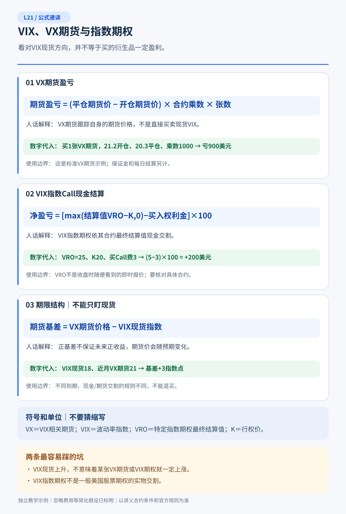

# L21｜期权、期货与VIX：看对恐慌指数，为什么仍可能亏钱？

> **专业教材级 v1.0｜C专业交易第四课｜对应总纲L21（不增加编号）｜先修L03、L07–L09、L13、L15–L16、L18–L20｜精读100–130分钟，习题45–60分钟**  
> **所有本课报价与未来路径均为人为构造的教学假设，不是市场实时数据，也不是特定券商可执行报价。** 主要市场为美国Cboe的VIX指数、Cboe Futures Exchange（CFE）VX期货与VIX指数期权（VIX/VIXW）；另有完全不同的**VX期货期权**。合约乘数、欧式/美式、实物/现金结算与截止时间**不得借用普通美股100股期权规则**。所有情景按实际假设的Ask买入、Bid卖出/关闭；基础P/L不计手续费、资金利息、维持保证金或税，另用风险章讨论。**不能把VIX点位变化直接乘一个合同乘数当作其它VIX产品的利润。**

## 5分钟速读：先分清你究竟持有什么

1. **VIX现货指数不是可以买进账户的股票。** VIX是由不同K、特定到期的**SPX看涨/看跌期权报价**推导出的、面向**未来恒定约30天**的风险中性预期波动率指标，按年化波动率点数表达；不是过去30天RV，不是股市涨跌方向，也不是可以像一股ETF那样直接买卖的持有资产。
2. **VX期货报价预测的是对应期货结算日期的波动率指数结算风险，不是当前屏幕VIX现货。** 常规VX期货的Cboe合约乘数**$1,000/指数点**，Mini VIX期货VXM为**$100/指数点**；两种合约不是同一个可直接轧差的代码。期货买开与保证金逐日结算机制和买股票不同。
3. **VIX指数期权（VIX/VIXW）是欧式、现金结算、每指数点×$100。** 到期内在收益由专门结算指数值确定，通常是相关日早上的**SOQ特别开盘报价（VRO）**，不必等于前一晚或正常交易屏幕显示的VIX；通常最后交易时间在结算日前一个交易日（节假日和系列规则另查）。
4. **VX期货期权是另一种产品。** CFE上市的Options on VIX Futures（VX Options）为**欧式、实物交割进期货头寸**；行权后你可能持有VX期货、面对期货保证金与逐日结算，**不是VIX/VIXW欧式现金结算的同义词**。
5. **本课虚构的反例**：现在VIX现货18，VX近月Bid21.00/Ask21.20。十天后现货涨到25，但同一近月期货Bid降到20.30；若原来按Ask21.20买了一张VX、这时按Bid20.30卖，**实际假设亏$900**。VIX现货上涨7点却没让这张期货赚钱。
6. **VIX期权买方也有到期保费门槛**：某期VIX C20 Bid2.10/Ask2.40，买1张花**$240**；若结算VRO=30，期末净赚**$760**；若VRO=20则亏尽240。买C20卖C25（C25 Bid0.90）的Bull Call Spread净支出**$150**，完整到期最大赚**$350**、最大亏**$150**、盈亏平衡VRO=21.50。
7. **期限结构与Roll不是“瞬间亏一笔价差”。** 近月期货21.20、远月22.70的contango显示不同交割日定价有差异；你关闭旧期货并另开远月，只建立新的风险基准。真实长期损耗来自之后的期货价格演化、收敛、连续滚动规则、交易摩擦及产品费，不应把22.7−20.3在开新仓当日直接记成已实现亏2400美元。
8. **VIX相关ETP不等于长期持有VIX现货**。很多产品追踪会滚动的VX期货篮子，长期路径会受contango/backwardation、再平衡、融资、杠杆/反向日度重置影响。VIX短时飙升，不保证你手里ETP等比例涨，也不保证能为股票组合提供稳定保险。
9. **最合理的行动可能是不交易**：如果只知道“市场可能会恐慌”，不知道何时、哪个期货期限、VRO相对执行价的分布、流动性和账户融资，就没有足够信息选出一张值得买的VIX衍生品。

### 读法与通关

| 路线 | 内容 | 完成能力 |
|---|---|---|
| 20分钟必要区分 | §1–§3、§5、§8、§11 | 明确spot VIX、VX、VIX/VIXW、VX Options的四种不同权益 |
| 专业完整版 | §1–§11＋[14道完整题解](习题与详解.md) | 独立复算期货两时间戳、VRO到期期权、远月Roll与ETP路径 |
| 组合风控角度 | §6–§10 | 判断VIX看涨与SPX/股票组合下跌保护的期限、相关性及资金不匹配 |

图解：[VIX四层产品关系与期限错配的现金收益图](图解.svg)。**图中的期货中途盈亏与期权最终VRO到期盈亏不同日期、不同计价基础；请勿直接把它们相加成同期套利。**

---

## 本课公式速读图｜先看人话，再看推导

> 下图给出本课核心公式与计算判断的**独立教学示例**。请先看名称、代入和使用边界，再读正文完整推导；原有收益图仍保留。

---

## §1｜VIX到底测量了什么？它不是股票市场的“价格方向”

### 1.1 波动率指数来自SPX期权，不来自过去30天指数收益序列

Cboe VIX（通常指30天VIX）用SPX/SPXW合适到期与跨执行价的看跌、看涨期权**Bid/Ask中间报价**构造，选择大致在**23–37天**范围内的期权到期，并通过**总方差的期限插值**形成恒定30天的年化隐含波动率。该指数不是对某一个ATM Call简单反推Black–Scholes IV；其广泛K加权结构用OTM期权价格估计接近**风险中性预期方差**的对象，而不是声称市场知道未来实际RV。实际计算还有F、贴现、K0、OTM选择、可用报价筛选等明确规则，详见Cboe白皮书。

其代表性某单一期限的方差表达可写作：
\[
\sigma^2(T)\approx\frac{2e^{rT}}{T}\sum_i
 \frac{\Delta K_i}{K_i^2}Q(K_i)
-\frac1T\left(\frac{F}{K_0}-1\right)^2.
\]
其中\(Q(K_i)\)为对应执行价的**期权市场价格**（请勿与概率记号的风险中性测度Q混淆），\(K_0\)是对应远期指数F之下的基准K，\(\Delta K_i\)是相邻执行价间隔；上述只是说明估计结构，真实VIX尚须**两期限方差插值、精确秒数和官方报价规则**。为避免符号误会，以下一律用**\(\mathbb Q\)**表示风险中性概率测度，\(Q(K)\)只在公式里指期权价格。

### 1.2 VIX=20不等于“下个月大概率跌20%”

VIX20表示近似**年化20%波动率**。若人为假设未来30日收益近似独立、正态、全年365天的扩散过程，则一个30日**1σ幅度**约为
\[
0.20\sqrt{30/365}\approx\boxed{5.73\%}.
\]
这是条件很强的**粗略标准差尺度**，绝不是VIX指数直接预测SPX下一月下跌5.73%，也不是“68%的无条件历史覆盖区间”；真实收益可能偏斜、肥尾、跳跃且波动率风险溢价使\(\mathbb Q\)与真实P不同。VIX也不能决定市场涨或跌：恐慌上行时常伴股票下跌，但上涨或横盘期间也能因事件不确定性使VIX上升。

### 1.3 VIX与RV、VIX1D、VIX3M各有不同时间对象

RV是已经发生的价格变化波动；VIX是SPX期权隐含的**未来30天**恒定期限风险中性波动率尺度；VIX1D/3M另有自身目标期限和方法。用VIX现货20与某只股票隐含波动40直接比“哪只更便宜”，没有统一资产、期限与风险定义；用VIX与未来真实波动差距证明无风险套利，更混淆了测度、对冲和交易成本。

---

## §2｜四种产品只差几个字，却在交割日变成完全不同的账户

| 产品 | 标的/定价对象 | 典型结算/乘数 | 最容易误认的事 |
|---|---|---|---|
| **VIX指数本身** | SPX期权形成的恒定30天现货预期波动率指标 | **不可直接买入VIX现货**，无可持有“1股VIX” | 新闻数字上涨不能照搬为交易利润 |
| **VX期货** | 某个未来结算日的VIX相关结算风险 | CFE标准**$1,000/点**；每日盯市、保证金；期末按SOQ现金结算 | 买VX不等于买今日VIX现货 |
| **VIX/VIXW指数期权** | 该期VIX结算值上的欧式期权 | **$100/点、欧式、现金结算**；到期受相关**VRO**控制 | 不能按美股“100股交割”推导 |
| **VX Options（期货期权）** | 一张指定VIX期货合约的期权 | **欧式、实物结算成VX期货头寸**，并非收到VIX/VIXW同样一笔现金 | 买方行权后可能需期货保证金 |

### 2.1 同叫“波动率期权”，最后收到的是现金还是期货？

普通VIX/VIXW指数期权：如持一张K20的Call，最终相关SOQ结算VRO=30，则**合同毛现金到期价值**是\((30-20)\times100=\$1,000\)，减去最初保费（本例240）才有净收益760；**不是买入100股VIX**。采用**欧式**行权不表示到期前不能把已持有期权卖给别人，而是**没有美式那种任意提前行权权利**。

期货期权则不同：如果持CFE的VX Options且到期价内按其规则行权，可能**取得一份VX期货多头或空头**，以后仍承受VX的价格、每日保证金和清算。不能先看到“欧式期权”就推断它必然现金结算。这一产品与VIX/VIXW具有不同交易所、代码、到期日以及账户期货权限，具体一张期货期权标的哪一期期货须读当次合约规格。

### 2.2 结算时间不是普通股票周五收盘价

Cboe说明VIX期货及VIX指数期权的到期结算值由结算日（常见**周三早晨**）SPX期权**Special Opening Quotation（SOQ）**计算，VIX期权的最后交易日通常是结算值计算日的前一交易日，实际**节假日/特殊系列**以Cboe日历、券商截止为准。SOQ使用的合约报价/开盘交易信息及其时间截面不同于屏幕即时VIX，因此**VRO可以偏离前一晚、清算前或盘中看到的现货VIX**。必须记录实际系列和结算指数，避免自己拿盘中VIX点位伪造到期利润。

---

## §3｜同是看涨“恐慌”，股票期权、VIX期货与VIX期权有什么根本差别？

### 3.1 股票看跌Put直接结算股票/指数下跌

若你需要保护某个SPX相关股票组合，买相关股票/指数的Put更直接和指定股票价值变化相关；代价是保费、保护K与时间、持有资产与对冲资产不完全匹配。Put支付取决于标的价格水平，相比VIX Call，它更直接针对市场下跌某幅度，但也不能无条件完美覆盖每一只个股。

### 3.2 VX期货的线性价格变化和期权买方的有限保费损失

VX期货对该合约**期货价格变动**一阶近似严格为每点$1000标准合约（VXM为100），多头买开再卖平的基本经济盈亏为：
\[
\boxed{\Pi_{\rm VX}=(F_{t_1}^{\rm exit}-F_{t_0}^{\rm entry})\times1000}.
\]
其中\(F\)必须是**同一到期、同一个可交易的VX期货合约**而不是VIX现货数字。期货不要求像股票那样全额买入一个“21.2×1000”的资产；**保证金押金不是最大经济亏损**，每日variation margin和被迫平仓影响存活路径，Short VX上涨方向理论无界风险。对于Long VX，结算值非负使理想期末下行有限，但期中现金压力/滑价仍可能非常大。

VIX指数期权买方有到期**权利金限定的合同损失**，却必须跑赢买开Ask与特定VRO；Short VIX Call则可能承受向上无界的合同风险，不能因波动率经常均值回归而断言做空稳健赚钱。VIX指数期权的传统股权“股息前指派”机制在此不适用（但仍要核对合约类别）。

### 3.3 不是所有“期货”都实物交付仓库商品

期货是一种约定特定结算日、合约规模与价格变化结算的标准化合约；有些标的对应实物交割，有些是现金结算。**VX期货属于现金最终结算**，没有“VIX股票”运来；相反**VX期货期权的实物交割对象是期货合约本身**。这里所谓“实物交割成期货”并不代表真的送来某个SPX股票篮子。这三层交割物必须单独画清。

---

## §4｜一个反直觉的完整期货案例：VIX现货大涨，期货仍亏钱

### 4.1 同一个时刻，三条报价不能混为一笔价格

全是**虚构报价**，单位为VIX指数点，合约非实际某月代码：

| 日期 | VIX现货指示值 | VX近月Bid / Ask | VX次月Bid / Ask | 解释 |
|---|---:|---:|---:|---|
| \(t_0\) | 18.0 | **21.00 / 21.20** | **22.50 / 22.70** | 远月高于近月，示意Contango |
| \(t_1=t_0+10天\) | **25.0** | **20.30 / 20.50** | **22.20 / 22.40** | 现货涨，两个同名到期的期货价格却跌 |

t0买入1张标准近月VX，主动买开按Ask21.20。t1卖出**同一份近月合约**只能按假设Bid20.30：
\[
\Pi_{\rm near}=(20.30-21.20)\times1000=\boxed{-\$900}.
\]
如果当初买1张次月VX@Ask22.70，t1按Bid22.20卖出：\((22.20-22.70)\times1000=\boxed{-\$500}\)。**同样VIX现货18→25，两个期货多头可以同时亏损。** 这不违反无套利：它们对不同结算日的未来风险重新定价；即使现货短时飙升，市场可能认为该事件会快速消退。

### 4.2 看涨方向完全正确，还可能输给Bid/Ask

在t0近月VX 21.00/21.20，刚以Ask21.20买一张、马上按Bid21.00卖掉，在**期货中间价完全不变**时已亏\((21.00-21.20)\times1000=\boxed{-\$200}\)，未计费。它没有期权式“付21.2×1000权利金”的概念；这只是**交易所报价的双边摩擦**，独立于券商要求多少保证金。

若t1事件更剧烈且近月真实可卖Bid变为**24.80**，则同一笔t0买开的期货得到\((24.8-21.2)\times1000=\boxed{+\$3,600}\)，而不是凭VIX现货25直接算\((25-18)\times1000=\$7000\)。**VIX spot指标变动不能直接代替期货退出报价。**

### 4.3 VXM不是股票期权的100股，也不是VX的可互换一张

如果同一示例以**Mini VIX期货VXM每点$100**计算，单张从21.2退出20.3的经济损益是**−$90**。尽管二者取相同标的、部分时段结算点可能一样，VX与VXM**合约代码、规模、交易深度和保证金不同，不能误认为一张VX自动与一张VXM互相抵消**。做组合时应统一美元/指数点和合约张数，检查不同产品是否允许券商按净风险抵扣。

---

## §5｜VIX指数期权：最终VRO相同，K20 Call与有限宽度价差怎么算？

### 5.1 一份虚构、同到期、同时间报价的VIX/VIXW Call链

两张欧式**现金结算的VIX指数期权**，每点乘数**100美元**：

| VIX指数期权 | Bid | Ask | 计划订单 |
|---|---:|---:|---|
| K20 Call | **2.10** | **2.40** | 买开1张按Ask2.40，实际付**$240** |
| K25 Call | **0.90** | **1.10** | 卖开1张按Bid0.90，收**$90** |

如果只买K20 Call，到期实际执行指数**VRO=V_T**时：
\[
\Pi_{\rm LC20}(V_T)=100[(V_T-20)^+-2.40].
\]
最大到期经济损失是**$240**（VRO≤20），到期BE **22.40**，上方盈利随VRO升高（理论上无事先给定封顶）。如果买C20并**同时卖C25构成Bull Call Spread**，净Debit \((2.4-0.9)\times100=\boxed{\$150}\)：
\[
\Pi_{\rm spread}(V_T)=100[(V_T-20)^+-(V_T-25)^+-1.50].
\]
在**两腿完整按同一VRO现金结算**的理想经济口径下，最大亏**$150**，最大盈利 \(100(25-20-1.5)=\boxed{\$350}\)，下方BE **21.50**。短C25被欧式行权的结算不涉及美股的100股提前指派，但卖方仍有资金、维持和结算支付风险。

### 5.2 不拿期中VIX点位冒充结算值

| **结算VRO** | C20 Long Call到期净P/L | C20/C25 Bull Call Spread到期净P/L |
|---:|---:|---:|
| 15 | **−$240** | **−$150** |
| 20 | −$240 | −$150 |
| 22 | −$40 | **+$50** |
| 25 | +$260 | **+$350** |
| 30 | **+$760** | +$350 |
| 40 | **+$1,760** | +$350 |

本表不代表“现货VIX盘中最高曾到40就一定赚1760”：你若没有在盘中按真实Bid卖掉，最终SOQ VRO=20时，K20 Long Call到期经济仍**亏240**。**盘中报价、相关VX期货的期限、VRO结算值是三个不同变量**，同一期权持仓必须用正确的未来现金流与退出时点计算。

### 5.3 VIX指数期权为什么更应该基于期货的相关远期而不是spot直觉估价？

VIX指数期权的未来到期结算取决于VRO，而不是当前VIX现货；定价与该对应期限的波动率**远期水平、期权供需、隐含波动率-of-volatility（vol-of-vol）和风险溢价**有关。即便VIX现货18、对应期货远期21，买Call K20**并不意味着有3点以上必然便宜的内在优势**；期权市场也已把未来结算分布及偏斜计入报价。不能将美股Black–Scholes里“当前股票现货18”机械代入并宣称某个VIX Call高估或低估，正确需要适配的远期/期货定价工具和官方条款。

---

## §6｜期限结构与Roll：contango如何影响长期持有，什么不是“立即亏损”？

### 6.1 先定义不同期限的F1、F2

若近月\(F_1<F_2\)，称这两条到期的**期货曲线Contango**；若\(F_1>F_2\)，称**Backwardation**。这里是**同一时点不同结算日的期货价格关系**；它不自动告诉你下周现货VIX上涨还是下跌。近月涨跌可能同时受新信息与随时间推进向到期SOQ收敛的影响。

### 6.2 不能把买远月贵2.1点直接记为当天Loss

t1近月VX假设Bid20.30、次月新合约**当日Ask22.40**（不是t0的22.70）。你卖出近月、买入次月，两个合约交易名义价差 \(22.40-20.30=2.10\)点，数值乘1000为2100美元。但**新开期货没有像买Long Call一样支付$2100净权利金**，而是立刻新建一个在22.40买开的远月风险敞口。实际当下已实现的近月期货交易P/L，是从t0买开21.20到t1卖平20.30的**−$900**；你不能再把2100当Roll当天另外发生的已实现亏损（否则重复创造不存在的费用）。

如果后来次月期货按Bid20.50卖平，那么**新期货**从22.40→20.50亏\((20.5-22.4)1000=\boxed{-\$1,900}\)；两个顺序交易的**已实现累计P/L=−900−1900=−$2,800**，费用尚未扣。在Contango状态中长期Roll常承受不利的收敛/期货曲线路径，但这依赖后续价格变化与滚动日程；不能把利差定义成账户当天无条件亏损。

### 6.3 期限曲线也可能反过来，卖波动并非免费Carry

市场恐慌期间可能出现Backwardation，期限端结构突然倒转；持有Short VX的策略可能因为波动率暴涨面临极大追加保证金/强平风险。**Contango和波动率风险溢价是两件不同的量**：一个是曲线不同日期的价格差，一个是现实P期望与风险中性价格的差；期货曲线看起来陡峭并不能证明长期买入或卖出期货一定赚。现货VIX的均值回归经验也不能保证在你的维持资金用完之前发生。

---

## §7｜波动率ETP、ETF/ETN和每日杠杆：为什么长期收益偏离VIX？

### 7.1 先看产品到底持有什么

市场上部分波动率相关ETP（交易所交易基金/票据）跟踪的是**不同期限VX期货及其滚动指数**，而不是不可直接持有的VIX spot。ETF和ETN又有法律载体、税务、发行人信用、提前终止/赎回及追踪方式的不同。不是所有带“VIX”“volatility”的产品都采用同一套期货滚动规则，更不能从名称自动推断其长期目标和当日期货权重。

选具体产品必须读**发行人最新prospectus、underlying index方法、持仓披露、费用与风险公告**。期货篮子含近远月、每天移动到期权重，所以哪怕VIX spot大体稳定，篮子在向更远期限滚动和之后收敛时的净收益也可能负；正向或反向、杠杆产品的实际期限与重置频率更影响路径。

### 7.2 日度杠杆复利例子：两日累计不等于总收益乘2

假定某个**可交易的期货篮子指数**（不是VIX spot指数）两天收益先**+10%**、后**−10%**。指数两日累计：
\[
(1.10)(0.90)-1=\boxed{-1\%}.
\]
人为假设有一只**2×每日重置**产品，完全无管理费和追踪误差，日回报恰为指数日收益2倍，则两日累计：
\[
(1.20)(0.80)-1=\boxed{-4\%}
\]
不是\(-1\%\times2=-2\%\)。如果另一只−1×每日重置产品，先−10%、后+10%，累计\((0.90)(1.10)-1=\boxed{-1\%}\)，而不是反过来因篮子累计−1%就应该赚+1%。**这叫路径依赖和每日再平衡的复利影响，不是所有产品每天都固定发生某个可保证百分比的“损耗”。**

### 7.3 为什么“长期持有多头VIX产品防黑天鹅”会特别昂贵？

为了等待很少发生的市场恐慌，VIX期货或期权暴露可能不断支付期限结构、回补Bid/Ask与保费；大行情时VIX现货飙升并不能保证你的到期VRO或ETP同时收益。很多反向/杠杆产品还可能存在突然大损失、终止、追踪误差或融资约束。**应把它们当具有具体期限、衍生品指数目标的交易工具，而不是存款式长期保险**；如果你的目的实际上是保护股票亏损，可以先比较标的相关Put、缩小股票仓位和直接持现金的确定性。

---

## §8｜实战如何对冲股票？VIX Call是相关工具，不是保险赔付合同

### 8.1 一组对冲示范：看似赚7600，仍可能保护不够

假设持有某宽基股票组合初始市值**$100,000**，持有到某VIX期权到期日T。发生股市下跌导致组合经济亏损**−12%=−$12,000**。另在t0购买**10张VIX/VIXW K20 Call**，每张Ask2.40×100=$240，合计保费**$2,400**，且每张的到期净利润仍取决于**T的VRO**。

若届时VRO=30，10张期权到期毛现金\((30-20)\times100\times10=\boxed{\$10,000}\)，减保费2400，**期权净盈利+$7,600**；股票亏12000，合计策略**−$4,400**。这并非免费把股票全部保住；也未计期权额外Bid/Ask、税费及股票与VIX结算时差。

若股票同样亏12000，但VRO最终仅20（例如恐慌先前已消退），10张Call**期末亏完−$2,400**，组合合计经济收益 **−$14,400**，甚至比不买这批Call的股票组合更差。**同一股市亏损，两个不同VRO足以翻转对冲贡献。**

### 8.2 Hedging effectiveness不能只算一条相关系数

需要同一估值时点、同一币种/可交易收盘、实际持有股票篮子Beta、期权到期/VRO以及压力状态估值：若SPX跌15%，VRO会到多少？有没有事件恐慌迅速消退？组合个股是否跌30%而SPX只跌5%？Long VIX Call的K/期限是否在事件爆发前已到期？大幅股票Gap后VIX Call的**真实可卖Bid与深度**是多少？以相关性历史均值代替联合尾部分布并不能提供可靠比例。

如目标是**明确定义的下跌区间赔付**，长Put或减少组合股票是更直接的风险工具，尽管也有基差和保费；如目标是研究未来VIX结算分布，买VIX期权才是与该观点直接一致的敞口。长期投资与波动率交易不应被“VIX是恐慌指数”一个口号混为一件事。

---

## §9｜真实世界P、风险中性定价与波动率Carry：哪里可能有优势？

### 9.1 看多VIX期权真正要预测的是VRO分布

对一张买开C20 Ask2.40的VIX指数期权（到期VRO按SOQ），真实世界经济期望：
\[
E_P[\Pi]=100\left(E_P[(VRO-20)^+]-2.40\right).
\]
只有你可以独立支持 \(E_P[(VRO-20)^+]>2.4\)（并覆盖未来交易成本、资金与模型误差）时，才有正的主观净期望。VIX现货今天只有18或者最近历史峰值80，**不能直接替代对应到期的VRO分布**。例如假设VRO三态=15、20、30，主观P=[.4,.4,.2]，Call每股预计内在=0×.8+10×.2=2，净期望 \(100(2-2.4)=\boxed{-\$40}\)。虽有20%概率恐慌升到30、赚760美元，也不能说这张Call有正优势。

同一三态假设下，普通股票95/110价差的投资逻辑不能直接照搬，因为VIX结算值是波动率指数，不是股票价格；更重要是合约单位、到期结算及真实权利金。若把P中的VRO30概率提高到30%、VRO15降至30%，则\(E[\text{内在}]=3\)每股，C20净期望变**+$60**。这是人为调整概率后的算术结论，**不是免费被动投资“恐慌”一定赚钱**。

### 9.2 VIX期货的风险溢价不是期权Theta的另一种叫法

期货定价大体关联未来结算市场风险中性的价值与风险溢价；它是对某结算日的**远期volatility index**风险定价，并不同于未来30天真实已实现波动率。VIX通常是对方差的隐含估计，期货基于未来VIX结算值，二者之间还存在**平方根的非线性、测度、预期和期限差异**。把“VIX20、真实RV未来15，所以应该做空VX20赚5点”是错误层级：RV15不等于期货SOQ VRO15。

### 9.3 不把平均Carry当Alpha

专业研究应记录每个结算日、同一实际报价时点的F1/F2/VIX指数、Bid/Ask、交易费用、波动率曲面、SOQ回测偏差与实际风险资本；用样本外情景和相关尾部估计长期风险。**最大收益来自某次极端恐慌，往往也意味着少数尾部情景决定期权/期货收益分布**，要检验对假设小修改是否从正期望变负。不能用期货平均Contango的正/负号等于某个产品持有人无风险可持续收益。

---

## §10｜专业风控卡：合约代码、结算、期限、相关性与现金生存

### 10.1 先核对产品，不同乘数不能“凭经验填100”

| 风险闸门 | 下单前必须确认 | 不满足时 |
|---|---|---|
| 交易的是哪一层？ | SPX股票指数Put、VIX spot指标、VX/VXM期货、VIX/VIXW指数期权还是VX期货期权？ | 名称不明直接停止 |
| 美式/欧式与交割 | VIX/VIXW欧式现金SOQ；VX最终现金SOQ；VX Options可能交割成VX期货；普通美股不同 | 无法承担期货头寸则不持VX Options到期 |
| 乘数和美元风险 | 标准VX1000/点、VXM100/点、VIX指数期权100/点，真实规格是否调整？ | 先用每点美元重新算资金 |
| 买卖价/流动性 | 同一系列真实Bid/Ask、盘口规模、交易所可交易时段、SOQ日历 | 不拿spot代替期货Bid |
| 事件和期限 | 市场恐慌发生日期、期货到期、VIX期权最后交易日和SOQ结算日 | 时间错配则不做该期权 |
| 账户生存 | 每日期货variation margin、house保证金、币种结算、强平权利 | 无备用现金不持高杠杆期货 |
| 实际对冲 | 股票组合尾部亏损与VRO或期货回报的联动、错配下的净亏 | 不把“VIX一般和SPX负相关”当保险 |
| 研究优势 | 独立P、风险中性定价、期货曲线与费用、ETP底层持仓 | 缺少证据则不交易 |

### 10.2 两种合理结论

**情景A：要限制某个股票仓位的已定义大跌损失。** 优先评估减仓或该股票/相关指数的保护性Put；VIX期权可能提供某些情景下的非线性尾部收益，但无法保证在股票跌幅对应的同一日期、同等金额支付。若该VIX期权保费$240且可能全亏，就把它当明确消费型保险成本而非定存利息。

**情景B：你独立研究认为下月VRO显著高于市场隐含分布，并可承受损失。** 在可验证具体VIX/VIXW结算与报价前提下，可对比买VIX Call与牛市价差、期货，确认上方封顶、保费及资金约束；若无法估算VRO真实P，或者只想到买期货因为VIX spot低，就不要因为名字含“恐慌”仓促交易。

---

## §11｜十条误区、结业验收与官方材料

1. **“VIX18就可以像股票那样以18元买入一股。”** 错，VIX现货是SPX期权派生的指数。
2. **“VIX20代表SPX下个月肯定跌20%。”** 错，是近30日年化隐含波动率尺度，而非收益方向预测。
3. **“现货VIX从18涨25，我做多VX就一定赚7000。”** 错，本课近月VX按21.20买、20.30卖亏900。
4. **“VX期货每点和VIX指数期权都乘100。”** 错，标准VX每点1000，指数期权100；VXM每点100。
5. **“VIX指数期权和VX期货期权都是欧式，所以到期都拿现金。”** 错，VX Options可能交割成期货。
6. **“VIX期权到期看昨天屏幕VIX就知道赔付。”** 错，看实际SOQ结算VRO，按指定系列规则核对。
7. **“Contango从20.3滚到22.7，当下肯定已经亏2400。”** 错，新远月是新的期货敞口，亏损来自期货真正价格变化和费用；不得重复记账。
8. **“每天2倍收益，持两天就一定是原指数两日累计×2。”** 错，先+10%后−10%时原指数−1%、日度2倍产品−4%。
9. **“VIX看涨期权能保证股票组合跌12%时100%赔付。”** 错，VRO=20则10张期权反亏2400，整体亏14400。
10. **“VIX期权不看VRO分布，只要新闻恐慌即可找到优势。”** 错，真实P、期货远期和可成交净保费才决定主观期望。

**结业条件**：不翻参考答案，能够独立说清四类产品的结算/乘数、VIX20的30日标准差启发值及边界、两时点VX在现货上涨时的亏损、VIX C20与Bull Call Spread六态VRO到期P/L、期货Roll完整现金账、日度2倍复利路径以及股票亏12000时两种VRO下的真实对冲结果；能够回答**“为什么不交易”**并提供缺失信息。

配套：[14道习题与完整答案](习题与详解.md)、[四层VIX产品/期货滚动与期权到期风险SVG](图解.svg)。**下一课仍严格依总纲为L22《复利与策略优势：胜率、赔率、样本偏差、成本和尾部风险》，本轮不写L22或L23。**

### Cboe及公开正式材料（2026-10-08核对）

- [Cboe VIX FAQs](https://www.cboe.com/tradable_products/vix/faqs)：VIX现货、SPX期权计算、现货不可直接持有以及SOQ和即时指数的区别。
- [Cboe VIX Futures Contract Specifications](https://www.cboe.com/tradable-products/vix/vix-futures/specifications/)：标准VX每点1000美元、相关期货合同要求。
- [Cboe VIX Options Product Specifications](https://www.cboe.com/tradable-products/vix/vix-options/specifications/)：VIX/VIXW每点100、系列期限与最后交易时间。
- [Cboe VIX Futures and Settlement](https://www.cboe.com/tradable-products/vix/vix-futures)：特殊开盘SOQ、VRO结算机制与期货术语。
- [Cboe Options on VIX Futures FAQ](https://www.cboe.com/document/tech-spec/content/technical-specifications/options-on-cboe-volatility-index-futures-faq/)：不同于VIX指数期权，VX期货期权行权可能交割成指定VX期货。
- [Cboe VIX Product Disclosures](https://www.cboe.com/global-disclaimers/)：VIX产品并非长期简单买入持有，收益与现货指数并不一致。
- [SEC公开披露中的波动率挂钩ETN说明](https://www.sec.gov/Archives/edgar/data/312070/000148105723005076/formfwp_vix.htm)：期货Roll/contango风险、长期追踪误差和权益产品注意事项。

**资料核验的是一般制度事实，不证明任何课堂报价真实存在或有Alpha。** VIX衍生品规格和交易时段可能更新，交易权限/风控以真实账户和Cboe最新页面为准。